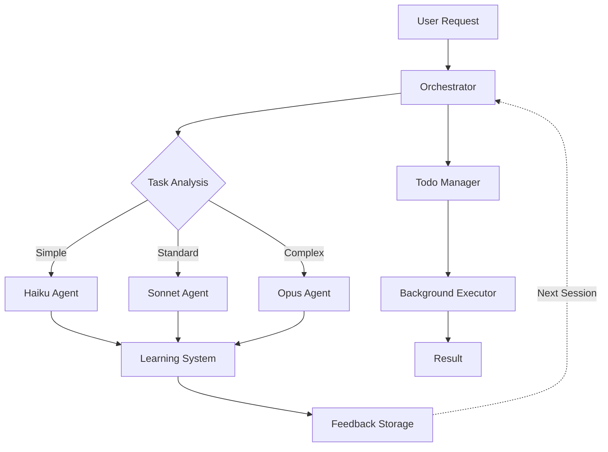

<div align="center">

# ⚡ Olympus

### Multi-Agent Orchestration for Claude Code

[](https://www.npmjs.com/package/olympus-ai)
[](https://opensource.org/licenses/MIT)
[](https://github.com/mikev10/olympus)
[](https://github.com/mikev10/olympus/actions)

**Summon the gods of code.**

[Why Olympus?](#why-olympus) • [Quick Start](#quick-start) • [Self-Learning](#self-learning-system) • [Use Cases](#use-cases) • [Agents](#available-agents) • [Docs](#documentation)

</div>

---

## What is Olympus?

Olympus is a multi-agent orchestration system for [Claude Code](https://docs.anthropic.com/claude-code). It provides:

- 🧠 **Self-Learning System** - Learns your preferences, patterns, and codebase over time
- 🤖 **20+ Specialized Agents** - Oracle, Prometheus, Olympian, Librarian, and more
- ⚡ **Smart Model Routing** - Auto-selects Haiku/Sonnet/Opus based on task complexity
- 📋 **Todo Management** - Tracks progress with real-time updates
- 🔄 **Background Execution** - Long-running tasks run async with notifications
- 🎯 **Continuation Enforcement** - Never stops until all tasks are complete
- 💬 **13+ Slash Commands** - `/ultrawork`, `/plan`, `/ascent`, and more
- 🔮 **Magic Keywords** - Natural language triggers for enhanced modes

---

## Why Olympus?

Olympus transforms Claude Code from a single agent into a **pantheon of specialized experts** that work together seamlessly.

### 🧠 Self-Learning System

**Olympus learns from your preferences and evolves over time.**

- **Passive Feedback Capture** - Automatically detects corrections, preferences, and patterns from your interactions
- **Pattern Extraction** - Identifies recurring feedback and adapts behavior accordingly
- **Preference Learning** - Infers your communication style (concise vs. detailed, autonomous vs. collaborative)
- **Agent Performance Tracking** - Monitors which agents succeed or fail for specific tasks
- **Discovery Storage** - Agents record technical insights about your codebase for future reference
- **Context Injection** - Learned preferences and discoveries are automatically applied in new sessions

**The more you use Olympus, the better it understands your workflow.**

### ⚡ Intelligent Orchestration

- **Smart Delegation** - Routes tasks to specialized agents based on complexity
- **Model Routing** - Automatically selects Haiku/Sonnet/Opus to optimize cost and performance
- **Parallel Execution** - Runs independent tasks concurrently for maximum throughput

### 🎯 Continuous Delivery

- **Todo Management** - Tracks progress across complex multi-step tasks
- **Continuation Enforcement** - Never stops until all tasks are verified complete
- **Background Operations** - Long-running builds, tests, and installs run async with notifications

### 🔧 Developer Experience

- **Zero Configuration** - Works out-of-the-box with sensible defaults
- **Slash Commands** - 13+ productivity commands (`/ultrawork`, `/plan`, `/ascent`)
- **Magic Keywords** - Natural language triggers for enhanced modes

### 📊 Olympus vs. Manual Claude Usage

| Feature | Manual Claude | Olympus |
|---------|---------------|---------|
| **Multi-Step Tasks** | Sequential, manual tracking | Automatic todo management |
| **Parallel Execution** | One task at a time | 3-5x faster with concurrent agents |
| **Learning** | Repeats mistakes | Learns from corrections automatically |
| **Model Selection** | Manual switching | Smart routing (cost optimized) |
| **Task Persistence** | Stops when asked | Continues until verified complete |
| **Background Tasks** | Blocks waiting | Runs async with notifications |
| **Agent Specialization** | Generic responses | 20+ experts for specific domains |

---

## Quick Start

Get started in under 60 seconds:

```bash
# Install globally
npm install -g olympus-ai

# Initialize Olympus
olympus-ai install

# Start Claude Code
claude

# Try it out
/olympus implement a REST API for user management
```

**That's it.** Olympus is now active and learning from your interactions.

---

## Installation

### Global Installation (Recommended)

Install Olympus globally to use across all projects:

```bash
npm install -g olympus-ai
olympus-ai install
```

This installs agents, commands, and hooks to `~/.claude/`.

### Local Project Installation

Install Olympus for a specific project only:

```bash
npm install -g olympus-ai
olympus-ai install --local
```

This installs to `./.claude/` in your current project directory.

---

## Usage

### Start Claude Code

```bash
claude
```

### Slash Commands

| Command                 | Description                                                            |
| ----------------------- | ---------------------------------------------------------------------- |
| `/olympus <task>`       | Activate multi-agent orchestration mode                                |
| `/olympus-default`      | Set Olympus as your permanent default mode                             |
| `/ultrawork <task>`     | Maximum performance mode with parallel agents                          |
| `/plan <description>`   | Start planning session with Prometheus                                 |
| `/prometheus <task>`    | Strategic planning with interview workflow                             |
| `/review [plan-path]`   | Review a plan with Momus                                               |
| `/ascent <task>`        | Persistence loop until task completion                                 |
| `/cancel-ascent`        | Cancel active The Ascent                                               |
| `/deepsearch <query>`   | Thorough multi-strategy codebase search                                |
| `/analyze <target>`     | Deep analysis and investigation                                        |
| `/complete-plan [path]` | Verify and complete a plan after implementation                        |
| `/doctor`               | Diagnose and fix olympus installation issues                           |
| `/deepinit`             | Deep codebase initialization with hierarchical AGENTS.md documentation |
| `/update`               | Check for and install updates                                          |

### Examples

```bash
# Activate Olympus for a task
/olympus refactor the authentication module

# Set as default mode (persistent)
/olympus-default

# Use ultrawork for maximum performance
/ultrawork implement user dashboard with charts

# Start planning
/plan build a task management application

# Deep search
/deepsearch API endpoints that handle user data
```

### Magic Keywords

Include these words anywhere in your prompt to activate enhanced modes:

| Keyword                    | Effect                                 |
| -------------------------- | -------------------------------------- |
| `ultrawork`, `ulw`, `uw`   | Activates parallel agent orchestration |
| `search`, `find`, `locate` | Enhanced search mode                   |
| `analyze`, `investigate`   | Deep analysis mode                     |

---

## Use Cases

### 🏗️ Complex Refactoring

```bash
/ascent refactor the entire authentication module to use OAuth 2.0
```

**What happens:**
- Creates todo list for all subtasks
- Delegates to specialized agents (Oracle for architecture, Olympian for execution)
- Runs tests in background
- Continues until all tasks verified complete

### 📊 Multi-Agent Research

```bash
/ultrawork research and document all API endpoints in the codebase
```

**What happens:**
- Spawns multiple agents in parallel (Explore for search, Librarian for docs)
- Aggregates findings
- Generates comprehensive documentation
- ~3x faster than sequential execution

### 📋 Strategic Planning

```bash
/plan build a real-time chat application with WebSocket support
```

**What happens:**
- Prometheus interviews you about requirements
- Creates detailed work plan with phases
- Identifies dependencies and risks
- Saves plan to `.olympus/plans/` for execution

### 🧠 Learning Your Workflow

**Automatic - no command needed**

You: "No, use TypeScript interfaces instead of types"
→ Olympus records this preference

You: "Use functional components, not class components"
→ Olympus learns your React style

**Next session:** Claude automatically applies these preferences without being told.

---

## Architecture

Olympus operates as a three-tier orchestration system with a continuous learning loop:



### How It Works

**Current Session Flow:**
1. **User Request** → Arrives with learned context already injected at SessionStart
2. **Orchestrator** → Analyzes task complexity and delegates to appropriate agents
3. **Model Router** → Selects Haiku (simple), Sonnet (standard), or Opus (complex)
4. **Agents Execute** → Specialized agents complete their tasks
5. **Learning System** → Passively captures feedback from corrections, preferences, and patterns
6. **Feedback Storage** → Stores learned preferences, agent performance, and discoveries
7. **Result** → User sees the completed work

**Learning & Context Injection (Between Sessions):**

The learning system operates across session boundaries:

- **During Session**: Captures feedback from user corrections ("No, use async/await"), preferences ("Always use TypeScript"), and agent discoveries (gotchas, workarounds)
- **Storage**: Writes to `~/.claude/olympus/learning/` (global) and `.olympus/learning/` (project-specific)
- **Next Session Start**: SessionStart hook automatically injects learned context into the initial prompt
- **Context Types Injected**:
  - User preferences (verbosity, autonomy, explicit rules)
  - Recurring corrections (mistakes to avoid)
  - Project conventions (tech stack, patterns)
  - Agent performance notes (weak areas to watch)
  - Recent discoveries (technical insights about your codebase)

**Key Insight:** Context injection happens at the **beginning** of each session (via SessionStart hook), not in the result. This means every new conversation starts with Claude already aware of your preferences and past learnings.

**Key Components:**
- **Orchestrator** - Delegates tasks to specialized agents based on complexity
- **Model Router** - Selects optimal tier (Haiku/Sonnet/Opus) to balance cost and capability
- **Learning System** - Captures feedback passively and builds preference models
- **Todo Manager** - Tracks multi-step task progress with real-time status updates
- **Background Executor** - Runs long-running operations (builds, tests, installs) async with notifications
- **Feedback Storage** - Persists learned preferences, patterns, and discoveries across sessions

---

## Available Agents

### Task Execution

| Agent                 | Model  | Best For                                                       |
| --------------------- | ------ | -------------------------------------------------------------- |
| **Oracle**            | Opus   | Complex debugging, architecture decisions, root cause analysis |
| **Librarian**         | Sonnet | Finding documentation, understanding code organization         |
| **Explore**           | Haiku  | Quick file searches, pattern matching, reconnaissance          |
| **Frontend Engineer** | Sonnet | UI components, styling, accessibility                          |
| **Document Writer**   | Haiku  | README files, API docs, code comments                          |
| **Multimodal Looker** | Sonnet | Analyzing screenshots, diagrams, mockups                       |
| **QA Tester**         | Sonnet | Interactive CLI/service testing with tmux                      |
| **Olympian**          | Sonnet | Focused task execution, direct implementation                  |

### Planning & Review

| Agent          | Model | Best For                                                          |
| -------------- | ----- | ----------------------------------------------------------------- |
| **Prometheus** | Opus  | Strategic planning, work plans, requirement gathering             |
| **Momus**      | Opus  | Critical plan review, feasibility assessment, risk identification |
| **Metis**      | Opus  | Pre-planning analysis, hidden requirement detection               |

### Tiered Variants (Smart Model Routing)

| Domain        | LOW (Haiku)             | MEDIUM (Sonnet)     | HIGH (Opus)              |
| ------------- | ----------------------- | ------------------- | ------------------------ |
| **Analysis**  | `oracle-low`            | `oracle-medium`     | `oracle`                 |
| **Execution** | `olympian-low`          | `olympian`          | `olympian-high`          |
| **Search**    | `explore`               | `explore-medium`    | -                        |
| **Research**  | `librarian-low`         | `librarian`         | -                        |
| **Frontend**  | `frontend-engineer-low` | `frontend-engineer` | `frontend-engineer-high` |

---

## The Ascent

The Ascent is a persistence loop that binds Claude to your task until verified completion.

```bash
/ascent implement the entire authentication system
```

**How it works:**

1. Creates a todo list for all subtasks
2. Works continuously until all tasks complete
3. Can only exit by outputting `<promise>DONE</promise>` after verification
4. If stopped prematurely, continuation is enforced

**Exit conditions:**

- `<promise>DONE</promise>` - Work verified complete
- `/cancel-ascent` - User cancels the loop
- Max iterations (100) - Safety limit

---

## Planning Workflow

1. **Start planning**: `/plan build a new feature`
2. **Interview**: Prometheus asks clarifying questions
3. **Generate plan**: Say "Create the plan" when ready
4. **Review** (optional): `/review .olympus/plans/my-feature.md`
5. **Execute**: Use `/olympus` or `/ascent` to implement

Plans are saved to `.olympus/plans/` in your project directory.

---

## Self-Learning System

Olympus continuously learns from your interactions to provide increasingly personalized assistance.

### How It Works

**Phase 1: Passive Feedback Capture**
- Detects corrections: "No, that's wrong"
- Identifies rejections: "Stop", "Cancel"
- Recognizes clarifications: "I meant X"
- Captures enhancements: "Also add Y"
- Records praise: "Perfect", "Thanks"
- Extracts explicit preferences: "Always use X"

**Phase 2: Pattern Extraction**
- Clusters similar feedback using Jaccard similarity
- Identifies recurring corrections (minimum 3 occurrences)
- Categorizes patterns: style, behavior, tooling, communication

**Phase 3: Preference Learning**
- Infers verbosity level (concise vs. detailed)
- Determines autonomy preference (ask first vs. just do it)
- Tracks agent-specific performance
- Implements 30-day decay for outdated patterns

**Phase 4: Context Injection**
- Automatically applies learned preferences at session start
- Injects relevant discoveries about your codebase
- Limits injection to ~500 tokens to avoid context bloat

**Phase 5: Agent Discovery**
- Agents record technical insights about your project
- Discoveries include: gotchas, workarounds, patterns, dependencies
- Validated and deduplicated before storage
- Retrieved contextually in future sessions

### Storage Locations

**Global Learning:**
```
~/.claude/olympus/learning/
├── feedback-log.jsonl          # All feedback entries
├── user-preferences.json        # Learned preferences
├── agent-performance.json       # Per-agent metrics
└── discoveries.jsonl            # Global discoveries
```

**Project-Specific Learning:**
```
.olympus/learning/
├── session-state.json           # Current session state
├── patterns.json                # Project patterns
└── discoveries.jsonl            # Project discoveries
```

### Example

**Session 1:** You tell Claude "No, use async/await instead of .then()"
→ Olympus records this as a correction

**Session 2:** Similar situation arises
→ You provide the same feedback

**Session 3:** Olympus detects the pattern (3+ occurrences)
→ Learns your preference: "Use async/await over Promise chains"

**Session 4+:** This preference is automatically injected
→ Claude proactively uses async/await without being told

**The learning happens silently in the background. No configuration required.**

---

## What Gets Installed

```
~/.claude/
├── agents/                  # 20+ agent definitions
│   ├── oracle.md
│   ├── prometheus.md
│   ├── olympian.md
│   └── ...
├── commands/                # 13+ slash commands
│   ├── olympus/skill.md
│   ├── ultrawork/skill.md
│   ├── plan.md
│   └── ...
├── hooks/                   # Event handlers
│   ├── keyword-detector.mjs
│   ├── persistent-mode.mjs
│   └── ...
└── CLAUDE.md               # Olympus system prompt
```

---

## Configuration

### Project-Level Config

Create `.claude/CLAUDE.md` in your project for project-specific instructions:

```markdown
# Project Context

This is a TypeScript monorepo using:

- React for frontend
- Node.js backend
- PostgreSQL database

## Conventions

- Use functional components
- All API routes in /src/api
```

---

## Uninstall

```bash
# Remove agents and commands
rm -rf ~/.claude/agents ~/.claude/commands ~/.claude/hooks ~/.claude/CLAUDE.md
```

---

## Requirements

- [Claude Code](https://docs.anthropic.com/claude-code) installed
- Anthropic API key (`ANTHROPIC_API_KEY` environment variable)
- Node.js 20+ (for npm installation)

---

## Contributing

We welcome contributions! Here's how to get started:

### Development Setup

```bash
# Clone the repository
git clone https://github.com/mikev10/olympus.git
cd olympus

# Install dependencies
npm install

# Build the project
npm run build

# Test locally
node dist/cli/index.js install --local
```

### Running Tests

```bash
npm test              # Run tests in watch mode
npm run test:run      # Run tests once
npm run test:coverage # Generate coverage report
```

### Project Structure

```
olympus/
├── src/
│   ├── agents/       # Agent definitions
│   ├── features/     # Core features (routing, learning, etc.)
│   ├── hooks/        # Event handlers
│   ├── learning/     # Self-learning system
│   └── cli/          # CLI commands
├── agents/           # Agent markdown files (installed)
├── commands/         # Slash command files (installed)
└── scripts/          # Build and installation scripts
```

---

## Documentation

- 📖 [Getting Started Guide](docs/Olympus.md)
- 🤖 [Agent Reference](docs/AGENTS.md)
- 🏗️ [Architecture Overview](docs/ARCHITECTURE.md)
- 🗺️ [Roadmap](docs/ROADMAP.md)
- 📋 [Changelog](CHANGELOG.md)

---

## License

MIT - see [LICENSE](LICENSE)

---

## Credits

---

<div align="center">

**Summon the gods of code.**

</div>

