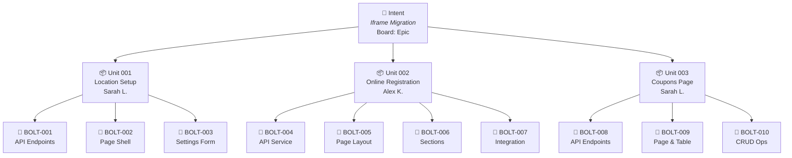

# AI-DLC Framework Architecture

> Living document — captures architectural decisions as they are made.
> This will become the blueprint for the Olympus AI-DLC refactor.

---

## Status

| Decision                                                           | Status      | Notes                                                                                                                                                                   |
|--------------------------------------------------------------------|-------------|-------------------------------------------------------------------------------------------------------------------------------------------------------------------------|
| Two top-level phases (Inception + Construction)                    | **Decided** | No separate "elaboration" phase                                                                                                                                         |
| `elaboration/` renamed to `design/`                                | **Decided** | Universal understanding, no Agile naming collision                                                                                                                      |
| Global bolt numbering                                              | **Decided** | "BOLT-005" in standup is unambiguous. Per-unit adds communication tax for teams that collaborate across units.                                                          |
| Per-unit checkpoint                                                | **Decided** | No merge conflicts on shared state                                                                                                                                      |
| Units overview as mob record                                       | **Decided** | Combined `units-overview.md` in inception captures cross-unit rationale. Per-unit briefs extracted to construction as squad input.                                      |
| Execution plan as inception artifact                               | **Decided** | Captures WHY THIS ORDER and WHAT RISKS — the mob's strategy that individual unit artifacts don't cover.                                                                 |
| Three gates (always enforced, even solo)                           | **Decided** | Inception exit, design approved, unit complete                                                                                                                          |
| Design + Build sub-phases within construction                      | **Decided** | Design before code, gate between them                                                                                                                                   |
| Design artifacts: always created, depth varies by complexity       | **Decided** | Lightweight for simple units, comprehensive for complex                                                                                                                 |
| Design belongs at unit level, not bolt level                       | **Decided** | Domain knowledge spans bolts; bolt specs reference unit design                                                                                                          |
| Bolt spec: one spec.md, enriched in place                          | **Decided** | Mob outlines → squad refines. `status` field tracks progression                                                                                                         |
| QA active during design, not just build                            | **Decided** | QA reviews specs for testability, adds edge cases before code starts                                                                                                    |
| Bolt lifecycle: Plan → Code → Review (3 steps per bolt)            | **Decided** | Human gate at Plan and Review. Code + tests is automated.                                                                                                               |
| Review.md created per bolt (lightweight)                           | **Decided** | Acceptance criteria checklist + test results + QA notes. AI drafts, QA enriches.                                                                                        |
| Human gates at every step                                          | **Decided** | Strict mode to start. Per-bolt gates can relax over time; Gate 2 and Gate 3 stay hard forever.                                                                          |
| QA role during build (what exactly QA validates per bolt)          | **Open**    | Current approach: test review + manual smoke test + acceptance criteria. Will evolve as team learns AI workflow.                                                        |
| Per-bolt gate relaxation criteria (when to loosen)                 | **Noted**   | Start strict. Revisit after 2-3 full workflows. Gate 2/3 never relax.                                                                                                   |
| Board integration (Azure DevOps mapping)                           | **Open**    | Feature = Unit, Child Task = Bolt                                                                                                                                       |
| Operations phase details                                           | **Open**    | Placeholder for now                                                                                                                                                     |
| Framework defaults to team mode                                    | **Decided** | Solo = degenerate case (one person fills all roles). Same structure, gates, artifacts.                                                                                  |
| Two-layer context model (persistent + per-intent)                  | **Decided** | Project context created once, scoped discovery per intent. No full reverse engineering every time.                                                                      |
| Technical brief as pre-inception input                             | **Decided** | Any senior dev who knows the affected area writes known constraints/patterns/gotchas (15 min). Reduces AI discovery waste.                                              |
| Adaptive discovery depth                                           | **Decided** | Discovery depth scales with team familiarity: deep knowledge = minimal scan, unknown area = full discovery.                                                             |
| Prep work distributed across roles                                 | **Decided** | PO writes intent brief, any senior dev writes technical brief. Not one person for everything.                                                                           |
| `{workflow-id}` renamed to `{intent-id}`, intent.md at folder root | **Decided** | Intent = Epic. Folder named after the business concept, not an implementation detail. intent.md lives at root because every phase references it.                        |
| User stories per unit + story-map + personas                       | **Decided** | Stories in construction/UNIT-NNN/stories.md (detail). Story-map in inception/ (PO review). Personas project-wide in inception/.                                         |
| Artifact templates in `.aidlc/templates/`                          | **Decided** | Two-tier: Olympus ships defaults, project-level `.aidlc/templates/` overrides. Consistent frontmatter on all artifacts. 13 templates covering inception + construction. |

---

## High-Level Architecture

### Conceptual Model



| Level      | Count          | Board Item | Assigned To                  | Relationship              |
|------------|----------------|------------|------------------------------|---------------------------|
| **Intent** | 1 per workflow | Epic       | PO                           | —                         |
| **Unit**   | N per intent   | Feature    | Dev + QA (assignee)          | Units run in **parallel** |
| **Bolt**   | N per unit     | User Story | Same assignee as parent unit | Bolts run in **sequence** |

### Phase Model

Two top-level phases. Construction has two sub-phases per unit.

```
INCEPTION                             CONSTRUCTION (per unit)
(Decision Makers)                     (Squads)

┌───────────────────────┐            ┌─────────────────────────────┐
│                       │            │  ┌──────────┐  ┌─────────┐ │
│  Intent               │            │  │  Design  │→ │  Build  │ │
│  Discovery            │   GATE 1   │  └──────────┘  └─────────┘ │
│  Requirements         │ ─────────→ │     GATE 2        GATE 3   │
│  Unit Decomposition   │  handoff   │                             │
│  Bolt Outlines        │            │  Units run in PARALLEL      │
│                       │            │  Bolts run in SEQUENCE      │
└───────────────────────┘            └─────────────────────────────┘
                                                  │
                                                  ▼
                                          OPERATIONS
                                     (after all units)
```

### Actor Model

The same framework serves both solo developers and teams. Solo mode is the degenerate case — one-person mob, one squad that owns all units sequentially.

```
Solo Mode                    Team Mode
─────────                    ─────────
You = mob                    Mob = PO + BA + Tech Lead + senior devs (5-6 people)
You = assignee               Sarah L. (+ QA) → Unit 001, Unit 003
Claude = agents              Alex K. (+ QA) → Unit 002
                             Board = coordination layer (Azure DevOps)

Same folder structure. Same artifacts. Same gates.
The difference is WHO, not WHAT.
```

### Checkpoint and Gate Model

The framework uses two levels of human approval: **stage checkpoints** (within a phase) and **gates** (at phase boundaries).

**Stage Checkpoints** happen after every stage. The AI presents stage output, the human reviews and either approves or requests changes. Work does not advance to the next stage without approval. Checkpoints are lightweight — the mob or squad is already in the session, so this is a natural pause, not a ceremony. But it's mandatory: the AI must stop and wait.

**Why checkpoints matter:** Without them, the AI could barrel through all of inception and present a complete package at Gate 1. If requirements were wrong, everything downstream (units, stories, bolts, execution plan) is wrong. Catching problems at each stage is cheap; catching them at the gate is expensive.

**Gates** are formal quality gates at phase boundaries with defined reviewers, defined criteria, and documented sign-off. Gates are hard stops — work cannot cross a phase boundary without explicit approval.

#### Inception Checkpoints + Gate 1

```
Workspace Detection    → checkpoint (mob confirms greenfield/brownfield, discovery depth)
Scoped Discovery       → checkpoint (mob reviews scope-analysis.md, flags gaps)
Requirements Analysis  → checkpoint (PO validates requirements.md + nfr.md)
Units Generation       → checkpoint (mob validates unit boundaries, cross-unit deps)
User Stories           → checkpoint (PO reviews story-map, QA reviews acceptance criteria)
Bolt Planning          → checkpoint (Tech Lead reviews bolt outlines + story coverage)
Workflow Planning      → checkpoint (mob reviews execution-plan.md)
                       ═══ GATE 1: Inception Complete ═══
```

#### Construction Checkpoints + Gates 2–3

```
Design sub-phase (per unit):
  Functional Design    → checkpoint (squad reviews)
  Business Rules       → checkpoint (squad + QA review)
  Domain Entities      → checkpoint (squad reviews)
  NFR Design           → checkpoint (if applicable)
  Bolt Spec Refinement → checkpoint (squad reviews enriched specs)
                       ═══ GATE 2: Design Approved ═══

Build sub-phase (per bolt):
  Plan                 → checkpoint (dev approves implementation approach)
  Code                 → automated (tests pass/fail)
  Review               → checkpoint (dev + QA validate, review.md created)
                       ... repeat for each bolt ...
                       ═══ GATE 3: Unit Complete ═══
```

#### Gate Definitions

| Gate | When | Who Approves | What's Checked |
|------|------|--------------|----------------|
| **Gate 1: Inception Complete** | After all inception stages + checkpoints pass | PO approves intent + stories (via story-map), Tech Lead approves unit boundaries + bolt outlines | Requirements covered, stories approved with full coverage, units independent, personas defined, bolt outlines reasonable, execution plan reviewed |
| **Gate 2: Design Approved** (per unit) | After squad finishes unit design | Tech Lead reviews (PR or walkthrough) | Functional design sound, bolt specs refined, domain entities documented, QA has reviewed for testability |
| **Gate 3: Unit Complete** (per unit) | After all bolts built + tested | QA validates, reviewer approves PR | All bolts pass acceptance criteria, tests pass, no regressions |

#### Checkpoint vs Gate: Key Differences

| | Stage Checkpoint | Gate |
|---|---|---|
| **Purpose** | Catch problems early, course-correct in real-time | Formal quality sign-off at phase boundary |
| **Who** | Whoever is in the session (mob or squad) | Defined reviewer role (PO, Tech Lead, QA) |
| **Formality** | Lightweight — "does this look right? OK, continue" | Documented — sign-off recorded, criteria verified |
| **Failure cost** | Low — redo one stage | High — may invalidate downstream work |
| **Can be skipped?** | No — AI must always pause and wait | No — gates are always enforced |

### Optional AI Quality Tools (Not Formal Artifacts)

AI-powered review tools (e.g., critical review of plans, hidden requirements analysis) are **facilitator aids** — the facilitator can invoke them before presenting work to the mob or gate reviewers. They are not formal artifacts, not part of the inception or construction artifact tree, and not locked at any gate. Treat them as ephemeral prep work: useful input that gets absorbed into the real artifacts (requirements, execution plan, unit briefs), not tracked as standalone deliverables.

---

## Design Principles

1. `inception/` is **SHARED** — mob creates, everyone reads, read-only after Gate 1
2. Each unit is **SELF-CONTAINED** — own checkpoint, own design, own validation
3. **No shared construction dirs** — no central `plans/` or `design/` across units
4. After inception, squads claim units and **only touch their own unit folder**
5. Gates are **always enforced** — the difference between solo and team mode is who approves, not whether approval happens
6. `design/` comes before `build` — no code generation until the design gate passes

---

## Two-Layer Context Model

AI needs context to build correctly during construction. That context comes from two layers — one persistent, one per-intent.

### Layer 1: Persistent Project Context (Created Once, Maintained Over Time)

This lives at the repo root, NOT inside `aidlc-docs/`. It captures what the team already knows about the codebase — architecture, patterns, conventions, gotchas. It exists so AI doesn't re-discover this for every intent.

```
<repo-root>/
└── .aidlc/
    ├── project-context.md          # Tech stack, architecture overview, key patterns
    ├── coding-standards.md         # Naming conventions, file organization, style rules
    └── legacy-notes.md             # Gotchas, technical debt, "don't touch this" warnings
```

**Who creates it?** AI drafts the initial version by scanning the codebase once. A senior dev (not always the same person) reviews and corrects. This is a one-time investment — 1-2 hours. After that, it gets updated incrementally as the codebase evolves.

**Why this matters:** The AWS AI-DLC reverse engineering phase creates 8 architecture artifacts from scratch for every intent. That design assumes the team doesn't know the codebase. Our team has worked on this codebase for 20 years. Senior devs already know the architecture, patterns, and constraints. Re-discovering this every time wastes mob session time and forces senior devs to review AI's guesses about things they already know.

**When to update:** After any intent that changes architecture, adds a new pattern, or introduces new infrastructure. The squad that made the change updates the relevant `.aidlc/` file as part of Gate 3.

### Layer 2: Scoped Discovery (Per-Intent, During Inception)

This is the per-intent analysis. AI reads the persistent project context (Layer 1), then does a focused scan of ONLY the code paths affected by this specific intent. The output is small and fast to review because AI already has the big picture.

**What scoped discovery produces:**

| Artifact              | Content                                                                                   | Review Time                     |
|-----------------------|-------------------------------------------------------------------------------------------|---------------------------------|
| `workspace-scan.json` | Machine-generated: affected repos, files, components                                      | Not reviewed (machine-consumed) |
| `scope-analysis.md`   | What specific code this intent touches, integration points, risks specific to this change | 10-15 min by mob                |

**What scoped discovery does NOT reproduce:**
- Full architecture documentation (that's in `.aidlc/project-context.md`)
- Technology stack inventory (that's in `.aidlc/project-context.md`)
- Coding conventions (that's in `.aidlc/coding-standards.md`)
- Complete API inventory (irrelevant — only the affected endpoints matter)

### Adaptive Discovery Depth

Not every intent needs the same level of discovery. The depth adapts to how well the team knows the affected area:

| Team Familiarity                             | Discovery Approach                                                                            | Example                                                    |
|----------------------------------------------|-----------------------------------------------------------------------------------------------|------------------------------------------------------------|
| **Deep** — senior dev knows the area cold    | Technical brief + minimal scoped scan. AI confirms what's known, doesn't re-discover.         | Migrating an iframe page that Eric built 3 years ago       |
| **Moderate** — someone worked on it recently | Brief technical notes + standard scoped discovery. AI fills gaps.                             | Adding a feature to a module the team touched last quarter |
| **Low** — nobody's touched this in years     | Full scoped discovery, closer to AWS-style. AI does the heavy lifting. Mob reviews carefully. | Integrating with a legacy module nobody remembers          |

The facilitator (or AI) determines depth at the start of the mob session based on who's in the room and what they know. This is a judgment call, not a rigid rule.

### Pre-Inception Prep: Intent Brief + Technical Brief

Before the mob session, two async inputs are prepared:

**Intent Brief (Business — written by PO or BA):**
- What we're building and why
- Success criteria, business constraints
- User personas affected
- What's in scope, what's out of scope
- ~30 minutes to write

**Technical Brief (Technical — written by any senior dev who knows the area):**
- Known constraints and dependencies ("this page uses postMessage bridge to TMS")
- Reference patterns ("follow what we did for Venues page")
- Gotchas and landmines ("the CC types dropdown depends on a stored proc with weird data shapes")
- Existing components to reuse vs. build new
- ~15 minutes to write

**Who writes the technical brief?** Whoever knows the affected area best. It doesn't have to be the tech lead every time. If Trang worked on a nearby page last month, she writes the brief for that intent. The point is: whoever has knowledge shares it so AI doesn't waste time and the mob doesn't sit idle watching AI scan code.

**What if nobody knows the area?** Then no technical brief is written. AI does fuller discovery during the mob session. This is the adaptive depth model — the framework handles both cases.

**Why two briefs instead of one combined document?** Different people write them at different times. The PO might draft the intent brief days before the mob session. The senior dev might add the technical brief the morning of. Keeping them separate means neither blocks the other.

---

## Artifact Templates

### Why Templates Matter

Every artifact — intent.md, scope-analysis.md, unit-brief.md, bolt spec, etc. — must be created with the same structure every time, regardless of who facilitates the session or which AI agent generates it. Inconsistent artifacts create confusion during handoffs and make automation harder.

### Two-Tier Template System

| Layer                 | Location                                               | Purpose                                                 |
|-----------------------|--------------------------------------------------------|---------------------------------------------------------|
| **Global defaults**   | Installed by Olympus to `~/.claude/olympus/templates/` | Sensible defaults for any team using AI-DLC             |
| **Project overrides** | `.aidlc/templates/` in the project repo                | Team-specific customizations. Override global defaults. |

**Resolution order:** AI checks `.aidlc/templates/` first. If a template exists there, use it. Otherwise, fall back to the global Olympus default.

**Why project-level overrides?** Different teams have different conventions. A team doing Angular + .NET iframe migrations needs different technical sections than a team building a Python ML pipeline. The global templates are a starting point — teams customize from there.

### Template Inventory

**Inception templates** (`.aidlc/templates/inception/`):

| Template            | Artifact It Produces                     | Created By                                       | Used In                                                                                               |
|---------------------|------------------------------------------|--------------------------------------------------|-------------------------------------------------------------------------------------------------------|
| `intent.md`         | `{intent-id}/intent.md`                  | AI during mob session                            | Root document — every phase references                                                                |
| `scope-analysis.md` | `inception/discovery/scope-analysis.md`  | AI during scoped discovery                       | Mob review during inception                                                                           |
| `requirements.md`   | `inception/requirements/requirements.md` | AI during mob session                            | PO + Tech Lead validation                                                                             |
| `nfr.md`            | `inception/requirements/nfr.md`          | AI during mob session                            | Tech Lead validation                                                                                  |
| `personas.md`       | `inception/personas.md`                  | AI during mob session                            | PO validation, story creation                                                                         |
| `story-map.md`      | `inception/story-map.md`                 | AI (generated from per-unit stories)             | PO review artifact at Gate 1                                                                          |
| `units-overview.md` | `inception/units-overview.md`            | AI during mob session                            | Mob's combined decomposition record — cross-unit rationale, dependency ordering, sequencing decisions |
| `execution-plan.md` | `inception/execution-plan.md`            | AI during mob session                            | Mob's strategy — risk matrix, sequencing rationale, scope decisions, pre/post checklists              |
| `unit-brief.md`     | `construction/UNIT-NNN/unit-brief.md`    | Extracted from units-overview during mob session | Squad input for construction                                                                          |
| `stories.md`        | `construction/UNIT-NNN/stories.md`       | AI during mob session                            | Squad + QA during construction                                                                        |

**Construction templates** (`.aidlc/templates/construction/`):

| Template               | Artifact It Produces                   | Created By                             | Used In           |
|------------------------|----------------------------------------|----------------------------------------|-------------------|
| `functional-design.md` | `UNIT-NNN/design/functional-design.md` | AI during squad design                 | Gate 2 review     |
| `business-rules.md`    | `UNIT-NNN/design/business-rules.md`    | AI during squad design                 | Gate 2 review     |
| `domain-entities.md`   | `UNIT-NNN/design/domain-entities.md`   | AI during squad design                 | Gate 2 review     |
| `bolt-spec.md`         | `UNIT-NNN/bolts/BOLT-NNN/spec.md`      | AI (outlined by mob, refined by squad) | Build phase input |
| `review.md`            | `UNIT-NNN/bolts/BOLT-NNN/review.md`    | AI after each bolt build               | Gate 3 validation |

### Common Frontmatter Pattern

Every artifact uses YAML frontmatter for machine-parseable metadata:

```yaml
---
type: {artifact-type}            # intent | scope-analysis | requirements | nfr | personas |
                                 # story-map | unit-brief | stories | functional-design |
                                 # business-rules | domain-entities | bolt-spec | review
intent: {intent-id}             # which intent this belongs to
unit: {UNIT-NNN-slug}           # only for per-unit artifacts (omit for intent-level)
status: draft | ready | approved # current artifact status
created: {YYYY-MM-DDTHH:MM:SSZ} # ISO 8601 timestamp
updated: {YYYY-MM-DDTHH:MM:SSZ} # last modification timestamp
```

**Additional frontmatter for bolt specs:**

```yaml
bolt: {BOLT-NNN-slug}
status: outlined | refined       # mob creates outlined, squad refines
complexity: low | medium | high
stories: [S-001, S-002]         # which stories this bolt implements
```

**Why frontmatter?**
- Machine parsing for the future dashboard
- Status tracking without separate state files
- Relationship linking (which intent, which unit, which bolt)
- Enables automated coverage verification (are all stories covered by bolts?)

### Template Rules

1. **Every artifact MUST be created from its template.** AI agents read the template before generating any artifact.
2. **All mandatory sections must be present**, even if lightweight. A section can say "N/A — not applicable for this unit" but cannot be omitted.
3. **Frontmatter must be complete.** No missing fields. Status starts as `draft`.
4. **Placeholder syntax:** Use `{variable-name}` for values that need to be filled in.
5. **Section descriptions:** Each template includes HTML comments (`<!-- -->`) explaining what the section should contain. These are removed when the artifact is generated.
6. **Project overrides take precedence** over global Olympus defaults.

---

## User Stories

### Per-Unit Stories (stories.md)

Each unit gets a `stories.md` file created by the mob during inception. This is the detailed reference that squads and QA use during construction.

**Format:**

```markdown
# User Stories: UNIT-001 Location Setup

## S-001: View Locations List
**As** a facility admin
**I want to** see all my locations in a paginated table
**So that** I can quickly find and manage individual locations

### Acceptance Criteria
- [ ] Table displays name, address, status, last modified
- [ ] Default sort by name ascending
- [ ] Pagination: 25 per page
- [ ] Search by name or address

---

## S-002: Create New Location
...
```

**Key rules:**
- Story IDs are per-unit: S-001, S-002, etc. (reset per unit, not global)
- Bolt specs reference story IDs: `"Implements: S-001, S-002"`
- Acceptance criteria are checkboxes — QA checks them off during validation
- Created by mob during inception, read-only after Gate 1

### Story Map (inception/story-map.md)

The story map is the PO's review artifact — a single-page view of all stories across all units with requirements coverage mapping.

**Format:**

```markdown
# Story Map

## UNIT-001: Location Setup (5 stories)
- S-001: View locations in paginated table
- S-002: Create new location with validation
- S-003: Edit location details
- S-004: Deactivate location (soft delete)
- S-005: Manage location-specific settings

## UNIT-002: Online Registration (4 stories)
- S-001: View registration settings by section
- S-002: Edit general settings
- S-003: Configure form fields
- S-004: Preview registration page

## Requirements Coverage
| Requirement                    | Stories                      | Status      |
|--------------------------------|------------------------------|-------------|
| FR-001: Manage locations       | UNIT-001/S-001 through S-005 | Covered     |
| FR-002: Configure registration | UNIT-002/S-001 through S-004 | Covered     |
| FR-003: Audit trail            | —                            | NOT COVERED |
```

**The story map is generated from the per-unit stories.** AI creates both simultaneously during the mob session. The PO reviews this file at Gate 1 to confirm all requirements are covered.

### Personas (inception/personas.md)

Project-wide user personas shared across all units. Multiple units reference the same personas ("Facility Admin", "End User", "API Consumer"). Created during inception, not per-unit.

---

## Folder Structure

```
<repo-root>/
├── .aidlc/                              # PERSISTENT PROJECT CONTEXT (Layer 1)
│   ├── project-context.md                   # architecture, tech stack, key patterns
│   ├── coding-standards.md                  # conventions, naming, file organization
│   ├── legacy-notes.md                      # gotchas, technical debt, warnings
│   └── templates/                           # artifact templates (override global defaults)
│       ├── inception/                       # intent, scope-analysis, requirements, etc.
│       └── construction/                    # functional-design, bolt-spec, review, etc.
│
aidlc-docs/
└── {intent-id}/
    ├── checkpoint.json              # global workflow state
    ├── aidlc-state.md               # human-readable progress
    ├── audit.md                     # full action trail
    ├── intent.md                    # business objective + success criteria
    │                                # (created during inception, lives at root
    │                                #  because every phase references it)
    │
    ├── inception/                   ══════ GATE 1 AT EXIT ══════
    │   ├── intent-questions.md          # Q&A + raw notes from mob session
    │   │
    │   ├── discovery/                   # AI does SCOPED scan (Layer 2 only)
    │   │   ├── workspace-scan.json          # machine-generated, machine-consumed
    │   │   └── scope-analysis.md            # affected code, integration points, risks for THIS intent
    │   │
    │   ├── requirements/
    │   │   ├── requirements.md          # functional requirements (FR-NNN)
    │   │   └── nfr.md                   # non-functional requirements
    │   │
    │   ├── personas.md                  # project-wide user personas (shared across all units)
    │   ├── story-map.md                 # PO review artifact: all stories + requirements coverage
    │   ├── units-overview.md            # mob's combined unit decomposition record
    │   │                                # (WHY these boundaries, cross-unit deps, sequencing rationale)
    │   └── execution-plan.md            # mob's strategy: risk matrix, sequencing rationale,
    │                                    # scope decisions, pre/post checklists
    │
    │
    ├── construction/                ══════ SQUADS OWN FROM HERE ══════
    │   │
    │   ├── UNIT-001-location-setup/
    │   │   ├── unit-brief.md                # created by mob during inception
    │   │   ├── stories.md                   # user stories with acceptance criteria (mob creates)
    │   │   ├── unit-checkpoint.json         # squad's own state
    │   │   │
    │   │   ├── design/          ═ GATE 2 ═  # squad creates before coding
    │   │   │   ├── functional-design.md         # data models, business logic
    │   │   │   ├── business-rules.md            # domain rules, edge cases
    │   │   │   └── domain-entities.md           # entity relationships
    │   │   │
    │   │   ├── bolts/                       # mob outlines, squad refines + builds
    │   │   │   ├── BOLT-001-api-endpoints/      # global numbering across all units
    │   │   │   │   ├── spec.md                  # outline from mob, refined by squad
    │   │   │   │   └── review.md                # added after build
    │   │   │   ├── BOLT-002-page-shell/
    │   │   │   │   ├── spec.md
    │   │   │   │   └── review.md
    │   │   │   └── BOLT-003-settings-form/
    │   │   │       ├── spec.md
    │   │   │       └── review.md
    │   │   │
    │   │   └── validation/      ═ GATE 3 ═  # squad creates during/after build
    │   │       ├── validation-report.md
    │   │       └── build-summary.md
    │   │
    │   ├── UNIT-002-online-registration/    ← different squad, same structure
    │   │   ├── unit-brief.md
    │   │   ├── stories.md
    │   │   ├── unit-checkpoint.json
    │   │   ├── design/
    │   │   │   ├── functional-design.md
    │   │   │   ├── business-rules.md
    │   │   │   └── domain-entities.md
    │   │   ├── bolts/
    │   │   │   ├── BOLT-004-api-service/        # continues global numbering from Unit 1
    │   │   │   │   ├── spec.md
    │   │   │   │   └── review.md
    │   │   │   ├── BOLT-005-page-layout/
    │   │   │   │   ├── spec.md
    │   │   │   │   └── review.md
    │   │   │   ├── BOLT-006-sections/
    │   │   │   │   └── spec.md
    │   │   │   └── BOLT-007-integration/
    │   │   │       └── spec.md
    │   │   └── validation/
    │   │       └── validation-report.md
    │   │
    │   └── UNIT-003-coupons-page/
    │       ├── unit-brief.md
    │       ├── unit-checkpoint.json
    │       ├── design/
    │       │   └── ...
    │       ├── bolts/
    │       │   └── ...
    │       └── validation/
    │           └── ...
    │
    └── operations/                  ══════ AFTER ALL UNITS ══════
        ├── deploy-guide.md
        ├── runbook.md
        ├── release-notes.md
        └── monitoring.json
```

---

## Team Session Model

How the framework maps to actual meetings and work sessions.

### Session 0: Pre-Mob Prep (Async, Before Mob Session)

Two inputs are prepared independently before the mob session:

**Intent Brief (PO or BA):**

|              |                                                                                              |
|--------------|----------------------------------------------------------------------------------------------|
| **Who**      | PO (+ BA if available)                                                                       |
| **Duration** | ~30 minutes                                                                                  |
| **What**     | PO drafts an intent brief — what they want built and why, success criteria, scope boundaries |
| **Output**   | Intent brief used as INPUT to the mob session                                                |
| **Why**      | Mob doesn't start from zero. PO arrives with a draft, mob validates and refines.             |

**Technical Brief (Any senior dev who knows the affected area):**

|                              |                                                                                                                                     |
|------------------------------|-------------------------------------------------------------------------------------------------------------------------------------|
| **Who**                      | Whoever knows the affected codebase area best (not always the tech lead)                                                            |
| **Duration**                 | ~15 minutes                                                                                                                         |
| **What**                     | Known constraints, reference patterns, gotchas, dependencies — things the dev already knows that AI would waste time re-discovering |
| **Output**                   | Technical brief used as INPUT to the mob session alongside the intent brief                                                         |
| **Why**                      | AI reads this instead of doing full reverse engineering. Scoped discovery fills gaps, not the whole picture.                        |
| **If nobody knows the area** | Skip the technical brief. AI does fuller discovery during the mob session. The framework adapts.                                    |

### Session 1: Mob Inception

|                   |                                                                                                                                                                                                                                                                                                |
|-------------------|------------------------------------------------------------------------------------------------------------------------------------------------------------------------------------------------------------------------------------------------------------------------------------------------|
| **Who**           | PO, BA, Tech Lead, 1-2 senior devs (5-6 people max)                                                                                                                                                                                                                                            |
| **Duration**      | 1-2 hours                                                                                                                                                                                                                                                                                      |
| **Inputs**        | Intent brief (from PO) + Technical brief (from senior dev, if available) + `.aidlc/` project context                                                                                                                                                                                           |
| **What**          | One person drives Claude. AI reads project context + briefs, does scoped discovery (not full reverse engineering), drafts requirements, proposes units, creates stories per unit, generates story-map for PO review, and outlines bolt specs. Humans validate and course-correct at each step. |
| **Output**        | `inception/` folder complete (including `units-overview.md` and `execution-plan.md`). Per-unit briefs extracted to `construction/UNIT-NNN/`. Board updated with Features.                                                                                                                      |
| **Gate 1**        | Intent approved, units validated, assigned on board.                                                                                                                                                                                                                                           |
| **Everyone else** | NOT in this meeting. They get context from the artifacts.                                                                                                                                                                                                                                      |

### Session 2+: Squad Work (per unit)

|                         |                                                                                                     |
|-------------------------|-----------------------------------------------------------------------------------------------------|
| **Who**                 | 1-2 devs + QA (per unit)                                                                            |
| **Duration**            | Days to weeks per unit                                                                              |
| **What**                | Squad claims unit on board. Pulls repo. Reads `inception/` + `unit-brief.md`. Opens Claude session. |
| **Sub-phase 1: Design** | Functional design, business rules, domain entities, bolt spec refinement.                           |
| **Gate 2**              | Tech Lead reviews design (PR or walkthrough).                                                       |
| **Sub-phase 2: Build**  | Execute bolts sequentially — code gen, test, review per bolt.                                       |
| **Gate 3**              | QA validates against acceptance criteria. PR merged.                                                |

### Integration (after all units)

|            |                                                              |
|------------|--------------------------------------------------------------|
| **Who**    | Tech Lead + QA + DevOps                                      |
| **What**   | Cross-unit integration testing, deployment, monitoring setup |
| **Output** | `operations/` folder                                         |

---

## Board Mapping (Azure DevOps)

| AI-DLC                  | Board Item     | Assignable?                    | Notes                                                                            |
|-------------------------|----------------|--------------------------------|----------------------------------------------------------------------------------|
| Intent (`{intent-id}/`) | **Epic**       | No (owned by PO)               | Business objective — one per workflow. Folder named after the intent.            |
| Unit (`UNIT-NNN-*/`)    | **Feature**    | **Yes** (assigned to dev + QA) | The assignable work item — the swimlane on the board                             |
| Bolt (`BOLT-NNN-*/`)    | **User Story** | No (owned by unit's assignee)  | The card that moves across board columns (Backlog → Plan → Code → Review → Done) |
| Story (in bolt spec)    | **Task**       | No (child of bolt)             | Tracked for traceability, not moved independently                                |
| `inception/`            | —              | No                             | Mob work, tracked by facilitator                                                 |
| `operations/`           | —              | No                             | Tracked at Epic level                                                            |

---

## Construction: Design Sub-Phase

### Why Design Lives at the Unit Level

A unit is a bounded domain context. Bolts are build steps within that context.

**Domain knowledge spans bolts.** The business rules for "Location Setup" apply across the API (BOLT-001), the page shell (BOLT-002), and the settings form (BOLT-003). If business rules lived in BOLT-001's spec, the developer building BOLT-003 would have to read a different bolt's spec to understand the validation rules they need to enforce in the form. That's a scavenger hunt.

**The hierarchy:**

| Level                                    | Answers                                                                  | Example                                                                    |
|------------------------------------------|--------------------------------------------------------------------------|----------------------------------------------------------------------------|
| **Unit design** (`design/`)              | WHAT the unit does — domain model, rules, entities                       | "Locations have these fields, these validation rules, these relationships" |
| **Bolt spec** (`bolts/BOLT-NNN/spec.md`) | HOW to implement one piece — target files, approach, acceptance criteria | "Build the REST endpoints for the Location entity at `/api/locations`"     |

Bolt specs **reference** the unit design: *"Implement the Location entity (see `design/domain-entities.md`) as a REST endpoint."* The design is the shared blueprint. The bolt spec is the work order for one part of it.

### Design Artifacts: Always Created, Depth Varies

Every unit gets a `design/` folder. The depth of each artifact scales with complexity — simple units get lightweight files, complex units get comprehensive ones.

| Artifact               | Always Created | Lightweight (simple unit)                                                     | Comprehensive (complex unit)                                                                                                              |
|------------------------|----------------|-------------------------------------------------------------------------------|-------------------------------------------------------------------------------------------------------------------------------------------|
| `functional-design.md` | **Yes**        | Brief summary: what the unit does, key interactions, UI sketch or API surface | Full data models, business logic flows, integration points, sequence diagrams                                                             |
| `business-rules.md`    | **Yes**        | Short list of validation rules and edge cases                                 | Full rule catalog with conditions, exceptions, error handling, state transitions                                                          |
| `domain-entities.md`   | **Yes**        | Entity list with key fields and relationships                                 | Full entity model with attributes, relationships, constraints, lifecycle states                                                           |
| ~~`adrs/`~~            | **Removed**    | —                                                                             | Dropped — team doesn't use ADRs today. Architectural choices are captured in `functional-design.md`. Can be reintroduced later if needed. |

**Why always create, even for simple work:**
- Gate 2 always fires. The Tech Lead needs *something* to review, even if it's a half-page summary.
- A lightweight file takes 2 minutes for AI to generate and 1 minute for a human to scan. The cost is negligible.
- It establishes the habit. If simple units skip design files entirely, squads will argue "our unit is simple" to avoid design work on units that aren't actually simple.
- The lightweight version acts as a **checklist** — even writing "no business rules beyond standard CRUD validation" is a conscious assertion the squad has thought about it.

**Example: lightweight functional-design.md for a simple CRUD page:**

```markdown
# Functional Design: UNIT-003 Coupons Page

## Overview
Read-only list page displaying coupons from the existing `/api/coupons` endpoint.
No new data models. No business logic beyond display formatting.

## Key Interactions
- Page loads → calls GET /api/coupons → renders table
- Pagination via existing shared pagination component
- No create/edit/delete in this unit (future work)

## Dependencies
- Existing CouponService (no changes needed)
- Shared TableComponent for rendering
```

### Bolt Spec: One File, Enriched in Place

Each bolt has a single `spec.md`. The mob creates a thin outline during inception. The squad enriches it during design.

**Progression tracked via `status` frontmatter field:**

| Status     | Set by          | Contains                                                                                                             |
|------------|-----------------|----------------------------------------------------------------------------------------------------------------------|
| `outlined` | Mob (inception) | Goal, high-level acceptance criteria, story traceability, estimated complexity                                       |
| `refined`  | Squad (design)  | + detailed acceptance criteria (Given/When/Then), target files, implementation approach, test strategy, dependencies |

**Example — BOLT-001 as outlined (mob creates):**

```markdown
---
status: outlined
unit: UNIT-001-location-setup
bolt: BOLT-001-api-endpoints
complexity: medium
---

## Goal
Build REST endpoints for CRUD operations on the Location entity.

## Acceptance Criteria (High-Level)
- GET /api/locations returns list
- POST /api/locations creates new location
- PUT /api/locations/:id updates
- DELETE /api/locations/:id removes

## Stories Covered
- S-001-manage-locations
```

**Example — same BOLT-001 after enrichment (squad refines):**

```markdown
---
status: refined
unit: UNIT-001-location-setup
bolt: BOLT-001-api-endpoints
complexity: medium
---

## Goal
Build REST endpoints for CRUD operations on the Location entity.

## Acceptance Criteria
- [ ] GET /api/locations returns paginated list (default 25, max 100)
- [ ] GET /api/locations/:id returns single location with related data
- [ ] POST /api/locations validates against business rules (see design/business-rules.md)
- [ ] PUT /api/locations/:id enforces ownership check
- [ ] DELETE /api/locations/:id is soft-delete (sets isActive = false)
- [ ] All endpoints return standard error envelope on failure
- [ ] 401 for unauthenticated, 403 for unauthorized, 422 for validation

## Target Files
- src/api/controllers/location.controller.ts (new)
- src/api/services/location.service.ts (new)
- src/api/models/location.model.ts (new)
- src/api/routes/location.routes.ts (new)

## Implementation Notes
- Follow existing pattern in user.controller.ts
- Use existing auth middleware for ownership check
- Soft-delete pattern matches how Company entity works

## Test Strategy
- Unit tests for service layer (validation, business rules)
- Integration tests for API endpoints (happy path + error cases)
- No E2E needed for this bolt — covered in BOLT-003

## Stories Covered
- S-001-manage-locations

## Dependencies
- None (first bolt in unit)
```

Git history shows the enrichment — mob outline in one commit, squad refinement in another.

### QA Role in Design

QA is part of the squad from the start — not a downstream validator brought in after code is written.

**QA during design (pre-Gate 2):**

| Activity                 | What QA Does                                                                                        | Time Cost               |
|--------------------------|-----------------------------------------------------------------------------------------------------|-------------------------|
| Review functional design | Flags gaps: "what happens when a location has active registrations and someone tries to delete it?" | 15-30 min               |
| Review bolt specs        | Checks acceptance criteria for testability and completeness. Adds edge cases.                       | 15-30 min per unit      |
| Add test scenarios       | Enriches bolt specs with negative cases, boundary conditions, regression concerns                   | Included in spec review |
| Flag legacy risks        | "This touches the iframe boundary — we need to test postMessage handling"                           | As discovered           |

**QA during build (per bolt):**

| Activity        | What QA Does                                                                                                | Time Cost          |
|-----------------|-------------------------------------------------------------------------------------------------------------|--------------------|
| Bolt validation | Quick check against bolt acceptance criteria after each bolt completes. Not a full QA cycle — a smoke test. | 15-30 min per bolt |

**QA at Gate 3 (unit complete):**

| Activity        | What QA Does                                                                | Time Cost                     |
|-----------------|-----------------------------------------------------------------------------|-------------------------------|
| Full validation | Regression, integration, edge cases across all bolts. This is the sign-off. | Hours (depends on unit scope) |

**Key principle:** QA shapes the definition of "done" BEFORE code starts, then validates against that definition as bolts complete. The bolt spec enrichment during design is a **dev + QA collaboration**, not dev-only. This means fewer surprises at Gate 3 because QA already agreed on what "done" looks like.

---

## Construction: Build Sub-Phase

### Bolt Lifecycle

Each bolt goes through three steps during build. Every step has a human gate.

```
┌─────────────────────────────────────────────────────────┐
│ BOLT-001-api-endpoints                                  │
│                                                         │
│  Plan ──────────→ Code ──────────→ Review               │
│  [human gate]     [automated]      [human gate]         │
│                                                         │
│  AI reads spec    AI generates     Dev reviews code     │
│  + unit design    code + tests.    quality. QA validates │
│  → creates impl   Tests run        acceptance criteria. │
│  approach.        automatically.   → review.md created  │
│  Dev approves                                           │
│  before code                                            │
│  starts.                                                │
└─────────────────────────────────────────────────────────┘
                        │
                        ▼
┌─────────────────────────────────────────────────────────┐
│ BOLT-002-page-shell                                     │
│  Plan ──→ Code ──→ Review                               │
└─────────────────────────────────────────────────────────┘
                        │
                        ▼
┌─────────────────────────────────────────────────────────┐
│ BOLT-003-settings-form                                  │
│  Plan ──→ Code ──→ Review                               │
└─────────────────────────────────────────────────────────┘
                        │
                        ▼
                    GATE 3
               (unit complete)
```

### Step Details

| Step       | What Happens                                                                                                                                                                   | Who                         | Gate Type                                                       |
|------------|--------------------------------------------------------------------------------------------------------------------------------------------------------------------------------|-----------------------------|-----------------------------------------------------------------|
| **Plan**   | AI reads the refined `spec.md` + unit `design/` artifacts → creates an implementation approach: exact files to create/modify, patterns to follow, potential risks or spec gaps | Dev approves or adjusts     | **Human gate** — dev must approve before code starts            |
| **Code**   | AI generates code + tests following the approved plan. Tests run automatically.                                                                                                | AI executes, human observes | **Automated** — tests pass/fail determines outcome              |
| **Review** | Dev reviews code quality. QA validates against acceptance criteria in `spec.md`. Issues flagged and addressed.                                                                 | Dev + QA                    | **Human gate** — both approve → `review.md` created → next bolt |

### Why the Plan Step Exists

The refined `spec.md` says WHAT to build. The plan step is where the AI says HOW — "I'll create this file first, then modify this existing one, then wire up the route." This catches problems before code is written:

- "The spec says follow the pattern in `user.controller.ts`, but that uses deprecated middleware — should I use the new one?"
- "The spec targets 4 files, but I also need to modify `routes/index.ts` to register the route — the spec missed this."
- "The spec says soft-delete, but the existing `Company` entity uses a different soft-delete pattern. Which one?"

Without this step, these mismatches surface during code review — when they're more expensive to fix.

### Per-Bolt Review (review.md)

Created after each bolt. AI drafts from build output. QA enriches with validation notes.

**Purpose:** Audit trail + handoff record. If a dev is unavailable mid-unit, the replacement reads `review.md` files for completed bolts and knows exactly where things stand.

**Format:**

```markdown
# Review: BOLT-001-api-endpoints

## Status: passed

## Acceptance Criteria
- [x] GET /api/locations returns paginated list
- [x] POST /api/locations validates against business rules
- [x] PUT /api/locations/:id enforces ownership check
- [x] DELETE /api/locations/:id is soft-delete
- [x] Standard error envelope on failure
- [x] Auth checks: 401/403/422

## Tests
- 12 unit tests (all passing)
- 6 integration tests (all passing)

## QA Validation
- Validated by: [QA name or "AI-validated" in solo mode]
- Notes: [any observations, edge cases found, deviations from spec]

## Deviations from Spec
- None (or: "Added rate limiting not in spec — flagged in functional-design.md")
```

### Advancing to Next Bolt

**Trigger:** Tests pass + QA validates + human says "continue"

All three conditions must be met. This is the strict configuration for a team building trust with AI-assisted development.

### Gate Strictness: Start Strict, Relax Over Time

Per-bolt gates (Plan approval, Review sign-off) are candidates for future relaxation once the team has run 2-3 full workflows and is comfortable. Per-unit gates (Gate 2: Design Approved, Gate 3: Unit Complete) stay hard forever.

| Gate                        | Now (strict)             | Future (optional relaxation)                                |
|-----------------------------|--------------------------|-------------------------------------------------------------|
| Plan approval (per bolt)    | Hard — dev must approve  | Could auto-approve for low-complexity bolts                 |
| QA validation (per bolt)    | Hard — QA must sign off  | Could become advisory — QA flags issues but dev can advance |
| Human "continue" (per bolt) | Hard — explicit approval | Could auto-advance if tests pass + QA has no blockers       |
| **Gate 2: Design Approved** | **Hard — always**        | **Never relaxes**                                           |
| **Gate 3: Unit Complete**   | **Hard — always**        | **Never relaxes**                                           |

### QA Role During Build (Open — Will Evolve)

QA validates each bolt, but what that validation looks like will evolve as the team gains experience with AI-assisted development.

**Current approach (starting point):**

| QA Activity                                                              | Value                                                         | Scalable Long-Term?                    |
|--------------------------------------------------------------------------|---------------------------------------------------------------|----------------------------------------|
| Review the AI-generated test code (are tests testing the right things?)  | **High** — catches "tests that pass but test the wrong thing" | Yes                                    |
| Validate acceptance criteria (does this actually do what the spec says?) | **High** — catches spec vs reality gaps                       | Partially (can automate over time)     |
| Manual smoke test of happy path                                          | **Medium** — catches UX issues AI can't see                   | No (but valuable while building trust) |

**Known risk:** If QA serves multiple developers and every bolt has a hard QA gate, QA can become a bottleneck. Two developers with 4 bolts each = 8 validation cycles. Watch for this once running for real and adjust if needed.

---

## Open Questions

These need to be resolved before the refactor begins:

### Cross-Unit Coordination
- Dependencies are tracked in `unit-brief.md` (created at inception, updated during construction when new dependencies are discovered)
- AI reads `unit-brief.md` at the start of each bolt, so it has current dependency context
- `unit-checkpoint.json` can track dependency status (blocked, resolved, etc.)
- **Real-time visibility requires tooling beyond the framework** — see Future: Custom Dashboard below

### Future: Custom Dashboard + Azure DevOps Integration
This is a planned future initiative, NOT part of the initial AI-DLC refactor, but critical for team adoption:
- **Azure DevOps integration** (extension) — sync intents, units, bolts to board items automatically
- **Custom dashboard** — purpose-built board view for the AI-DLC workflow:
  - Intent tracking (workflow-level view)
  - Unit assignments (which developer owns which unit)
  - Bolt progress (per-unit sequential progress)
  - Dependency visualization (cross-unit dependency status, blockers)
  - Team view (who is working on what)
  - Dashboard/reporting view (overall workflow health)
- This dashboard reads from `aidlc-docs/` artifacts + `unit-checkpoint.json` files as its data source
- Will be revisited after the core AI-DLC refactor is stable

### Implementation Details (Deferred to Refactor)
- How does `/continue` determine which unit to resume? (Unit-aware resumption)
- How does the AI know which assignee/unit context it's operating in?

### Operations Phase
- What belongs here vs project-level docs?
- Is this framework-managed or team-managed?

---

## Change Log

| #  | Change                                                                              | Before                                                                  | After                                                                                                                                                                                                                                               | Reason                                                                                                                                                                                                                                                                                                                         |
|----|-------------------------------------------------------------------------------------|-------------------------------------------------------------------------|-----------------------------------------------------------------------------------------------------------------------------------------------------------------------------------------------------------------------------------------------------|--------------------------------------------------------------------------------------------------------------------------------------------------------------------------------------------------------------------------------------------------------------------------------------------------------------------------------|
| 1  | Rename `elaboration/` to `design/`                                                  | `elaboration/` folder per unit                                          | `design/` folder per unit                                                                                                                                                                                                                           | "Elaboration" causes confusion — in Agile contexts, people associate it with inception/requirements phase. "Design" is universally understood as "design the solution before coding."                                                                                                                                          |
| 2  | Two phases, not three                                                               | Three phases: Mob Inception → Squad Elaboration → Construction          | Two phases: Inception → Construction (with Design + Build sub-phases per unit)                                                                                                                                                                      | Avoids the naming confusion entirely. Construction naturally contains "design then build." The gate between them serves the same purpose as a separate phase.                                                                                                                                                                  |
| 3  | Three explicit gates                                                                | Implicit exit gates per phase                                           | Three named gates: Inception Complete, Design Approved, Unit Complete                                                                                                                                                                               | Gates are the enforcement mechanism. Making them explicit and always-on (even solo) ensures quality is structural, not optional.                                                                                                                                                                                               |
| 4  | Actor model documented                                                              | Folder structure assumed multi-team                                     | Explicit solo vs team model. Same structure, same gates, different actors.                                                                                                                                                                          | Solo mode must work. The framework can't only make sense for teams. Solo = one-person mob + one squad owning all units.                                                                                                                                                                                                        |
| 5  | Merge interview log into intent questions                                           | `intent-questions.md` + `interview-log.md`                              | `intent-questions.md` (single file with Q&A + raw notes)                                                                                                                                                                                            | Redundant — the structured Q&A already captures what the interview log records.                                                                                                                                                                                                                                                |
| 6  | Simplify discovery to 3 files                                                       | 9 AWS AIDLC discovery files                                             | `workspace-scan.json` + `codebase-analysis.md` + `risk-and-constraints.md`                                                                                                                                                                          | AI builds understanding, humans validate. 3 scoped files cover what 9 enterprise files did.                                                                                                                                                                                                                                    |
| 7  | Remove `inception/design/` folder                                                   | `design/` folder in inception with `components.md`, `services.md`       | Removed                                                                                                                                                                                                                                             | Existing architecture captured in `discovery/codebase-analysis.md`. New design belongs in each unit's `design/` folder.                                                                                                                                                                                                        |
| 8  | ~~Remove `inception/plans/` folder~~ Keep `execution-plan.md` as inception artifact | `plans/` with `execution-plan.md` + `workflow-routing.md`               | `execution-plan.md` stays at `inception/execution-plan.md`. `workflow-routing.md` is internal plumbing (checkpoint field, not a repo artifact).                                                                                                     | v5 captures WHAT (intent, requirements, units, stories, bolts) but not WHY THIS ORDER or WHAT RISKS. The execution plan fills that gap — risk matrix, sequencing rationale, scope decisions. Without it, squads don't know why Unit 1 comes before Unit 2.                                                                     |
| 9  | Replace `spec.md` with `unit-brief.md`                                              | `spec.md` (thin) + `unit-brief.md` (rich)                               | Per-unit `unit-brief.md` in construction (squad input), combined `units-overview.md` in inception (mob record)                                                                                                                                      | Two overlapping artifacts merged. Unit-brief is squad input. Units-overview captures cross-unit rationale, dependency ordering, sequencing decisions — context that only makes sense when you see all units together.                                                                                                          |
| 10 | Clarify `risk-and-constraints.md` scope                                             | "AI risks + mob's institutional knowledge"                              | "Codebase risks, not cross-unit deps"                                                                                                                                                                                                               | Discovery runs before unit decomposition — can't reference cross-unit deps. Those are captured in unit specs.                                                                                                                                                                                                                  |
| 11 | Design at unit level, not bolt level                                                | No clear decision                                                       | Unit `design/` folder = shared domain knowledge. Bolt `spec.md` = implementation detail that references design.                                                                                                                                     | Domain knowledge (business rules, entities) spans all bolts in a unit. Putting it in one bolt's spec forces other bolts to scavenge.                                                                                                                                                                                           |
| 12 | Design artifacts always created, depth varies                                       | Some artifacts conditional (create or skip)                             | Always created — lightweight for simple units, comprehensive for complex                                                                                                                                                                            | Gate 2 always fires, so reviewers need something. Lightweight files cost 2 min to generate, 1 min to scan. Prevents "our unit is simple" avoidance of design work.                                                                                                                                                             |
| 13 | One spec.md enriched in place                                                       | Unclear if mob outline and squad spec are separate files                | Single `spec.md` per bolt. Mob creates with `status: outlined`, squad enriches to `status: refined`.                                                                                                                                                | Single source of truth. No "which version do I read?" Git history shows the progression.                                                                                                                                                                                                                                       |
| 14 | QA active during design                                                             | QA only involved at Gate 3 (after build)                                | QA reviews functional design and bolt specs during design sub-phase. Adds edge cases, flags testability issues.                                                                                                                                     | QA shapes the definition of "done" before code starts. Fewer surprises at Gate 3. Dev + QA collaboration on specs, not dev-only.                                                                                                                                                                                               |
| 15 | Remove `adrs/` folder                                                               | `adrs/` folder per unit with ADR-001-*.md files                         | Removed                                                                                                                                                                                                                                             | Team doesn't use ADRs today. Introducing a new artifact type inside an already-new workflow is unnecessary friction. Architectural choices are captured naturally in `functional-design.md`. Easy to reintroduce later if needed.                                                                                              |
| 16 | Bolt lifecycle: Plan → Code → Review                                                | Elaboration → Code Generation → Build & Test → Review (4 steps)         | Plan → Code → Review (3 steps). Human gate at Plan and Review. Code + tests automated.                                                                                                                                                              | Simplified from 4 to 3 steps. "Elaboration" renamed to "Plan" to avoid naming collision. Build & Test folded into Code (tests run automatically as part of code generation).                                                                                                                                                   |
| 17 | Review.md per bolt (lightweight)                                                    | Unclear when review.md is created                                       | AI drafts after each bolt, QA enriches with validation notes. Acceptance criteria checklist + test results + deviations.                                                                                                                            | Per-bolt creates audit trail + handoff record. If a dev is unavailable mid-unit, replacement reads review.md files to understand state.                                                                                                                                                                                        |
| 18 | Human gates at every step                                                           | Unclear gate enforcement                                                | Hard human gate at Plan (dev approves) and Review (dev + QA approve). Start strict, per-bolt gates can relax over time. Gate 2 and Gate 3 never relax.                                                                                              | Team is new to AI-assisted development. More gates = more safety = more trust. Loosening comes after 2-3 full workflows of experience.                                                                                                                                                                                         |
| 19 | Bolt advancement requires tests + QA + human approval                               | Unclear trigger for next bolt                                           | Tests pass + QA validates + human says "continue". All three required.                                                                                                                                                                              | Strict configuration while building trust. Prevents advancing past issues that compound across bolts.                                                                                                                                                                                                                          |
| 20 | No separate NFR artifacts                                                           | Old implementation had `nfr-requirements.md` + `nfr-design.md` per unit | NFR concerns folded into existing artifacts: `requirements/nfr.md` (inception), `functional-design.md` + `business-rules.md` (unit design), bolt spec acceptance criteria                                                                           | Separate NFR files duplicate what's already in the design artifacts. NFRs are addressed where they naturally arise — not as a standalone document.                                                                                                                                                                             |
| 21 | Cross-unit dependencies tracked in unit-brief.md + checkpoint                       | Open question about protocol                                            | Dependencies documented in `unit-brief.md` (updated when new ones found). `unit-checkpoint.json` tracks dependency status. AI reads these at bolt start. Real-time visibility deferred to custom dashboard.                                         | Framework tracks dependencies in artifacts. Real-time team visibility requires tooling (Azure DevOps integration + custom dashboard) — planned as future initiative after core refactor.                                                                                                                                       |
| 22 | Framework defaults to team mode                                                     | Unclear whether solo or team is primary                                 | Team is the canonical model. Solo is the degenerate case (one person fills all roles). Same checkpoint format, same gates, same artifacts.                                                                                                          | Designed for a 20-person team. Solo mode just means one-person mob + one squad. No special casing needed.                                                                                                                                                                                                                      |
| 23 | Two-layer context model                                                             | Full reverse engineering (8 artifacts) per intent                       | Persistent project context (`.aidlc/`, created once) + scoped discovery per intent (2 artifacts)                                                                                                                                                    | Team has 20 years of codebase knowledge. Re-discovering architecture every time wastes mob session time and forces senior devs to review AI's guesses about things they already know. AI reads persistent context and only scans code paths affected by the specific intent.                                                   |
| 24 | Technical brief as pre-inception input                                              | No technical prep before mob session                                    | Any senior dev who knows the affected area writes a technical brief (~15 min): known constraints, reference patterns, gotchas                                                                                                                       | Addresses the "we already know this" problem. AI gets a head start from human knowledge instead of re-discovering it. Not always the tech lead — whoever knows the area writes it. If nobody knows, skip it and let AI do fuller discovery.                                                                                    |
| 25 | Adaptive discovery depth                                                            | Same discovery depth for every intent                                   | Depth scales with team familiarity: deep knowledge = minimal scan, moderate = standard discovery, low = full AWS-style discovery                                                                                                                    | Different intents touch different areas with different levels of team familiarity. A one-size-fits-all approach either wastes time (too much discovery for known areas) or misses things (too little for unknown areas).                                                                                                       |
| 26 | Prep work distributed across roles                                                  | PO does pre-mob alone                                                   | PO writes intent brief (business), any senior dev writes technical brief (technical). Neither blocks the other.                                                                                                                                     | Prevents any single person from becoming a bottleneck. Multiple POs can write intent briefs. Multiple senior devs can write technical briefs. The mob session is where convergence happens.                                                                                                                                    |
| 27 | Rename `{workflow-id}` to `{intent-id}`                                             | `aidlc-docs/{workflow-id}/`                                             | `aidlc-docs/{intent-id}/`                                                                                                                                                                                                                           | Intent = Epic on the board. The folder name should match what people actually call it. "Which intent are you working on?" → the folder name IS the answer.                                                                                                                                                                     |
| 28 | Move `intent.md` to folder root                                                     | `inception/intent.md`                                                   | `{intent-id}/intent.md`                                                                                                                                                                                                                             | intent.md is created during inception but consumed by every phase. Artifacts live where they're consumed, not where they're created. Same pattern as unit-brief.md (created in inception, lives in construction).                                                                                                              |
| 29 | User stories per unit                                                               | No explicit story artifacts                                             | `stories.md` per unit (detailed, with acceptance criteria) created by mob during inception. Story IDs (S-NNN) per unit, referenced by bolt specs.                                                                                                   | Stories bridge the gap between requirements and bolts. PO validates user-facing requirements. QA uses acceptance criteria during validation. Squads use stories to understand what each unit must deliver.                                                                                                                     |
| 30 | Story map as PO review artifact                                                     | No cross-unit story view                                                | `inception/story-map.md` — single-page index of all stories across all units with requirements coverage mapping. PO reviews at Gate 1.                                                                                                              | PO needs a single document to confirm all requirements are covered by stories. Prevents navigating into each unit folder individually. Coverage gaps are immediately visible.                                                                                                                                                  |
| 31 | Personas as project-wide artifact                                                   | No persona artifact                                                     | `inception/personas.md` — project-wide user personas shared across all units.                                                                                                                                                                       | Multiple units share the same personas. Per-unit personas would duplicate. Created during inception as a shared reference.                                                                                                                                                                                                     |
| 32 | Artifact templates in `.aidlc/templates/`                                           | No formal template system                                               | Two-tier templates: Olympus ships global defaults, project-level `.aidlc/templates/` overrides. 13 templates covering all inception + construction artifacts. Consistent YAML frontmatter on all artifacts for machine parsing and status tracking. | Consistency is critical — every artifact must follow the same structure regardless of who facilitates or which AI agent generates it. Project overrides allow team customization without forking Olympus.                                                                                                                      |
| 33 | Global bolt numbering (not per-unit)                                                | Per-unit numbering (BOLT-001 resets per unit)                           | Global sequential numbering (BOLT-001 through BOLT-NNN across all units)                                                                                                                                                                            | "BOLT-005" in a standup is unambiguous. "BOLT-001 of Unit 2" is a communication tax on a team that collaborates across units. Per-unit numbering only makes sense for fully siloed squads.                                                                                                                                     |
| 34 | Combined units-overview.md in inception                                             | Per-unit briefs only (no combined view)                                 | `inception/units-overview.md` (mob's combined record) + `construction/UNIT-NNN/unit-brief.md` (per-unit squad input)                                                                                                                                | The combined overview captures WHY the units were split this way — dependency rationale, sequencing priorities, cross-unit context. Splitting into per-unit briefs alone loses that cross-unit view. Both artifacts serve different audiences.                                                                                 |
| 35 | Execution plan restored as inception artifact                                       | Removed (change #8)                                                     | `inception/execution-plan.md` — standard inception artifact                                                                                                                                                                                         | v5 captures WHAT (intent, requirements, units, stories, bolts) but not WHY THIS ORDER or WHAT RISKS. The execution plan is the mob's strategy — risk matrix, sequencing rationale, scope decisions, pre/post checklists. Without it, squads don't know why Unit 1 comes before Unit 2 or which risks were explicitly accepted. |

