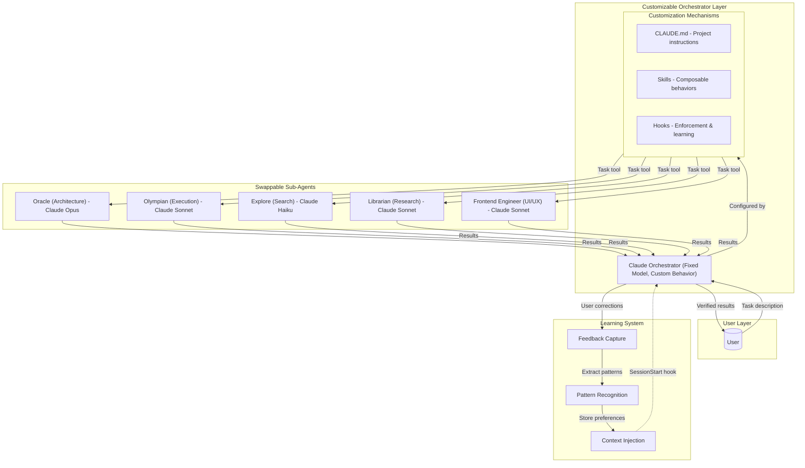
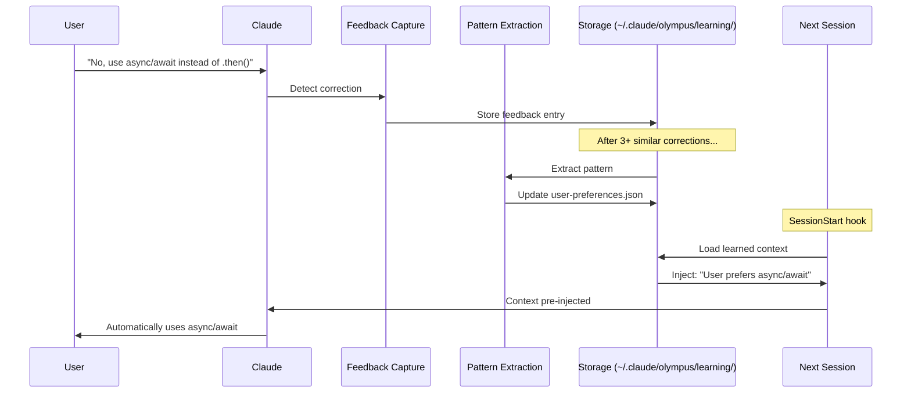
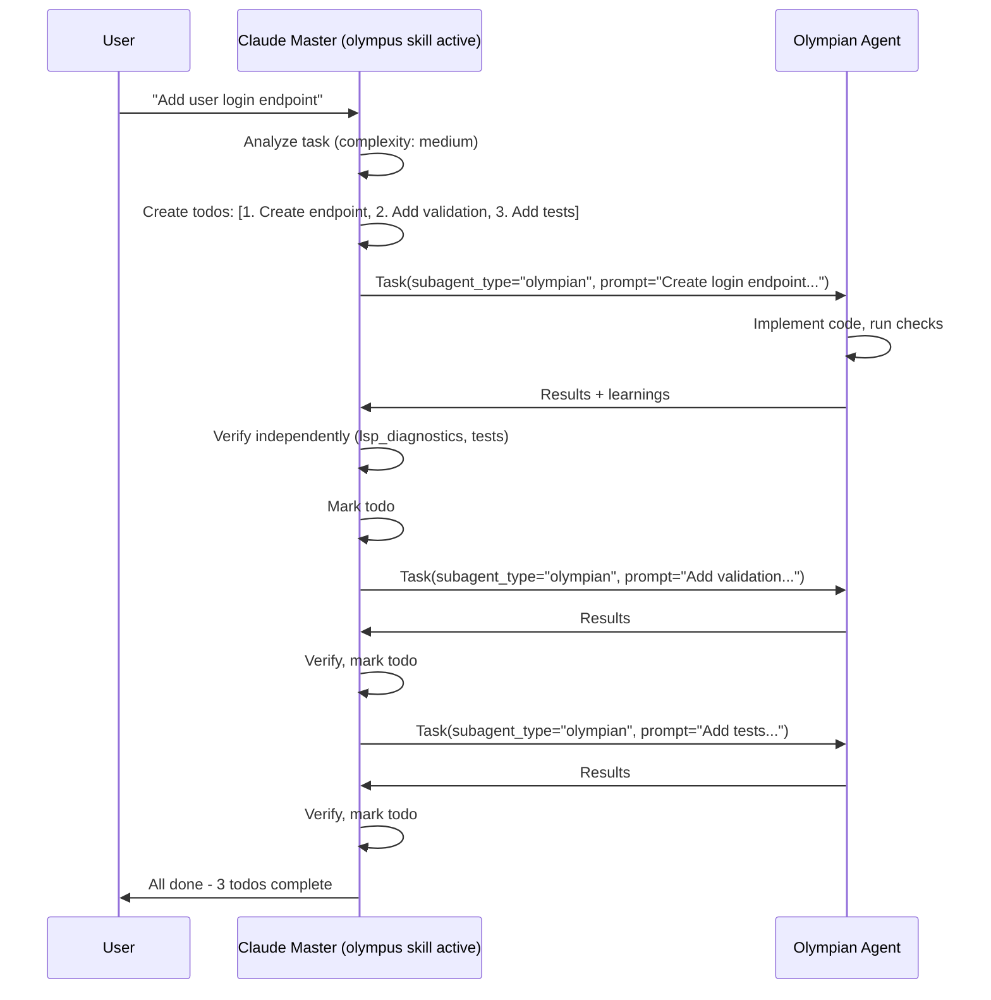
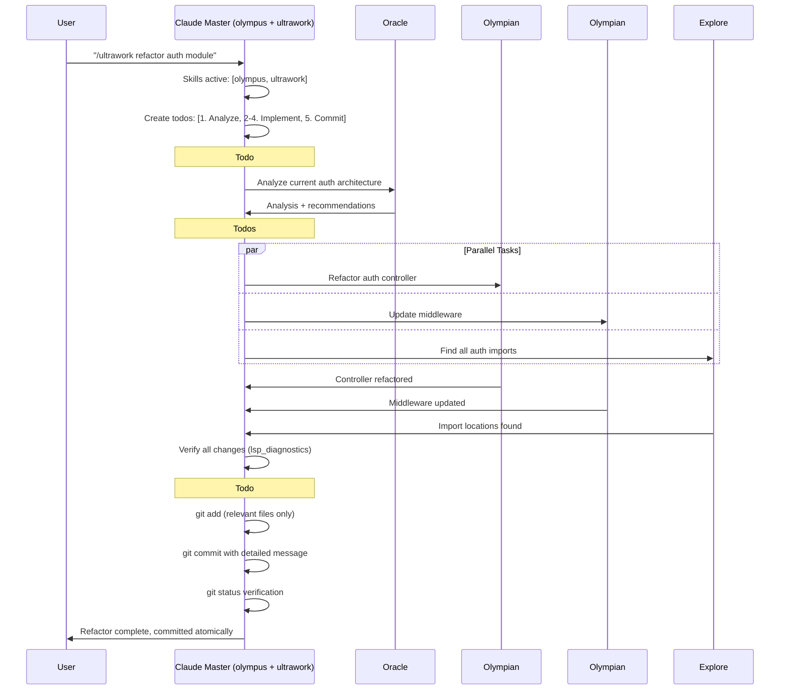
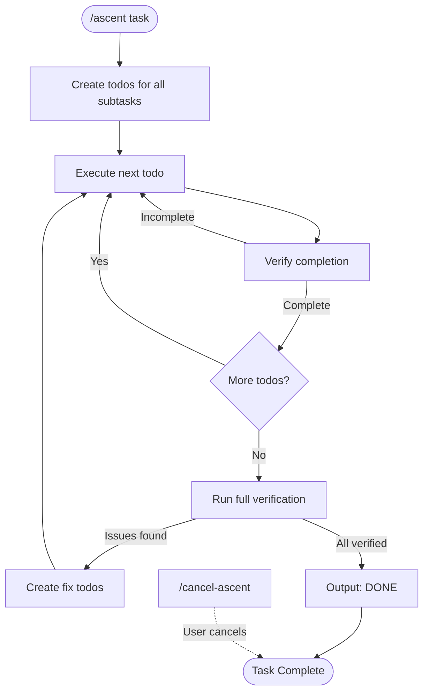

# Understanding the Olympus Orchestration System

Olympus transforms Claude Code from a single AI assistant into a coordinated team of specialized experts. This document explains how the skill-based orchestration system creates high-quality, reliable code through intelligent delegation and continuous learning.

---

## The Core Philosophy

Traditional AI coding follows a simple pattern: user asks → AI responds. This works for small tasks but fails for complex work because:

1. **Context overload**: Large tasks exceed effective working memory
2. **Skill mismatch**: One generalist can't match multiple specialists
3. **Verification gaps**: No systematic way to ensure completeness
4. **Learning loss**: Mistakes get repeated across sessions
5. **Human bottleneck**: Requires constant user intervention

Olympus solves these problems through **skill composition, specialization, and learning**.

---

## The Architecture: Three Layers of Customization

Olympus leverages Claude Code's full customization surface through a **three-layer architecture**: a fixed underlying model, a deeply customized orchestrator, and fully swappable specialized sub-agents.



---

## Layer 1: Skills (Behavior Injections)

### What Are Skills?

Skills are **behavior injections** that modify Claude's context and instructions. Each skill is a markdown file (`SKILL.md`) in `.claude/commands/{skill-name}/` that layers onto the master agent, enhancing its capabilities in specific ways.

**How Skills Work:**
```
User types: /olympus refactor auth
     ↓
Slash command handler loads: .claude/commands/olympus/SKILL.md
     ↓
Claude receives skill prompt injected into system context
     ↓
Claude operates under skill instructions until session ends
```

### Skill Categories

| Category | Skills | Purpose | Activation |
|----------|--------|---------|-----------|
| **Orchestration** | `olympus`, `prometheus`, `plan` | Primary work modes | Slash command or magic keyword |
| **Enhancement** | `ultrawork`, `ascent` | Special behaviors | Slash command or magic keyword |
| **Workflow** | `continue`, `complete-plan`, `retro` | AIDLC workflow management | Slash command |
| **Utility** | `deepsearch`, `analyze`, `review`, `doctor` | Targeted operations | Slash command or magic keyword |

**Important:** Skills are **additive behavior modifiers**. Multiple skills can be active simultaneously, with each contributing its specific behaviors to the master agent's context.

### Skill Usage Examples

```bash
# Orchestration mode
/olympus add user authentication
# Loads: .claude/commands/olympus/SKILL.md

# Planning mode (triggers AIDLC workflow)
/plan build authentication system
# Loads: .claude/commands/plan/SKILL.md → AIDLC pipeline

# Workflow resumption
/continue
# Resumes an in-progress AIDLC workflow from last checkpoint

# Persistence guarantee (stacks with other skills)
/ascent fix all failing tests
# Loads: .claude/commands/ascent/SKILL.md (can combine with olympus, ultrawork, etc.)
```

### Skill Activation Methods

Skills can be activated in two ways: **manual activation** (slash commands) or **automatic activation** (magic keywords).

**Automatic Activation (Magic Keywords):**

| Keyword | Patterns | Effect |
|---------|----------|--------|
| `ultrawork` | `ultrawork`, `ulw` | Persistent maximum performance mode |
| `olympus` | `olympus`, `orchestrate`, `coordinate`, `multi-agent`, `conductor` | Persistent orchestration mode |
| `search` | `search`, `find`, `locate`, `lookup`, `explore`, `discover`, `scan`, `grep` + more | Context injection for thorough search |
| `analyze` | `analyze`, `investigate`, `examine`, `research`, `debug`, `diagnose` + more | Context injection for deep analysis |
| `ultrathink` | `ultrathink`, `think` | Extended reasoning mode |

**Note:** Only `ultrawork` and `olympus` create persistent state (survives across messages). The others are one-shot context injections.

**Manual Activation (Slash Commands):**

- `/olympus` - Orchestration mode
- `/ultrawork` - Maximum performance mode
- `/prometheus` or `/plan` - Strategic planning / AIDLC workflow
- `/ascent` - Persistence guarantee
- `/continue` - Resume AIDLC workflow
- `/review` - Critical plan evaluation
- `/deepsearch` - Thorough codebase search
- `/analyze` - Deep analysis mode
- `/doctor` - Installation diagnostics
- `/retro` - Workflow retrospective

**Example:**
```bash
# Automatic activation via magic keyword
> ultrawork implement auth system
# Automatically activates ultrawork skill (persistent state)

# Automatic activation via olympus keyword
> orchestrate the API refactoring
# Detects "orchestrate" keyword, activates olympus mode

# Manual activation via slash command
> /ascent fix all failing tests
# Explicitly activates ascent persistence loop
```

---

## Layer 2: The Orchestrator (Customized Claude)

### Fixed Model, Customizable Agent

The underlying Claude model is fixed — you can't swap it for a different LLM. But the **agent built on top of that model** is deeply customizable through three mechanisms that Olympus fully leverages:

1. **CLAUDE.md** — Project and global instructions that define orchestrator behavior
2. **Skills** — Composable behavior injections loaded via slash commands or magic keywords
3. **Hooks** — TypeScript handlers that enforce patterns, capture learning, and inject context

```
┌─────────────────────────────────────────────────────────┐
│              CUSTOMIZABLE ORCHESTRATOR                    │
│         (Fixed Claude Model + Custom Behavior)           │
│                                                          │
│  ┌──────────────────┐  ┌──────────────────────────┐     │
│  │   CLAUDE.md       │  │     HOOKS                 │     │
│  │   Instructions    │  │     Enforcement & context │     │
│  └──────────────────┘  └──────────────────────────┘     │
│                                                          │
│  ┌────────────────────────────────────────────────┐     │
│  │           ACTIVE SKILL STACK                   │     │
│  │                                                 │     │
│  │  ┌─────────────────────────────────────────┐   │     │
│  │  │ ascent (Guarantee Layer)                │   │     │
│  │  └─────────────────────────────────────────┘   │     │
│  │                    ↓                            │     │
│  │  ┌─────────────────────────────────────────┐   │     │
│  │  │ ultrawork (Enhancement Layer)           │   │     │
│  │  └─────────────────────────────────────────┘   │     │
│  │                    ↓                            │     │
│  │  ┌─────────────────────────────────────────┐   │     │
│  │  │ olympus (Execution Layer)               │   │     │
│  │  └─────────────────────────────────────────┘   │     │
│  └────────────────────────────────────────────────┘     │
└─────────────────────────────────────────────────────────┘
```

### What the Master Agent Does

**Direct Execution** (No delegation needed):
- Read single files
- Quick searches (fewer than 10 results)
- Status checks and verification
- Single-line code changes
- Simple command execution

**Delegates to Sub-Agents**:
- Multi-file code changes
- Complex debugging/architecture
- Deep codebase exploration
- Specialized work (UI, docs, testing)
- Long-running analysis

### How Delegation Actually Works

Olympus enforces delegation through **two mechanisms**:

#### 1. Hook-Based Enforcement (Automatic)

When the master agent tries to Write/Edit files outside `.olympus/`, a hook intervenes:

```typescript
export function isAllowedPath(filePath: string): boolean {
  if (!filePath) return true;
  return filePath.includes('.olympus/');
}

export function processOrchestratorPreTool(input: ToolExecuteInput) {
  const { toolName, toolInput } = input;

  if (!isWriteEditTool(toolName)) {
    return { continue: true };
  }

  const filePath = toolInput?.filePath;

  if (!filePath || isAllowedPath(filePath)) {
    return { continue: true };
  }

  const warning = `
[CRITICAL - DELEGATION REQUIRED]

You are attempting to directly modify: ${filePath}

As an ORCHESTRATOR, you MUST:
1. DELEGATE implementation work via Task tool
2. VERIFY the work done by subagents
3. COORDINATE - you orchestrate, not implement
`;

  return { continue: true, message: warning };
}
```

**What happens in practice:**

```
Master Agent: [Tries to use Edit tool on src/auth.ts]
           ↓
Hook Intercepts: Returns { continue: false }
           ↓
Tool EXECUTION BLOCKED
           ↓
Master Agent: [Receives clear delegation error]
           ↓
Master Agent: [Must delegate to sub-agent to proceed]
```

**Important:** The hook **HARD BLOCKS** execution with `continue: false`. The tool cannot run, and Claude must delegate to a sub-agent to make the required changes. This enforces the orchestration pattern at the tool level.

#### 2. Skill Prompt Instructions (Guidance)

The olympus skill (`.claude/commands/olympus/SKILL.md`) contains explicit rules:

```markdown
**FUNDAMENTAL RULE: You NEVER work alone when specialists are available.**

### What You Do vs. Delegate

Direct Execution (No delegation):
✅ Read single files
✅ Quick searches (fewer than 10 results)
✅ Status checks and verification
✅ Single-line code changes

Delegates to Sub-Agents:
❌ Multi-file code changes
❌ Complex debugging/architecture
❌ Deep codebase exploration
❌ Specialized work (UI, docs, testing)
```

**Combined Effect:**

- **Skill prompt** tells Claude WHEN to delegate (guidance)
- **Hook system** prevents Claude from working directly (enforcement)
- **Verification reminders** appear after delegation (quality control)

---

## Layer 3: Sub-Agents (Swappable Specialists)

### The Specialized Workforce

Sub-agents are **fully custom, swappable specialists** defined as Markdown files with YAML frontmatter in `~/.claude/agents/`. Olympus installs 20+ agents, but you can add, modify, or remove them at any time. Each agent is spawned via the `Task` tool, operates independently, and reports back to the orchestrator.

| Agent | Model | Purpose | When to Use |
|-------|-------|---------|-------------|
| **Oracle** | Opus | Deep reasoning, architecture decisions | Complex problems, root cause analysis |
| **Olympian** | Sonnet | Focused task execution | Direct implementation, multi-file changes |
| **Librarian** | Sonnet | Documentation research | Finding docs, understanding patterns |
| **Explore** | Haiku | Fast codebase search | Quick file/pattern searches |
| **Frontend Engineer** | Sonnet | UI/UX work | Component design, styling, accessibility |
| **Document Writer** | Haiku | Technical writing | README, API docs, code comments |
| **Multimodal Looker** | Sonnet | Visual analysis | Screenshots, diagrams, mockups |
| **QA Tester** | Sonnet | Interactive testing | CLI testing with tmux sessions |
| **Prometheus** | Opus | Strategic planning | Work plans, requirement gathering |
| **Momus** | Opus | Critical review | Plan evaluation, risk assessment |
| **Metis** | Opus | Pre-planning analysis | Hidden requirements, gap detection |

### Smart Model Routing

Olympus optimizes cost by using **tiered variants** - same agent, different model sizes:

| Complexity | Haiku (LOW) | Sonnet (MEDIUM) | Opus (HIGH) |
|------------|-------------|-----------------|-------------|
| **Analysis** | `oracle-low` | `oracle-medium` | `oracle` |
| **Execution** | `olympian-low` | `olympian` | `olympian-high` |
| **Search** | `explore` | `explore-medium` | - |
| **Research** | `librarian-low` | `librarian` | - |
| **Frontend** | `frontend-engineer-low` | `frontend-engineer` | `frontend-engineer-high` |

**Routing Logic:**
- **Simple lookups** → Haiku (fast, cheap)
- **Standard work** → Sonnet (balanced)
- **Complex reasoning** → Opus (powerful, expensive)

### Real Delegation Example

Here's what actually happens when you ask Olympus to refactor authentication:

**User Request:**
```
> /olympus refactor the authentication module
```

**Master Agent Actions:**

1. **Creates Todos** (TaskCreate):
```
✓ Todo 1: Analyze current auth architecture
✓ Todo 2: Refactor auth controller
✓ Todo 3: Update middleware
✓ Todo 4: Verify all changes
```

2. **Delegates Analysis** (Task tool):
```typescript
Task({
  subagent_type: 'oracle',           // High complexity → Opus
  description: 'Analyze auth architecture',
  prompt: `Analyze the current authentication module architecture.

  Files to examine:
  - src/auth/controller.ts
  - src/auth/middleware.ts

  Provide:
  1. Current architecture assessment
  2. Refactoring recommendations
  3. Risk areas to watch

  MUST DO: Read all auth files
  MUST NOT: Make any changes`
})
```

3. **Receives Oracle Analysis:**
```
Oracle found:
- Auth uses outdated session pattern
- Recommends JWT with refresh tokens
- Risk: Breaking existing sessions
```

4. **Delegates Implementation** (parallel):
```typescript
// Launch two olympian agents in parallel
Task({ subagent_type: 'olympian', prompt: 'Refactor controller...' })
Task({ subagent_type: 'olympian', prompt: 'Update middleware...' })
```

5. **Verification After Delegation:**

Hook automatically adds reminder (from `src/hooks/olympus-orchestrator/constants.ts`):
```
**MANDATORY VERIFICATION - SUBAGENTS LIE**

Subagents FREQUENTLY claim completion when:
- Tests are actually FAILING
- Code has type/lint ERRORS
- Implementation is INCOMPLETE
- Patterns were NOT followed

**YOU MUST VERIFY EVERYTHING YOURSELF:**

1. Run tests yourself - Must PASS (not "agent said it passed")
2. Read the actual code - Must match requirements
3. Check build/typecheck - Must succeed

DO NOT TRUST THE AGENT'S SELF-REPORT.
VERIFY EACH CLAIM WITH YOUR OWN TOOL CALLS.
```

Master agent then verifies:
```typescript
Bash({ command: 'npm test' })           // Tests pass ✓
Bash({ command: 'npm run typecheck' })  // Types valid ✓
Read({ file: 'src/auth/controller.ts' }) // Code looks correct ✓
```

6. **Marks Todo Complete:**
```
TaskUpdate({ taskId: '2', status: 'completed' })
```

---

## Layer 4: Learning System (Continuous Improvement)

### The Silent Observer

Olympus **learns from your corrections** without explicit training commands. The learning system operates in the background across all sessions.



### Learning Phases

**Phase 1: Feedback Capture** (Passive)
- Detects corrections: "No, that's wrong"
- Identifies rejections: "Stop", "Cancel"
- Recognizes clarifications: "I meant X, not Y"
- Captures enhancements: "Also add Y"
- Records praise: "Perfect", "Great"
- Extracts explicit rules: "Always use X"

**Phase 2: Pattern Extraction** (Automated)
- Clusters similar feedback using Jaccard similarity
- Identifies recurring corrections (3+ occurrences)
- Categorizes: style, behavior, tooling, communication
- Applies 30-day decay for outdated patterns

**Phase 3: Preference Learning** (Inference)
- Infers verbosity level (concise vs. detailed)
- Determines autonomy preference (ask first vs. just do it)
- Tracks agent-specific performance
- Notes weak areas to watch

**Phase 4: Context Injection** (SessionStart)
- Automatically loads learned preferences at session start
- Injects relevant discoveries about your codebase
- Limits to ~500 tokens to avoid context bloat
- **Happens BEFORE first user message**

**Phase 5: Agent Discovery** (Active)
- Agents record technical insights during work
- Discoveries: gotchas, workarounds, patterns, dependencies
- Validated and deduplicated before storage
- Retrieved contextually in future sessions

### Storage Architecture

```
~/.claude/olympus/learning/          # Global preferences
├── feedback-log.jsonl               # All feedback (auto-rotates at 10k)
├── user-preferences.json            # Learned preferences
├── agent-performance.json           # Per-agent success/failure tracking
└── discoveries.jsonl                # Global discoveries

.olympus/learning/                   # Project-specific learning
├── session-state.json               # Current session state
├── patterns.json                    # Project conventions
└── discoveries.jsonl                # Project-specific insights
```

### Learning Example

**Session 1:**
```
You: "No, use TypeScript interfaces instead of types"
→ Feedback logged: correction, category=style
```

**Session 2:**
```
You: "Use interfaces, not type aliases"
→ Feedback logged: correction, category=style
→ Similarity detected with Session 1
```

**Session 3:**
```
You: "Always prefer interfaces over types"
→ Feedback logged: explicit preference
→ Pattern recognized (3+ occurrences)
→ Preference stored: "Use TypeScript interfaces over type aliases"
```

**Session 4+:**
```
[SessionStart hook injects learned context]
Claude automatically uses interfaces without being told
```

### Token Efficiency Learning

Olympus automatically tracks token usage across all agents to optimize cost without manual intervention.

**How It Works:**

Olympus monitors every agent execution and records:
- **Token Usage** - Input/output tokens consumed per agent
- **Success Rates** - Which agents succeed vs fail for specific task types
- **Performance Trends** - Whether agents are improving or declining in efficiency
- **Cost Breakdown** - Which models (Haiku/Sonnet/Opus) are most expensive for your workflows

**Automatic Optimization:**

```
Session 1-5: Olympus collects baseline metrics
→ Records: Oracle uses 5,000 tokens on average, 95% success rate

Session 6+: Smart Model Routing engages
→ Simple architectural analysis? Use oracle-low (Haiku) first
→ Complex refactoring? Escalate to oracle (Opus)
→ Routine lookups? Default to oracle-medium (Sonnet)

Session 10+: Efficiency Trends detected
→ Sees that oracle-low works 92% of the time
→ Routes more simple tasks to cheaper oracle-low
→ Saves 30% on simple analysis without quality loss
```

**What You See:**

View efficiency metrics anytime using the CLI:

```bash
# View agent efficiency rankings
olympus-ai learn --efficiency

# See cost breakdown by model
olympus-ai learn --show-costs

# Check current session token budget
olympus-ai learn --budget-status
```

**Example Output:**

```
Agent Efficiency Rankings
━━━━━━━━━━━━━━━━━━━━━━━━━━━━━━━━━━━━━━━━━━
1. explore (Haiku)       - 2.1x efficient  │ 95% success
2. olympian-low (Haiku)  - 1.8x efficient  │ 88% success
3. olympian (Sonnet)     - 1.5x efficient  │ 96% success
4. oracle-low (Haiku)    - 1.2x efficient  │ 82% success
5. oracle (Opus)         - 0.8x efficient  │ 100% success

Cost Breakdown (Last 30 Days)
━━━━━━━━━━━━━━━━━━━━━━━━━━━━━━━━━━━━━━━━━━
Haiku (explore)           $0.15 (32% of spend)
Sonnet (olympian)         $0.28 (60% of spend)
Opus (oracle)             $0.04 (8% of spend)

Session Token Budget
━━━━━━━━━━━━━━━━━━━━━━━━━━━━━━━━━━━━━━━━━━
Used:        45,000 / 100,000 tokens
Remaining:   55,000 tokens
Efficiency:  1.5x (better than baseline)
```

**Key Insight:** You don't need to do anything. Olympus learns token patterns silently in the background and automatically routes future tasks to the most efficient agents. The system emphasizes that token tracking and cost optimization happen automatically - no CLI commands required for the system to work, though you can inspect metrics anytime.

---

## The Olympus Workflow

### Simple Task Workflow



### Complex Multi-Skill Workflow



---

## Planning & AIDLC Workflow

For complex or multi-phase projects, the `/plan` command activates the **AIDLC (AI-Driven Development Life Cycle)** workflow — a structured pipeline that guides features from requirements through implementation.

### AIDLC Pipeline Overview

```
INCEPTION PHASE (What & Why)          CONSTRUCTION PHASE (How)           OPERATIONS (Future)
├── Workspace Detection (always)      ├── Per-Unit Loop:                 └── Placeholder
├── Reverse Engineering (brownfield)  │   ├── Functional Design
├── Requirements Analysis (always)    │   ├── NFR Requirements
├── User Stories (conditional)        │   ├── NFR Design
├── Workflow Planning (always)        │   ├── Infrastructure Design
├── Application Design (conditional)  │   └── Code Generation (always)
└── Units Generation (conditional)    └── Build & Test (always)
```

### How It Works

1. **`/plan <description>`** — Starts the AIDLC pipeline
2. **Workspace Detection** — Scans for existing code (greenfield vs brownfield)
3. **Requirements** — Gathers and documents requirements (adaptive depth)
4. **Workflow Planning** — Determines which stages to execute, at what depth
5. **Construction** — Delegates code generation to `olympian` agents per unit
6. **Build & Test** — Verifies everything compiles and passes tests

Each stage requires **explicit user approval** before proceeding. Progress is tracked in `aidlc-state.md` and `checkpoint.json`.

### Workflow Artifacts

```
aidlc-docs/{workflow-id}/
├── aidlc-state.md          # Human-readable progress tracker
├── checkpoint.json          # Machine-readable state (V3)
├── audit.md                 # Append-only interaction log
├── manifest.json            # Artifact registry
├── inception/               # Requirements, stories, design docs
│   ├── intent.md
│   ├── requirements.md
│   └── plans/
└── construction/            # Per-unit design and code summaries
    ├── {unit-name}/
    └── build-and-test/
```

### AIDLC Rules System

The installer deploys **26 rule files** to `~/.claude/olympus/rules/` that guide AI behavior at each stage:

- `rules/common/` — Shared rules (terminology, validation, question format, error handling)
- `rules/inception/` — Stage-specific rules for each inception stage
- `rules/construction/` — Stage-specific rules for each construction stage
- `rules/core-workflow.md` — Master workflow definition

These rules are loaded on-demand by the AI when executing each stage.

### Prometheus Interview Process

Before the AIDLC pipeline executes, Prometheus conducts a requirements interview:

1. **Clarifies requirements** through targeted questions
2. **Researches your codebase** to understand existing patterns
3. **Identifies constraints** (performance, compatibility, architecture)
4. **Generates detailed work plan** with tasks, acceptance criteria, and guardrails

### Workflow Commands

| Command | Purpose |
|---------|---------|
| `/plan <description>` | Start a new AIDLC workflow |
| `/continue` | Resume an in-progress workflow from last checkpoint |
| `/review [plan-path]` | Have Momus critically evaluate a plan |
| `/complete-plan [path]` | Verify and close out a completed plan |
| `/retro` | Run a retrospective on workflow guardrail events |

---

## The Ascent: Persistence Loop

The `/ascent` skill adds a **completion guarantee** - Claude cannot stop until the task is verified complete.



### How The Ascent Works

**Activation:**
```bash
/ascent implement the entire authentication system
```

**Behavior:**
1. Creates comprehensive todo list
2. Works through todos systematically
3. **Cannot skip verification** - each task must pass checks
4. **Cannot stop early** - continuation enforced if incomplete
5. Only exits via `<promise>DONE</promise>` or user cancellation

**Exit Conditions:**
- `<promise>DONE</promise>` - All work verified complete
- `/cancel-ascent` - User explicitly cancels
- "User says stop" — Ignored (continuation enforced)

**Note:** Maximum iterations are enforced to prevent infinite loops. The Ascent continues until completion, explicit cancellation, or iteration limit is reached.

**System Reminder:**
```
[SYSTEM REMINDER - TODO CONTINUATION]

You have incomplete todos! Complete ALL before responding:
- [x] Create user model
- [x] Add validation
- [ ] Write tests ← IN PROGRESS
- [ ] Add documentation

DO NOT respond until all todos are marked completed.
```

---

## Why This Architecture Works

### 1. Skill Composition

**Flexible Behavior Modification:**
- Skills stack on a single agent (context preserved)
- Natural language activation (no explicit mode switching)
- Judgment-based routing (Claude decides based on task)

**Example:**
```
Task: "Implement dashboard with multiple charts"

Auto-detected skills:
- olympus (primary execution mode)

Delegation:
- frontend-engineer agent handles UI components
```

### 2. Smart Delegation

**Efficiency Through Specialization:**
- Simple tasks: Master agent handles directly (fast)
- Complex tasks: Delegate to specialists (quality)
- Model routing: Right size for each task (cost optimized)

**Example:**
```
Task: "Fix authentication bug"

Master: Read relevant files (direct)
Master: Analyze issue (direct)
Master: Complex fix needed? → Delegate to Oracle (Opus)
Oracle: Returns architectural solution
Master: Verify fix (direct)
```

### 3. Continuous Learning

**Gets Better Over Time:**
- Passive feedback capture (no explicit training)
- Pattern recognition (3+ occurrences)
- Context injection (SessionStart hook)
- Project-specific insights (discoveries)

**Example:**
```
Session 1-2: You correct Claude multiple times
Session 3+: Pattern recognized, preference stored
Session 4+: Behavior automatically corrected
```

### 4. Verification at Every Step

**Trust But Verify:**
- Master agent never trusts sub-agent claims
- Runs independent verification (lsp_diagnostics, tests)
- Checks actual file changes
- Cross-references requirements

**Example:**
```
Olympian: "I've implemented the feature"
Master: [Runs lsp_diagnostics - finds TypeScript error]
Master: [Re-delegates with error context]
Olympian: [Fixes error]
Master: [Verifies again - passes]
Master: Task complete
```

---

## Comparison: Olympus vs. Manual Claude Usage

| Feature | Manual Claude | Olympus |
|---------|---------------|---------|
| **Multi-Step Tasks** | Manual tracking, easy to lose context | Automatic todo management, progress tracked |
| **Parallelization** | Sequential only | 3-5x faster with concurrent sub-agents |
| **Learning** | Repeats same mistakes | Learns from corrections automatically |
| **Specialization** | Generic responses | 19 experts for specific domains |
| **Model Selection** | Manual tier switching | Smart routing (Haiku/Sonnet/Opus) |
| **Completion** | Stops when you say stop | Continues until verified complete (ascent) |
| **Planning** | Ad-hoc | Strategic planning workflow (prometheus) |
| **UI/UX Work** | Generic implementation | Specialized frontend-engineer agent |

---

## Getting Started

### Quick Start (Simplest Path)

```bash
# Just use magic keywords in your prompt
claude

> ultrawork implement user authentication

# That's it! Olympus automatically:
# - Activates olympus + ultrawork skills
# - Spawns parallel agents as needed
# - Tracks todos
# - Learns from your feedback
```

### Planning First (Complex Projects)

```bash
# 1. Create a strategic plan
> /plan build a task management application

[Prometheus interviews you about requirements]

# 2. Review the plan (optional)
> /review .olympus/plans/task-management.md

# 3. Execute the plan
> /olympus

# Olympus reads the plan and implements it
```

### Maximum Intensity (Ultrawork Mode)

```bash
# Parallel everything, maximum speed
> /ultrawork refactor entire API layer

# What happens:
# - Multiple olympian agents spawn in parallel
# - Independent modules refactored simultaneously
# - Atomic commits created for each logical change
# - Full verification before declaring complete
```

### Persistence Loop (Must-Complete Tasks)

```bash
# Cannot stop until done
> /ascent fix all failing tests

# What happens:
# - Creates todos for each failing test
# - Works through systematically
# - Cannot exit until ALL tests pass
# - Continuation enforced if stopped early
```

---

## Advanced Topics

### Custom Skill Combinations

Manually combine skills for specific workflows:

```bash
# Plan, then implement with ascent guarantee
> /plan build authentication
[answer questions]
> /ascent /olympus

# Frontend work with delegation
> /olympus build dashboard
# Olympus delegates UI work to frontend-engineer agent
```

### Managing Learning Data

```bash
# View what Olympus has learned
olympus-ai learn --show

# View statistics
olympus-ai learn --stats

# Clean up old data (180+ days)
olympus-ai learn --cleanup

# Forget all learnings (fresh start)
olympus-ai learn --forget
```

### Project-Specific Configuration

Create `.claude/CLAUDE.md` in your project:

```markdown
# Project Context

This is a TypeScript monorepo using:
- React 18 for frontend
- Node.js backend with Express
- PostgreSQL database with Prisma ORM

## Conventions

- Use functional components with hooks
- All API routes in /src/api
- Tests colocated with source files
- Use kebab-case for filenames
```

---

## Further Reading

- [Installation Guide](../getting-started/installation) - Step-by-step setup
- [Overview](../getting-started/overview) - Quick start and feature summary
- [Workflow Guide](../guides/workflow) - Practical workflow selection guide
- [Learning System](../guides/learning-system) - Deep dive into the learning system

---

## Summary

Olympus orchestration = **Fixed Model** + **Customizable Orchestrator** + **Swappable Agents** + **Continuous Learning**

**Key Takeaways:**
1. The underlying Claude model is fixed — the orchestrator built on it is deeply customizable (CLAUDE.md + skills + hooks)
2. Sub-agents are fully swappable specialists defined in `~/.claude/agents/`
3. Learning happens automatically from corrections
4. Verification at every step (never trust, always verify)
5. Smart model routing (Haiku/Sonnet/Opus) optimizes cost

**The Result:** A coding assistant that gets better over time, coordinates specialized experts, and never stops until the job is done.
