# Understanding the Olympus Orchestration System

Olympus transforms Claude Code from a single AI assistant into a coordinated team of specialized experts. This document explains how the skill-based orchestration system creates high-quality, reliable code through intelligent delegation and continuous learning.

---

## The Core Philosophy

Traditional AI coding follows a simple pattern: user asks → AI responds. This works for small tasks but fails for complex work because:

1. **Context overload**: Large tasks exceed effective working memory
2. **Skill mismatch**: One generalist can't match multiple specialists
3. **Verification gaps**: No systematic way to ensure completeness
4. **Learning loss**: Mistakes get repeated across sessions
5. **Human bottleneck**: Requires constant user intervention

Olympus solves these problems through **skill composition, specialization, and learning**.

---

## The Architecture: Skills, Not Roles

Unlike traditional orchestration systems with fixed roles (planner → orchestrator → executor), Olympus uses **composable skills** that layer onto a single master agent.

```mermaid
flowchart TB
    subgraph User["User Layer"]
        Human[("👤 User")]
    end

    subgraph Master["Master Agent Layer"]
        Claude["🧠 Claude Master Agent<br/>(Fixed - Cannot Swap)"]

        subgraph Skills["Active Skills (Stacked)"]
            Guarantee["🔒 Guarantee Layer<br/>ascent"]
            Enhancement["⚡ Enhancement Layer<br/>ultrawork + git-master"]
            Execution["🎯 Execution Layer<br/>olympus/prometheus"]
        end

        Claude -->|"Skill injection"| Skills
    end

    subgraph Workers["Specialized Sub-Agents"]
        Oracle["🧠 Oracle<br/>(Architecture)<br/>Claude Opus"]
        Olympian["⚡ Olympian<br/>(Execution)<br/>Claude Sonnet"]
        Explore["🔍 Explore<br/>(Search)<br/>Claude Haiku"]
        Librarian["📚 Librarian<br/>(Research)<br/>Claude Sonnet"]
        Frontend["🎨 Frontend Engineer<br/>(UI/UX)<br/>Claude Sonnet"]
    end

    subgraph Learning["Learning System"]
        Feedback["💾 Feedback Capture"]
        Patterns["🧩 Pattern Recognition"]
        Context["📋 Context Injection"]
    end

    Human -->|"Task description"| Claude
    Skills -->|"Task tool"| Oracle
    Skills -->|"Task tool"| Olympian
    Skills -->|"Task tool"| Explore
    Skills -->|"Task tool"| Librarian
    Skills -->|"Task tool"| Frontend

    Oracle -->|"Results"| Claude
    Olympian -->|"Results"| Claude
    Explore -->|"Results"| Claude
    Librarian -->|"Results"| Claude
    Frontend -->|"Results"| Claude

    Claude -->|"User corrections"| Feedback
    Feedback -->|"Extract patterns"| Patterns
    Patterns -->|"Store preferences"| Context
    Context -.->|"SessionStart hook"| Claude

    Claude -->|"Verified results"| Human
```



---

## Layer 1: Skills (Independent Commands)

### What Are Skills?

Skills are **slash commands** that activate specific behavior modes for the master agent. Each skill is an independent markdown file in `.claude/commands/` that modifies Claude's instructions for that session.

**How Skills Work:**
```
User types: /olympus refactor auth
     ↓
Slash command handler loads: .claude/commands/olympus/skill.md
     ↓
Claude receives skill prompt injected into system context
     ↓
Claude operates under skill instructions until session ends
```

### Skill Categories

| Category | Skills | Purpose | Can Chain? |
|----------|--------|---------|------------|
| **Orchestration** | `olympus`, `prometheus` | Primary work modes | No - one at a time |
| **Enhancement** | `ultrawork`, `git-master`, `frontend-ui-ux` | Special behaviors | Manual activation only |
| **Persistence** | `ascent` | Enforce completion | Yes - chain with others |

**Important:** Skills do NOT automatically "stack" or "compose". Each is activated manually via slash command.

### Skill Usage Examples

```bash
# Orchestration mode
/olympus add user authentication
# Loads: .claude/commands/olympus/skill.md

# Planning mode (different workflow)
/plan build authentication system
# Loads: .claude/commands/plan/skill.md → prometheus agent

# Manual enhancement (must explicitly invoke)
/git-master
/olympus refactor API layer
# Loads git-master skill, then olympus skill

# Persistence guarantee
/ascent fix all failing tests
# Loads: .claude/commands/ascent/skill.md
```

### Magic Keywords (Auto-Detection)

Olympus has **magic keyword detection** for a limited set of skills. Most skills require manual activation.

**Actually Implemented:**

| Keyword | Auto-Activated Behavior | Implementation |
|---------|------------------------|----------------|
| `ultrawork`, `ulw`, `uw` | Maximum performance mode | `src/features/magic-keywords.ts` |
| `search`, `deepsearch` | Thorough codebase search | `src/features/magic-keywords.ts` |
| `analyze` | Deep analysis mode | `src/features/magic-keywords.ts` |
| `ultrathink` | Extended reasoning | `src/features/magic-keywords.ts` |

**Requires Manual Activation:**

- `/git-master` - NOT auto-detected
- `/frontend-ui-ux` - NOT auto-detected
- `/ascent` - NOT auto-detected
- `/prometheus` - Use `/plan` instead

**Example:**
```bash
# Magic keyword (auto-detected)
> ultrawork implement auth system
# Automatically loads ultrawork behavior

# Manual activation required
> /git-master
> /olympus refactor API layer
# Must explicitly invoke /git-master first
```

---

## Layer 2: The Master Agent (Claude)

### Fixed Master with Skill Enhancement

Claude Code provides a **fixed master agent** - you can't swap it out, but you can dramatically modify its behavior through skills.

```
┌─────────────────────────────────────────────────────────┐
│                    CLAUDE MASTER AGENT                   │
│                                                          │
│  ┌────────────────────────────────────────────────┐     │
│  │           ACTIVE SKILL STACK                   │     │
│  │                                                 │     │
│  │  ┌─────────────────────────────────────────┐   │     │
│  │  │ ascent (Guarantee Layer)                │   │     │
│  │  └─────────────────────────────────────────┘   │     │
│  │                    ↓                            │     │
│  │  ┌─────────────────────────────────────────┐   │     │
│  │  │ ultrawork (Enhancement Layer)           │   │     │
│  │  └─────────────────────────────────────────┘   │     │
│  │                    ↓                            │     │
│  │  ┌─────────────────────────────────────────┐   │     │
│  │  │ olympus (Execution Layer)               │   │     │
│  │  └─────────────────────────────────────────┘   │     │
│  └────────────────────────────────────────────────┘     │
└─────────────────────────────────────────────────────────┘
```

### What the Master Agent Does

**Direct Execution** (No delegation needed):
- ✅ Read single files
- ✅ Quick searches (<10 results)
- ✅ Status checks and verification
- ✅ Single-line code changes
- ✅ Simple command execution

**Delegates to Sub-Agents**:
- ❌ Multi-file code changes
- ❌ Complex debugging/architecture
- ❌ Deep codebase exploration
- ❌ Specialized work (UI, docs, testing)
- ❌ Long-running analysis

### How Delegation Actually Works

Olympus enforces delegation through **two mechanisms**:

#### 1. Hook-Based Enforcement (Automatic)

When the master agent tries to Write/Edit files outside `.olympus/`, a hook intervenes:

```typescript
// Real code from src/hooks/olympus-orchestrator/index.ts

export function isAllowedPath(filePath: string): boolean {
  if (!filePath) return true;
  return filePath.includes('.olympus/'); // Only .olympus/ is allowed
}

export function processOrchestratorPreTool(input: ToolExecuteInput) {
  const { toolName, toolInput } = input;

  if (!isWriteEditTool(toolName)) {
    return { continue: true };
  }

  const filePath = toolInput?.filePath;

  // Block direct code edits
  if (!filePath || isAllowedPath(filePath)) {
    return { continue: true };
  }

  // Inject warning before tool executes
  const warning = `
[CRITICAL - DELEGATION REQUIRED]

You are attempting to directly modify: ${filePath}

As an ORCHESTRATOR, you MUST:
1. DELEGATE implementation work via Task tool
2. VERIFY the work done by subagents
3. COORDINATE - you orchestrate, not implement

CORRECT APPROACH:
Task tool with subagent_type="olympian"
prompt="[specific single task]"
`;

  return { continue: true, message: warning };
}
```

**What happens in practice:**

```
Master Agent: [Tries to use Edit tool on src/auth.ts]
           ↓
Hook Intercepts: Returns { continue: true, message: "WARNING..." }
           ↓
Tool STILL EXECUTES (not blocked!)
           ↓
Master Agent: [Sees warning message in output]
           ↓
Master Agent: [Learns to delegate next time]
```

**Important:** The hook **WARNS but does NOT BLOCK** execution. The tool still runs, but Claude receives guidance to delegate instead in future interactions.

#### 2. Skill Prompt Instructions (Guidance)

The olympus skill (.claude/commands/olympus/skill.md) contains explicit rules:

```markdown
**FUNDAMENTAL RULE: You NEVER work alone when specialists are available.**

### What You Do vs. Delegate

Direct Execution (No delegation):
✅ Read single files
✅ Quick searches (<10 results)
✅ Status checks and verification
✅ Single-line code changes

Delegates to Sub-Agents:
❌ Multi-file code changes
❌ Complex debugging/architecture
❌ Deep codebase exploration
❌ Specialized work (UI, docs, testing)
```

**Combined Effect:**

- **Skill prompt** tells Claude WHEN to delegate (guidance)
- **Hook system** prevents Claude from working directly (enforcement)
- **Verification reminders** appear after delegation (quality control)

---

## Layer 3: Sub-Agents (Specialists)

### The Specialized Workforce

Sub-agents are **single-purpose experts** spawned via the `Task` tool. They operate independently but report back to the master agent.

| Agent | Model | Purpose | When to Use |
|-------|-------|---------|-------------|
| **Oracle** | Opus | Deep reasoning, architecture decisions | Complex problems, root cause analysis |
| **Olympian** | Sonnet | Focused task execution | Direct implementation, multi-file changes |
| **Librarian** | Sonnet | Documentation research | Finding docs, understanding patterns |
| **Explore** | Haiku | Fast codebase search | Quick file/pattern searches |
| **Frontend Engineer** | Sonnet | UI/UX work | Component design, styling, accessibility |
| **Document Writer** | Haiku | Technical writing | README, API docs, code comments |
| **Multimodal Looker** | Sonnet | Visual analysis | Screenshots, diagrams, mockups |
| **QA Tester** | Sonnet | Interactive testing | CLI testing with tmux sessions |
| **Prometheus** | Opus | Strategic planning | Work plans, requirement gathering |
| **Momus** | Opus | Critical review | Plan evaluation, risk assessment |
| **Metis** | Opus | Pre-planning analysis | Hidden requirements, gap detection |

### Smart Model Routing

Olympus optimizes cost by using **tiered variants** - same agent, different model sizes:

| Complexity | Haiku (LOW) | Sonnet (MEDIUM) | Opus (HIGH) |
|------------|-------------|-----------------|-------------|
| **Analysis** | `oracle-low` | `oracle-medium` | `oracle` |
| **Execution** | `olympian-low` | `olympian` | `olympian-high` |
| **Search** | `explore` | `explore-medium` | - |
| **Research** | `librarian-low` | `librarian` | - |
| **Frontend** | `frontend-engineer-low` | `frontend-engineer` | `frontend-engineer-high` |

**Routing Logic:**
- **Simple lookups** → Haiku (fast, cheap)
- **Standard work** → Sonnet (balanced)
- **Complex reasoning** → Opus (powerful, expensive)

### Real Delegation Example

Here's what actually happens when you ask Olympus to refactor authentication:

**User Request:**
```
> /olympus refactor the authentication module
```

**Master Agent Actions:**

1. **Creates Todos** (TaskCreate):
```
✓ Todo 1: Analyze current auth architecture
✓ Todo 2: Refactor auth controller
✓ Todo 3: Update middleware
✓ Todo 4: Verify all changes
```

2. **Delegates Analysis** (Task tool):
```typescript
Task({
  subagent_type: 'oracle',           // High complexity → Opus
  description: 'Analyze auth architecture',
  prompt: `Analyze the current authentication module architecture.

  Files to examine:
  - src/auth/controller.ts
  - src/auth/middleware.ts

  Provide:
  1. Current architecture assessment
  2. Refactoring recommendations
  3. Risk areas to watch

  MUST DO: Read all auth files
  MUST NOT: Make any changes`
})
```

3. **Receives Oracle Analysis:**
```
Oracle found:
- Auth uses outdated session pattern
- Recommends JWT with refresh tokens
- Risk: Breaking existing sessions
```

4. **Delegates Implementation** (parallel):
```typescript
// Launch two olympian agents in parallel
Task({ subagent_type: 'olympian', prompt: 'Refactor controller...' })
Task({ subagent_type: 'olympian', prompt: 'Update middleware...' })
```

5. **Verification After Delegation:**

Hook automatically adds reminder (from `src/hooks/olympus-orchestrator/constants.ts`):
```
**MANDATORY VERIFICATION - SUBAGENTS LIE**

Subagents FREQUENTLY claim completion when:
- Tests are actually FAILING
- Code has type/lint ERRORS
- Implementation is INCOMPLETE
- Patterns were NOT followed

**YOU MUST VERIFY EVERYTHING YOURSELF:**

1. Run tests yourself - Must PASS (not "agent said it passed")
2. Read the actual code - Must match requirements
3. Check build/typecheck - Must succeed

DO NOT TRUST THE AGENT'S SELF-REPORT.
VERIFY EACH CLAIM WITH YOUR OWN TOOL CALLS.
```

Master agent then verifies:
```typescript
Bash({ command: 'npm test' })           // Tests pass ✓
Bash({ command: 'npm run typecheck' })  // Types valid ✓
Read({ file: 'src/auth/controller.ts' }) // Code looks correct ✓
```

6. **Marks Todo Complete:**
```
TaskUpdate({ taskId: '2', status: 'completed' })
```

---

## Layer 4: Learning System (Continuous Improvement)

### The Silent Observer

Olympus **learns from your corrections** without explicit training commands. The learning system operates in the background across all sessions.


### Learning Phases

**Phase 1: Feedback Capture** (Passive)
- Detects corrections: "No, that's wrong"
- Identifies rejections: "Stop", "Cancel"
- Recognizes clarifications: "I meant X, not Y"
- Captures enhancements: "Also add Y"
- Records praise: "Perfect", "Great"
- Extracts explicit rules: "Always use X"

**Phase 2: Pattern Extraction** (Automated)
- Clusters similar feedback using Jaccard similarity
- Identifies recurring corrections (3+ occurrences)
- Categorizes: style, behavior, tooling, communication
- Applies 30-day decay for outdated patterns

**Phase 3: Preference Learning** (Inference)
- Infers verbosity level (concise vs. detailed)
- Determines autonomy preference (ask first vs. just do it)
- Tracks agent-specific performance
- Notes weak areas to watch

**Phase 4: Context Injection** (SessionStart)
- Automatically loads learned preferences at session start
- Injects relevant discoveries about your codebase
- Limits to ~500 tokens to avoid context bloat
- **Happens BEFORE first user message**

**Phase 5: Agent Discovery** (Active)
- Agents record technical insights during work
- Discoveries: gotchas, workarounds, patterns, dependencies
- Validated and deduplicated before storage
- Retrieved contextually in future sessions

### Storage Architecture

```
~/.claude/olympus/learning/          # Global preferences
├── feedback-log.jsonl               # All feedback (auto-rotates at 10k)
├── user-preferences.json            # Learned preferences
├── agent-performance.json           # Per-agent success/failure tracking
└── discoveries.jsonl                # Global discoveries

.olympus/learning/                   # Project-specific learning
├── session-state.json               # Current session state
├── patterns.json                    # Project conventions
└── discoveries.jsonl                # Project-specific insights
```

### Learning Example

**Session 1:**
```
You: "No, use TypeScript interfaces instead of types"
→ Feedback logged: correction, category=style
```

**Session 2:**
```
You: "Use interfaces, not type aliases"
→ Feedback logged: correction, category=style
→ Similarity detected with Session 1
```

**Session 3:**
```
You: "Always prefer interfaces over types"
→ Feedback logged: explicit preference
→ Pattern recognized (3+ occurrences)
→ Preference stored: "Use TypeScript interfaces over type aliases"
```

**Session 4+:**
```
[SessionStart hook injects learned context]
Claude automatically uses interfaces without being told
```

---

## The Olympus Workflow

### Simple Task Workflow

```mermaid
sequenceDiagram
    participant User
    participant Master as Claude Master<br/>(olympus skill active)
    participant Sub as Olympian Agent

    User->>Master: "Add user login endpoint"
    Master->>Master: Analyze task (complexity: medium)
    Master->>Master: Create todos: [1. Create endpoint, 2. Add validation, 3. Add tests]
    Master->>Sub: Task(subagent_type="olympian", prompt="Create login endpoint...")
    Sub->>Sub: Implement code, run checks
    Sub->>Master: Results + learnings
    Master->>Master: Verify independently (lsp_diagnostics, tests)
    Master->>Master: Mark todo #1 complete
    Master->>Sub: Task(subagent_type="olympian", prompt="Add validation...")
    Sub->>Master: Results
    Master->>Master: Verify, mark todo #2 complete
    Master->>Sub: Task(subagent_type="olympian", prompt="Add tests...")
    Sub->>Master: Results
    Master->>Master: Verify, mark todo #3 complete
    Master->>User: ✅ All done - 3 todos complete
```



### Complex Multi-Skill Workflow

```mermaid
sequenceDiagram
    participant User
    participant Master as Claude Master<br/>(olympus + ultrawork<br/>+ git-master)
    participant Oracle
    participant Olympian1 as Olympian #1
    participant Olympian2 as Olympian #2
    participant Explore

    User->>Master: "/ultrawork refactor auth module"
    Master->>Master: Skills active: [olympus, ultrawork, git-master]
    Master->>Master: Create todos: [1. Analyze, 2-4. Implement, 5. Commit]

    Note over Master: Todo #1: Architecture analysis
    Master->>Oracle: Analyze current auth architecture
    Oracle->>Master: Analysis + recommendations

    Note over Master: Todos #2-4: Parallel execution
    par Parallel Tasks
        Master->>Olympian1: Refactor auth controller
        and
        Master->>Olympian2: Update middleware
        and
        Master->>Explore: Find all auth imports
    end

    Olympian1->>Master: Controller refactored
    Olympian2->>Master: Middleware updated
    Explore->>Master: Import locations found

    Master->>Master: Verify all changes (lsp_diagnostics)

    Note over Master: Todo #5: Atomic commit (git-master)
    Master->>Master: git add (relevant files only)
    Master->>Master: git commit with detailed message
    Master->>Master: git status verification

    Master->>User: ✅ Refactor complete, committed atomically
```



---

## Planning Workflow (Prometheus Skill)

For complex or multi-phase projects, activate the `prometheus` skill to create a strategic plan before execution.


### Prometheus Interview Process

**What Prometheus Does:**
1. **Clarifies requirements** through targeted questions
2. **Researches your codebase** to understand existing patterns
3. **Identifies constraints** (performance, compatibility, architecture)
4. **Generates detailed work plan** with tasks, acceptance criteria, and guardrails
5. **Saves plan** to `.olympus/plans/` for execution

**Example Interview:**
```
User: /plan add OAuth 2.0 authentication

Prometheus: I'll help you plan the OAuth 2.0 implementation.

[Launches explore agent to find existing auth code]

Questions:
1. Which OAuth provider(s)? (Google, GitHub, custom, etc.)
2. Do you have existing user sessions to integrate with?
3. Token storage preference? (JWT, server-side sessions, etc.)
4. Required scopes/permissions?

[User answers questions]

[Launches librarian to research OAuth best practices]

Creating comprehensive work plan...

Plan saved to: .olympus/plans/oauth-implementation.md

Ready to implement? Run: /olympus
Want review first? Run: /review .olympus/plans/oauth-implementation.md
```

---

## The Ascent: Persistence Loop

The `/ascent` skill adds a **completion guarantee** - Claude cannot stop until the task is verified complete.


### How The Ascent Works

**Activation:**
```bash
/ascent implement the entire authentication system
```

**Behavior:**
1. Creates comprehensive todo list
2. Works through todos systematically
3. **Cannot skip verification** - each task must pass checks
4. **Cannot stop early** - continuation enforced if incomplete
5. Only exits via `<promise>DONE</promise>` or user cancellation

**Exit Conditions:**
- ✅ `<promise>DONE</promise>` - All work verified complete
- ✅ `/cancel-ascent` - User explicitly cancels
- ❌ ~~User says "stop"~~ - Ignored (continuation enforced)

**Note:** No iteration limit is enforced. The Ascent continues until completion or explicit cancellation.

**System Reminder:**
```
[SYSTEM REMINDER - TODO CONTINUATION]

You have incomplete todos! Complete ALL before responding:
- [x] Create user model
- [x] Add validation
- [ ] Write tests ← IN PROGRESS
- [ ] Add documentation

DO NOT respond until all todos are marked completed.
```

---

## Why This Architecture Works

### 1. Skill Composition

**Flexible Behavior Modification:**
- Skills stack on a single agent (context preserved)
- Natural language activation (no explicit mode switching)
- Judgment-based routing (Claude decides based on task)

**Example:**
```
Task: "Implement dashboard with multiple charts"

Auto-detected skills:
- olympus (primary execution mode)
- frontend-ui-ux (UI work detected)

Result: Same context, enhanced with UI expertise
```

### 2. Smart Delegation

**Efficiency Through Specialization:**
- Simple tasks: Master agent handles directly (fast)
- Complex tasks: Delegate to specialists (quality)
- Model routing: Right size for each task (cost optimized)

**Example:**
```
Task: "Fix authentication bug"

Master: Read relevant files (direct)
Master: Analyze issue (direct)
Master: Complex fix needed? → Delegate to Oracle (Opus)
Oracle: Returns architectural solution
Master: Verify fix (direct)
```

### 3. Continuous Learning

**Gets Better Over Time:**
- Passive feedback capture (no explicit training)
- Pattern recognition (3+ occurrences)
- Context injection (SessionStart hook)
- Project-specific insights (discoveries)

**Example:**
```
Session 1-2: You correct Claude multiple times
Session 3+: Pattern recognized, preference stored
Session 4+: Behavior automatically corrected
```

### 4. Verification at Every Step

**Trust But Verify:**
- Master agent never trusts sub-agent claims
- Runs independent verification (lsp_diagnostics, tests)
- Checks actual file changes
- Cross-references requirements

**Example:**
```
Olympian: "I've implemented the feature"
Master: [Runs lsp_diagnostics - finds TypeScript error]
Master: [Re-delegates with error context]
Olympian: [Fixes error]
Master: [Verifies again - passes]
Master: ✅ Task complete
```

---

## Comparison: Olympus vs. Manual Claude Usage

| Feature | Manual Claude | Olympus |
|---------|---------------|---------|
| **Multi-Step Tasks** | Manual tracking, easy to lose context | Automatic todo management, progress tracked |
| **Parallelization** | Sequential only | 3-5x faster with concurrent sub-agents |
| **Learning** | Repeats same mistakes | Learns from corrections automatically |
| **Specialization** | Generic responses | 20+ experts for specific domains |
| **Model Selection** | Manual tier switching | Smart routing (Haiku/Sonnet/Opus) |
| **Completion** | Stops when you say stop | Continues until verified complete (ascent) |
| **Planning** | Ad-hoc | Strategic planning workflow (prometheus) |
| **Git Commits** | Manual or generic | Atomic commits with style detection (git-master) |
| **UI/UX Work** | Generic implementation | Design-first approach (frontend-ui-ux) |

---

## Getting Started

### Quick Start (Simplest Path)

```bash
# Just use magic keywords in your prompt
claude

> ultrawork implement user authentication

# That's it! Olympus automatically:
# - Activates olympus + ultrawork skills
# - Spawns parallel agents as needed
# - Tracks todos
# - Learns from your feedback
```

### Planning First (Complex Projects)

```bash
# 1. Create a strategic plan
> /plan build a task management application

[Prometheus interviews you about requirements]

# 2. Review the plan (optional)
> /review .olympus/plans/task-management.md

# 3. Execute the plan
> /olympus

# Olympus reads the plan and implements it
```

### Maximum Intensity (Ultrawork Mode)

```bash
# Parallel everything, maximum speed
> /ultrawork refactor entire API layer

# What happens:
# - Multiple olympian agents spawn in parallel
# - Independent modules refactored simultaneously
# - Atomic commits created for each logical change
# - Full verification before declaring complete
```

### Persistence Loop (Must-Complete Tasks)

```bash
# Cannot stop until done
> /ascent fix all failing tests

# What happens:
# - Creates todos for each failing test
# - Works through systematically
# - Cannot exit until ALL tests pass
# - Continuation enforced if stopped early
```

---

## Advanced Topics

### Custom Skill Combinations

Manually combine skills for specific workflows:

```bash
# Plan, then implement with ascent guarantee
> /plan build authentication
[answer questions]
> /ascent /olympus

# Frontend work with git commits
> /olympus build dashboard
# Skills: [olympus + frontend-ui-ux + git-master]
```

### Managing Learning Data

```bash
# View what Olympus has learned
olympus-ai learn --show

# View statistics
olympus-ai learn --stats

# Clean up old data (180+ days)
olympus-ai learn --cleanup

# Forget all learnings (fresh start)
olympus-ai learn --forget
```

### Project-Specific Configuration

Create `.claude/CLAUDE.md` in your project:

```markdown
# Project Context

This is a TypeScript monorepo using:
- React 18 for frontend
- Node.js backend with Express
- PostgreSQL database with Prisma ORM

## Conventions

- Use functional components with hooks
- All API routes in /src/api
- Tests colocated with source files
- Use kebab-case for filenames
```

---

## Further Reading

- [Installation Guide](./installation.md) - Step-by-step setup
- [Overview](./overview.md) - Quick start and feature summary
- [Agent Reference](../AGENTS.md) - Complete agent documentation
- [Architecture](../ARCHITECTURE.md) - Deep dive into skill system
- [README](../../README.md) - Project overview

---

## Summary

Olympus orchestration = **Skill Composition** + **Smart Delegation** + **Continuous Learning**

**Key Takeaways:**
1. Skills layer onto a single master agent (context preserved)
2. Sub-agents are specialists (oracle, olympian, explore, etc.)
3. Learning happens automatically from corrections
4. Verification at every step (never trust, always verify)
5. Smart model routing (Haiku/Sonnet/Opus) optimizes cost

**The Result:** A coding assistant that gets better over time, coordinates specialized experts, and never stops until the job is done.
