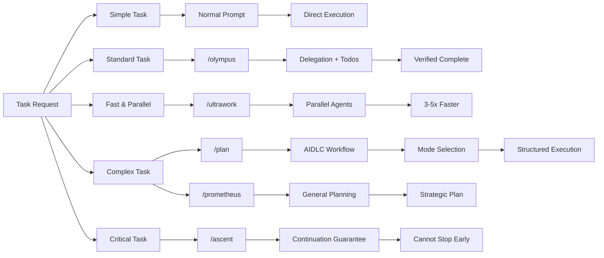
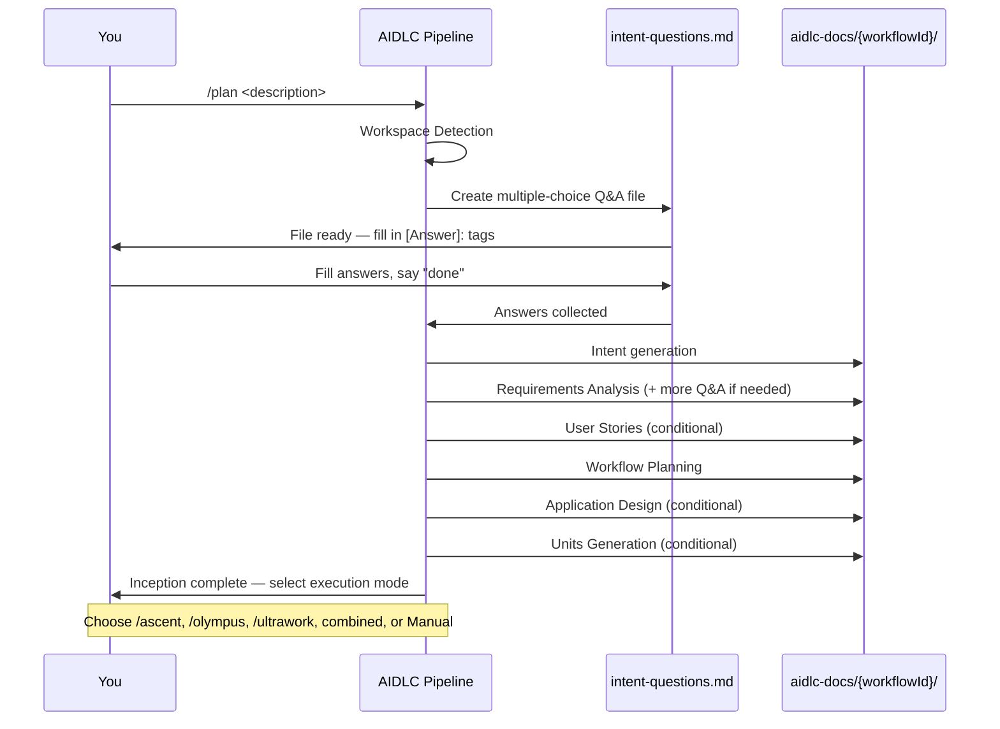

# Olympus Workflow Guide

A practical guide to choosing the right workflow for your task and executing it effectively with Olympus.

---

## TL;DR - Decision Flow

```
How complex is your task?
├─ Simple (1-2 steps, single file)
│  └─ Just prompt normally in Claude Code
│
├─ Standard (multi-step, clear requirements)
│  └─ Use /olympus <task>
│
├─ Fast & Parallel (independent subtasks)
│  └─ Use /ultrawork <task>
│
├─ Complex & Unclear (need planning)
│  └─ Use /plan → file-based Q&A → select execution mode
│
└─ Must Complete (critical, can't be partial)
   └─ Use /ascent <task>
```

**Quick Reference:**

| Keyword | Command | When to Use |
|---------|---------|-------------|
| Quick fix | Normal prompt | Single-file, < 5 lines, obvious solution |
| Standard | `/olympus` | Multi-step, delegatable, clear scope |
| Maximum speed | `/ultrawork` | Many independent tasks, speed critical |
| Need clarity | `/plan` | Complex features needing structured AIDLC lifecycle |
| General planning | `/prometheus` | General planning, non-AIDLC strategic decisions |
| Must finish | `/ascent` | Critical task, cannot be incomplete |

---

## 1. Workflow Overview

Olympus provides multiple workflows optimized for different scenarios. Understanding when to use each maximizes your productivity.

### The Four Core Workflows


```mermaid
flowchart LR
    Request[Task Request]

    Request --> Simple[Simple Task]
    Request --> Standard[Standard Task]
    Request --> Fast[Fast & Parallel]
    Request --> Complex[Complex Task]
    Request --> Critical[Critical Task]

    Simple --> Normal[Normal Prompt]
    Standard --> Olympus["/olympus"]
    Fast --> Ultrawork["/ultrawork"]
    Complex --> Plan["/plan"]
    Complex --> Prometheus["/prometheus"]
    Critical --> Ascent["/ascent"]

    Normal --> Done1[Direct Execution]
    Olympus --> Delegate[Delegation + Todos]
    Ultrawork --> Parallel[Parallel Agents]
    Plan --> Interview[AIDLC Workflow]
    Prometheus --> FreeForm[General Planning]
    Ascent --> Guarantee[Continuation Guarantee]

    Delegate --> Done2[Verified Complete]
    Parallel --> Done3[3-5x Faster]
    Interview --> ModeSelect[Mode Selection]
    ModeSelect --> Done4[Structured Execution]
    FreeForm --> Done6[Strategic Plan]
    Guarantee --> Done5[Cannot Stop Early]
```

---

## 2. Workflow Selection Guide

### When to Use Normal Prompts

**Best for:**
- Single-file edits (< 5 lines)
- Obvious fixes with clear solutions
- Quick lookups or explanations
- File reads or simple searches

**Example:**
```
> Fix the typo in line 42 of auth.ts
> What does this function do?
> Read the config file
```

**Why not Olympus?** Overhead of todo creation and delegation isn't worth it for trivial tasks.

---

### When to Use `/olympus`

**Best for:**
- Multi-file changes (2+ files)
- Tasks requiring specialized agents (architecture, UI, docs)
- Standard feature implementation
- Refactoring with clear scope
- Tasks you want to track with todos

**Example:**
```
> /olympus implement JWT authentication
> /olympus refactor the API layer to use async/await
> /olympus add validation to all user inputs
```

**What happens:**
1. Creates todo list automatically
2. If an active AIDLC workflow exists, enters unit dispatch mode (reads from checkpoint)
3. Delegates to appropriate agents (Oracle for analysis, Olympian for implementation)
4. Tracks progress with checkboxes
5. Verifies each step before marking complete
6. Learns from your corrections

**When to skip:** Task is unclear, requirements are ambiguous, or you need strategic planning first.

---

### When to Use `/ultrawork`

**Best for:**
- Tasks with many independent subtasks
- Speed is critical
- Research and documentation (parallel searches)
- Large refactoring across many files
- When you want maximum throughput

**Example:**
```
> /ultrawork document all API endpoints
> /ultrawork refactor entire authentication system
> /ultrawork research and implement caching strategy
```

**What changes from `/olympus`:**
- AIDLC-aware: dispatches units in parallel from active AIDLC checkpoint
- Batches Gate 4 code reviews across units
- Spawns multiple agents **in parallel** (3-5 concurrent)
- Doesn't wait for one task to finish before starting the next
- Background execution for all compatible operations
- More aggressive delegation (even small tasks)
- Continues until ALL tasks verified complete

**Trade-off:** Higher token usage, but 3-5x faster completion.

---

### When to Use `/plan`

**Best for:**
- Complex projects (multi-day work)
- Unclear or evolving requirements
- Strategic decisions needed (architecture, tech stack, approach)
- Critical production changes where mistakes are costly
- Software development features needing structured lifecycle (AIDLC)
- Tasks where you're not sure what the right approach is

**Example:**
```
> /plan migrate from REST API to GraphQL
> /plan build real-time collaboration features
> /plan refactor monolith to microservices
```

**The Planning Workflow:**

`/plan` **ALWAYS** triggers the **AIDLC (AI-Driven Development Life Cycle)** pipeline — a 7-stage gated Inception workflow. Questions are collected via **file-based Q&A** (multiple choice in `aidlc-docs/{workflowId}/inception/intent-questions.md`), never in chat.


```mermaid
sequenceDiagram
    participant You
    participant Pipeline as AIDLC Pipeline
    participant QAFile as intent-questions.md
    participant Artifacts as aidlc-docs/{workflowId}/

    You->>Pipeline: /plan <description>
    Pipeline->>Pipeline: Workspace Detection
    Pipeline->>QAFile: Create multiple-choice Q&A file
    QAFile->>You: File ready — fill in [Answer]: tags

    You->>QAFile: Fill answers, say "done"
    QAFile->>Pipeline: Answers collected

    Pipeline->>Artifacts: Intent generation
    Pipeline->>Artifacts: Requirements Analysis (+ more Q&A if needed)
    Pipeline->>Artifacts: User Stories (conditional)
    Pipeline->>Artifacts: Workflow Planning
    Pipeline->>Artifacts: Application Design (conditional)
    Pipeline->>Artifacts: Units Generation (conditional)

    Pipeline->>You: Inception complete — select execution mode
    Note over You,Pipeline: Choose /ascent, /olympus, /ultrawork, combined, or Manual
```

For general planning **without** the AIDLC structure (e.g., brainstorming, non-software decisions), use `/prometheus` instead — it runs a free-form strategic interview in chat.

**Benefits:**
- File-based Q&A with multiple choice options and AI recommendations
- Trust-level calibration (fewer questions as trust builds)
- Requirements are clarified upfront before any code is written
- Strategic decisions documented with approval gates at each stage
- Can review artifacts before execution (`/review`)
- All artifacts stored in `aidlc-docs/{workflowId}/`
- Resume interrupted workflows with `/continue` (scans `aidlc-docs/` for checkpoints)

---

### When to Use `/ascent`

**Best for:**
- Must-complete tasks (all tests must pass, all errors must be fixed)
- Critical bug fixes that need full resolution
- Tasks that often get abandoned incomplete
- When you need a guarantee of completion
- Clean-up tasks (fix all linter errors, resolve all TODOs)

**Example:**
```
> /ascent fix all TypeScript errors
> /ascent resolve all failing tests
> /ascent complete the authentication implementation
```

**What The Ascent guarantees:**
1. Creates comprehensive todo list
2. **Cannot stop until all todos are complete**
3. System reminder if attempting to exit early
4. Re-verification if any step fails
5. Only exits via `<promise>DONE</promise>` or user cancellation

**AIDLC-aware features:**
- At Trust Level 2+, code-generation plans are auto-approved (no manual gate)
- Target a single unit: `/ascent execute {unit-name}`
- Resume from first pending unit: `/ascent finish remaining units`

**Warning:** Use this when you're committed to finishing. The Ascent Never Ends.

**Exit conditions:**
- ✅ `<promise>DONE</promise>` - All verified complete
- ✅ `/cancel-ascent` - Manual cancellation
- ❌ "Stop" or "that's enough" - Ignored, continuation enforced

---

## 3. Detailed Workflow Examples

### Workflow 1: Standard Feature Implementation

**Scenario:** Add user profile editing functionality

**Approach:** `/olympus`

```bash
> /olympus add user profile editing with avatar upload
```

**Execution:**
```
[Olympus creates todos]
- [ ] Design database schema for profile data
- [ ] Create API endpoint for profile updates
- [ ] Add file upload handling for avatars
- [ ] Create frontend form component
- [ ] Add validation and error handling
- [ ] Write tests for profile update flow

[Delegations]
1. Oracle: Analyze existing user model, recommend schema changes
2. Olympian: Implement API endpoint
3. Frontend Engineer: Create profile form component
4. Olympian: Add validation logic
5. Olympian: Write tests

[Verifications after each step]
- lsp_diagnostics on changed files
- npm test (if applicable)
- Manual review of output

[Result]
✅ All todos complete, feature verified working
```

**Timeline:** 10-20 minutes with proper delegation

---

### Workflow 2: Large Parallel Refactoring

**Scenario:** Convert entire codebase from JavaScript to TypeScript

**Approach:** `/ultrawork`

```bash
> /ultrawork convert all JavaScript files to TypeScript
```

**Execution:**
```
[Ultrawork spawns multiple agents in parallel]

Agent 1 (Olympian): Convert src/auth/*.js (3 files)
Agent 2 (Olympian): Convert src/api/*.js (5 files)
Agent 3 (Olympian): Convert src/utils/*.js (4 files)
Agent 4 (Olympian): Update imports and references
Agent 5 (Document Writer): Update documentation

All agents run simultaneously ↑

[Background verification]
- tsc --noEmit (runs in background)
- eslint check (runs in background)

[Cleanup phase]
- Fix any type errors found
- Update package.json and configs
- Run full test suite

[Result]
✅ Entire codebase converted in ~1/3 the time
```

**Timeline:** 30-60 minutes vs 2-3 hours sequential

---

### Workflow 3: Strategic Planning + Execution

**Scenario:** Add OAuth authentication (unclear which provider, uncertain about implementation)

**Approach:** `/plan` → mode selection → execution

#### Phase 1: AIDLC Inception

```bash
> /plan add OAuth authentication to the application
```

**AIDLC pipeline begins — Workspace Detection runs, then a Q&A file is created:**

```
[Pipeline creates: aidlc-docs/oauth-auth/inception/intent-questions.md]
```

**The file looks like this:**

```markdown
# Intent Questions — OAuth Authentication

## Q1: What authentication providers should be supported? (select all that apply)
A) Google OAuth 2.0
B) GitHub OAuth
C) Microsoft/Azure AD
D) Email/password (non-OAuth)
E) Other: please specify

[Recommendation]: A, D — Google OAuth covers the largest user base, and email/password
provides a fallback for users who prefer not to use social login.

[Answer]:

---

## Q2: How should tokens be stored?
A) JWT in HTTP-only cookies (most secure)
B) JWT in localStorage (simpler, less secure)
C) Server-side sessions (traditional)
D) Database-backed sessions (for distributed systems)

[Recommendation]: A — HTTP-only cookies prevent XSS token theft.

[Answer]:

---

## Q3: Do you have an existing user model to integrate with?
A) Yes — users table already exists, just add OAuth fields
B) Yes — but it needs significant restructuring
C) No — starting from scratch

[Recommendation]: A or C — describe your current state.

[Answer]:
```

**You fill in the `[Answer]:` tags and say "done":**

```
[Answer]: A, D

[Answer]: A

[Answer]: A
```

```bash
> done
```

**Pipeline continues automatically through all Inception stages:**

```
[Requirements Analysis complete]
  → Requirements document: aidlc-docs/oauth-auth/inception/requirements.md

[User Stories generated]
  → Stories + personas: aidlc-docs/oauth-auth/inception/stories.md

[Workflow Planning complete]
  → Routing plan: aidlc-docs/oauth-auth/inception/plans/workflow-routing.md
  → Execution plan: aidlc-docs/oauth-auth/inception/plans/execution-plan.md

[Units Generated]
  → Unit 1: oauth-backend (routes, session, user lookup)
  → Unit 2: oauth-frontend (sign-in button, redirect flow)
  → Unit 3: oauth-security (CSRF, rate limiting, audit)
  → Unit of work: aidlc-docs/oauth-auth/inception/unit-of-work.md

Inception complete. Select execution mode:
  A) /ascent — guaranteed completion, auto-approves at Trust 2+
  B) /olympus — standard orchestration, sequential units
  C) /ultrawork — maximum parallelism, all units in parallel
  D) Combined: /ascent /ultrawork — parallel + completion guarantee
  E) Manual — I'll trigger execution myself
```

#### Phase 2: Construction

```bash
> B
```

**`/olympus` reads the AIDLC checkpoint and enters unit dispatch mode:**

```
[Reading checkpoint: aidlc-docs/oauth-auth/checkpoint.json]
[Units to dispatch: oauth-backend, oauth-frontend, oauth-security]

--- Unit 1: oauth-backend ---

→ Oracle: Review OAuth flow for security concerns (spec.md)
→ Olympian: Implement OAuth routes (/auth/google, /auth/callback)
→ Olympian: Add session management and user lookup/creation
→ Olympian: Handle token refresh

[Gate 4: Code review — approve to continue]
✅ Unit 1 complete

--- Unit 2: oauth-frontend ---

→ Frontend Engineer: Create "Sign in with Google" component
→ Olympian: Wire up OAuth redirect flow and error states

[Gate 4: Code review — approve to continue]
✅ Unit 2 complete

--- Unit 3: oauth-security ---

→ Oracle: Security audit (CSRF, rate limiting)
→ Olympian: Implement CSRF protection and rate limiting
→ QA Tester: End-to-end login flow test

[Gate 4: Code review — approve to continue]
✅ Unit 3 complete

[All units complete — Build and Test phase]
✅ Plan fully implemented and verified
```

**Artifacts produced:**
```
aidlc-docs/oauth-auth/
  checkpoint.json                  ← machine-readable state
  aidlc-state.md                   ← human-readable progress
  inception/
    intent.md
    requirements.md
    stories.md
    unit-of-work.md
    plans/
      workflow-routing.md
      execution-plan.md
  construction/
    oauth-backend/spec.md
    oauth-frontend/spec.md
    oauth-security/spec.md
```

**Timeline:** 15-20 minutes Inception (Q&A + gated approvals) + 40-60 minutes Construction = ~1 hour total

---

### Workflow 4: Critical Bug Fix (Must Complete)

**Scenario:** Production bug - users can't checkout, must be fixed completely

**Approach:** `/ascent`

```bash
> /ascent fix the checkout bug where users get stuck after payment
```

**Execution with continuation guarantee:**
```
[The Ascent begins - cannot stop until complete]

[Creates comprehensive todos]
- [ ] Reproduce the bug locally
- [ ] Identify root cause
- [ ] Fix the issue
- [ ] Add regression test
- [ ] Verify in all browsers
- [ ] Deploy fix

[Step 1: Reproduce]
→ Olympian: Set up test environment, reproduce bug
✅ Bug reproduced - payment confirmation not triggering state update

[Step 2: Root cause]
→ Oracle: Analyze payment flow and state management
✅ Issue identified - race condition in async payment handler

[Step 3: Fix]
→ Olympian: Implement fix with proper async handling
✅ Fix applied

[Step 4: Test]
→ Olympian: Add test covering the race condition
✅ Test added and passing

[Step 5: Verify]
→ QA Tester: Test in Chrome, Firefox, Safari
✅ All browsers working

[System check: All todos complete?]
[lsp_diagnostics: Clean]
[Tests: All passing]

<promise>DONE</promise>

✅ Bug fixed, tested, and verified
```

**Note:** If you tried to stop at step 3, system would enforce continuation:

```
> That's enough for now

[SYSTEM REMINDER - TODO CONTINUATION]
Incomplete tasks remain:
- [ ] Add regression test
- [ ] Verify in all browsers
- [ ] Deploy fix

Continue working. The Ascent Never Ends.
```

---

## 4. Best Practices

### For All Workflows

**1. Let Olympus create todos**
- Don't manually break down tasks - let Olympus analyze and create todos
- Todos help track progress and ensure nothing is forgotten
- Review todo list before declaring completion

**2. Trust but verify**
- Olympus verifies each step (lsp_diagnostics, tests)
- But do a final review of important changes
- Use `git diff` before committing

**3. Let it learn**
- Correct naturally: "No, use interfaces instead of types"
- Be specific: "Always prefer async/await over .then()"
- After 3 corrections, Olympus learns the pattern

**4. Use project CLAUDE.md**
- Put conventions in `.claude/CLAUDE.md`
- Examples: file naming, import patterns, code style
- Olympus reads this at session start

### For `/olympus` Workflow

**Do:**
- ✅ Give clear, specific tasks
- ✅ Let it delegate to specialists
- ✅ Review delegated work before next step
- ✅ Use for multi-file changes

**Don't:**
- ❌ Micromanage the delegation
- ❌ Stop work before verification
- ❌ Use for trivial single-line changes

### For `/ultrawork` Workflow

**Do:**
- ✅ Use for tasks with independent subtasks
- ✅ Expect higher token usage
- ✅ Let agents run in parallel
- ✅ Use background execution

**Don't:**
- ❌ Use for tasks with sequential dependencies
- ❌ Interrupt mid-execution (agents may be running)
- ❌ Use for simple tasks (overhead not worth it)

### For `/plan` Workflow

**Do:**
- ✅ Take time answering the Q&A files thoroughly
- ✅ Use the 'Other' option when the multiple-choice answers don't fit
- ✅ Review artifacts in `aidlc-docs/{workflowId}/` before executing
- ✅ Use for strategic decisions and complex features
- ✅ Use `/prometheus` instead if you need free-form strategic discussion without AIDLC structure

**Don't:**
- ❌ Rush the planning phase
- ❌ Skip or rush through Q&A files
- ❌ Start executing without reviewing the plan
- ❌ Use for well-understood simple tasks

### For `/ascent` Workflow

**Do:**
- ✅ Use for critical, must-complete tasks
- ✅ Commit to finishing
- ✅ Let continuation enforcement work
- ✅ Verify all exit conditions met

**Don't:**
- ❌ Use casually (it's intense)
- ❌ Try to stop early (it won't let you)
- ❌ Use for exploratory work
- ❌ Forget `/cancel-ascent` exists if truly needed

---

## 5. Skill Combination Patterns

Skills can be **stacked** for powerful workflows:

### Pattern: Planning + Ultrawork

```bash
# Run the AIDLC pipeline
> /plan refactor authentication system

[Answer Q&A files, approve each Inception stage]

# At end of Inception, select ultrawork mode:
> C   # /ultrawork — maximum parallelism

# Or trigger after Inception completes:
> /ultrawork
```

**Result:** Strategic planning via AIDLC + parallel unit execution = fast, high-quality results

---

### Pattern: Olympus + Ascent

```bash
> /ascent /olympus implement user dashboard
```

**Result:** Standard orchestration + completion guarantee = reliable delivery

---

### Pattern: Planning + Review

```bash
# Step 1: Run the AIDLC pipeline
> /plan refactor authentication system

[Answer Q&A files, approve each Inception stage]

# Step 2: Have Momus review the AIDLC execution plan
> /review aidlc-docs/auth-refactor/inception/plans/execution-plan.md

[Momus provides critical feedback on units, risks, approach]

# Step 3: Execute with confidence
> /olympus
```

**Result:** AIDLC planning + critical artifact review + execution = high-quality, vetted results

---

## 6. Common Patterns & Recipes

### Recipe: Feature from Scratch

```bash
# If you know exactly what to build:
> /olympus build user notifications system

# If requirements are unclear:
> /plan build user notifications system
[Answer Q&A files in aidlc-docs/]
[Approve each Inception stage]
[Select execution mode at the end of Inception]
```

---

### Recipe: Bug Investigation + Fix

```bash
# For straightforward bugs:
> /olympus fix the login redirect bug

# For complex, critical bugs:
> /ascent investigate and fix why emails aren't sending
```

---

### Recipe: Large Codebase Refactoring

```bash
# Step 1: Understand scope
> /plan refactor from class components to hooks

# Step 2: Execute in parallel
> /ultrawork

# Result: Strategic plan + fast execution
```

---

### Recipe: Documentation Generation

```bash
# Multiple independent docs:
> /ultrawork generate README, API docs, and usage guide

# Single complex doc:
> /olympus create comprehensive API documentation
```

---

### Recipe: Learning a Codebase

```bash
# Quick exploration:
> /deepsearch authentication flow

# Deep pattern search:
> /analyze src/auth

# Strategic understanding (free-form, no AIDLC structure):
> /prometheus understand the architecture and data flow
[Prometheus interviews you and produces a strategic overview]
```

---

## 7. Troubleshooting Workflows

### Problem: Task stalls or gets confused

**Solution: Resume or replan**
```bash
# If already inside an AIDLC workflow — resume from last checkpoint:
> /continue

# If no active AIDLC workflow — start structured planning:
> /plan [original task]
[Answer Q&A files, approve Inception stages, select execution mode]

# Note: /plan starts a NEW workflow — don't use it to unstall an existing one
```

---

### Problem: Need to pause multi-step work

**Solution: Use `/continue` to resume**
```bash
# AIDLC workflows save progress automatically in aidlc-docs/
# Next session, /continue scans aidlc-docs/ for checkpoints and resumes:
> /continue

# For non-AIDLC work, todos persist across sessions:
> Continue the previous task
```

---

### Problem: Agent chose wrong approach

**Solution: Correct once, let learning system adapt**
```bash
> No, use [correct approach] instead

# After 3 similar corrections:
> Olympus learns your preference automatically
```

---

### Problem: Task incomplete but "done"

**Solution: Use `/ascent` for completion guarantee**
```bash
> /ascent [task]

# Olympus won't stop until verified complete
```

---

## 8. Workflow Decision Tree (Detailed)

```
START: You have a task
│
├─ Is it a single obvious change?
│  ├─ YES → Normal prompt
│  └─ NO → Continue
│
├─ Do you know exactly what to build?
│  ├─ NO → Use /plan (AIDLC pipeline with file-based Q&A)
│  └─ YES → Continue
│
├─ Can subtasks run independently?
│  ├─ YES → Use /ultrawork (parallel execution)
│  └─ NO → Continue
│
├─ Is incomplete work unacceptable?
│  ├─ YES → Use /ascent (completion guarantee)
│  └─ NO → Continue
│
└─ Default: Use /olympus (standard orchestration)
```

---

## 9. Performance Optimization Tips

### Maximize Parallel Work

```bash
# Don't do this (sequential):
> /olympus task1, then task2, then task3

# Do this (parallel):
> /ultrawork task1, task2, and task3
```

---

### Minimize Planning When Clear

```bash
# Don't over-plan simple tasks:
❌ /plan add a button to the navbar

# Just do it:
✅ /olympus add logout button to navbar
```

---

### Use Background Execution

Olympus automatically backgrounds:
- npm install, pip install
- npm test, pytest
- npm run build
- git operations (fetch, pull)

Don't wait for these - Olympus continues working.

---

### Leverage Learning System

```bash
# First time (you teach):
> /olympus implement feature X
> "No, use pattern Y instead"

# After 3 corrections:
> /olympus implement feature Z
# Olympus automatically uses pattern Y
```

---

## 10. When NOT to Use Olympus

Skip Olympus orchestration for:

1. **Simple reads**: "Show me the config file"
2. **Quick questions**: "What does this function do?"
3. **Obvious one-liners**: "Fix typo on line 42"
4. **Exploratory prompts**: "What are the different ways to implement X?"

Use normal Claude Code for these - orchestration overhead isn't worth it.

---

## Summary: Your Olympus Workflow Toolkit

| Situation | Command | Key Benefit |
|-----------|---------|-------------|
| Simple task | Normal prompt | Fast, no overhead |
| Standard task | `/olympus` | Delegation + tracking |
| Fast & parallel | `/ultrawork` | 3-5x speedup |
| Complex feature | `/plan` | Structured AIDLC lifecycle for complex features |
| General planning | `/prometheus` | General planning, non-AIDLC strategic decisions |
| Resume workflow | `/continue` | Pick up from last AIDLC checkpoint |
| Review a plan | `/review` | Critical evaluation before execution |
| Must complete | `/ascent` | Completion guarantee |
| Search | `/deepsearch` | Thorough exploration |
| Analysis | `/analyze` | Deep investigation |
| Diagnostics | `/doctor` | Fix installation issues |

**Remember:**
- Start with the simplest approach that works
- Escalate to more powerful workflows when needed
- Use `/plan` for complex features needing AIDLC structure; use `/prometheus` for free-form strategic planning
- Let Olympus learn from your corrections
- Trust the orchestration, but verify results

---

**The right workflow makes all the difference.** Choose wisely, execute confidently.
