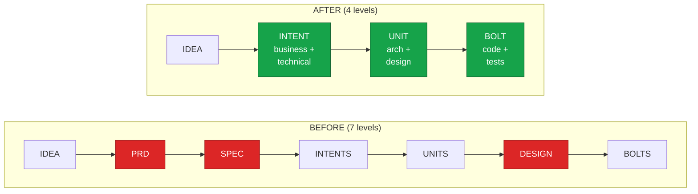
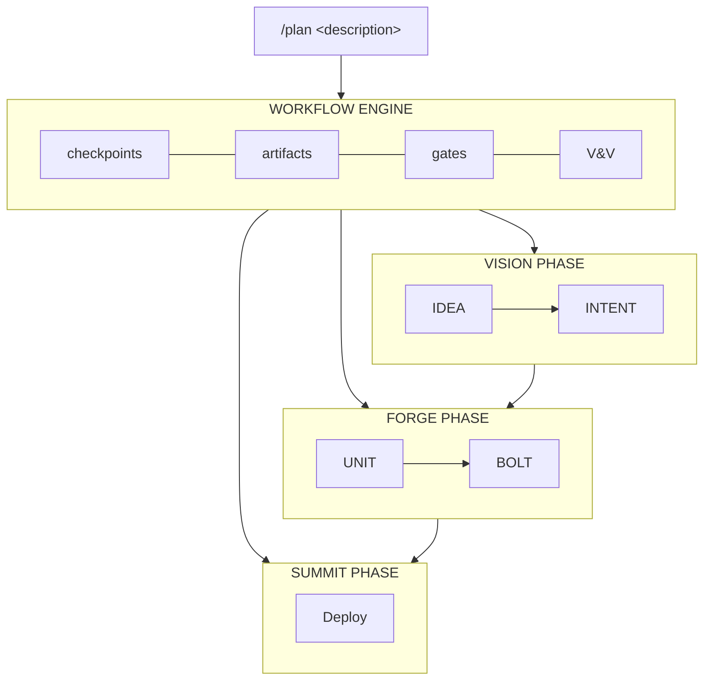
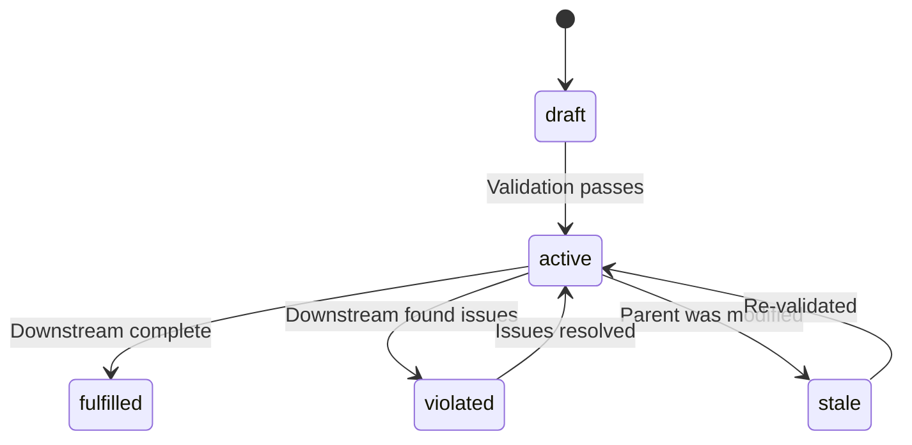
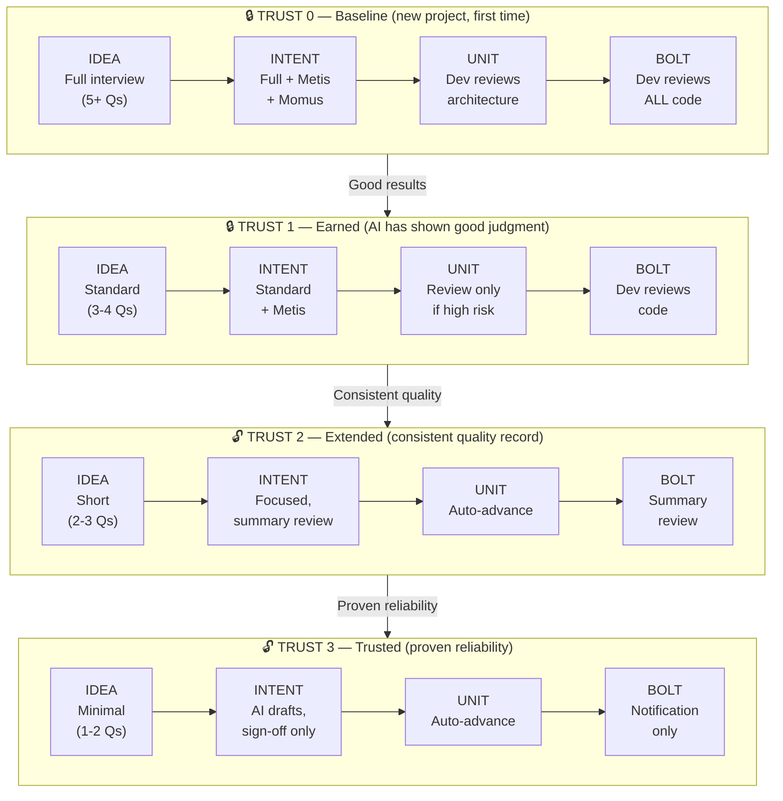
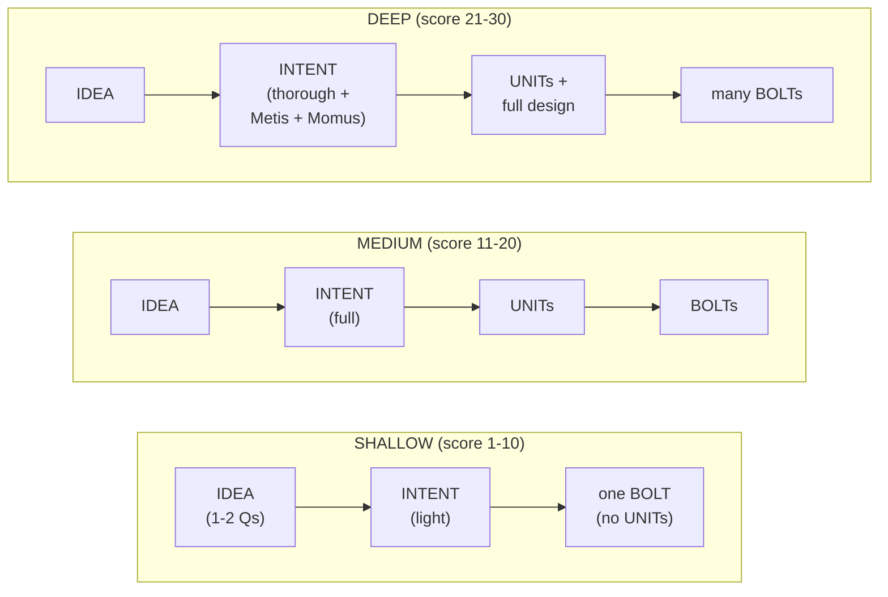

# ODLC Pipeline Proposal: 4-Level Architecture

> **Status**: Proposal — seeking feedback
> **Author**: Olympus Team
> **Date**: 2026-02-08

---

> **What is Olympus?** Olympus is a multi-agent orchestration system for Claude Code (Anthropic's CLI tool for developers). It spawns specialized AI agents as subprocesses to handle planning (Prometheus), code generation (Olympian), debugging (Oracle), testing (QA-Tester), and more. The ODLC (Olympus Development Lifecycle) is the structured workflow pipeline that coordinates these agents from initial idea to deployment, ensuring quality gates and human oversight at every step.

## Executive Summary

We're restructuring the Olympus Development Lifecycle (ODLC) pipeline from 7 levels to 4 levels, making it simpler, faster, and more collaborative. The new pipeline preserves all the power of Olympus agents (Prometheus, Metis, Momus, etc.) while eliminating redundant stages.

**Current Pipeline (7 levels):**

```
IDEA ─→ PRD ─→ SPEC ─→ INTENTS ─→ UNITS ─→ DESIGN ─→ BOLTS
```

**Proposed Pipeline (4 levels):**

```
IDEA ─→ INTENT ─→ UNIT ─→ BOLT
```

> **Important distinction**: The **4 levels** (IDEA, INTENT, UNIT, BOLT) are the artifact hierarchy — each represents a type of document or deliverable. These artifacts live within **3 execution phases**: Vision (where IDEA + INTENT are created), Forge (where UNIT + BOLT decomposition and execution happen), and Summit (deployment and release). Summit is a phase, not a level — it doesn't produce a new artifact type in the hierarchy, but instead handles deployment artifacts like runbooks and release notes.

### The Four Levels

| Stage      | What It Is                                                                                                                  | Analogy                  | Key Question                                          |
| ---------- | --------------------------------------------------------------------------------------------------------------------------- | ------------------------ | ----------------------------------------------------- |
| **IDEA**   | The _problem_ to solve. Non-technical, business-focused. Written by the PM.                                                 | "What and why"           | "What problem are we solving and for whom?"           |
| **INTENT** | The _plan_ to solve it. Business requirements + technical specification. Co-authored by PM and AI via interview.            | "What to build and how"  | "What are the requirements and how will we build it?" |
| **UNIT**   | An _architectural module_. A bounded piece of the system with defined interfaces, dependencies, and design artifacts.       | "A component or service" | "What are the building blocks?"                       |
| **BOLT**   | A _coding task_. The smallest executable unit of work — one focused code change with tests. AI executes, developer reviews. | "A pull request"         | "What specific code change needs to happen?"          |

**How they relate:**

```
  IDEA = 1 problem
    └→ INTENT = 1 comprehensive plan for that problem
         └→ UNITs = N architectural modules (e.g., 3 modules)
              └→ BOLTs = M coding tasks per UNIT (e.g., 2-4 tasks each)

  Example:
    IDEA: "Users need password reset"
    INTENT: Business reqs + technical architecture for password reset
      UNIT-001: "Auth API Module"
        BOLT-001: Create /api/reset endpoint
        BOLT-002: Add token generation + validation
      UNIT-002: "Email Service"
        BOLT-003: Integrate SendGrid email service
        BOLT-004: Add email templates + retry logic
      UNIT-003: "Reset UI"
        BOLT-005: Build password reset form component
        BOLT-006: Add client-side validation + error states
```

> **IDEA vs INTENT**: An IDEA describes the _problem_ ("users can't reset passwords"). An INTENT describes the _solution_ — business requirements, technical architecture, API design, and implementation approach. The IDEA is the "why"; the INTENT is the "what and how."
>
> **INTENT vs UNIT**: An INTENT is the _complete plan_ for a feature. A UNIT is _one architectural module_ within that plan. An INTENT might produce 3 UNITs (Auth API, Email Service, Reset UI), each with its own scope, interfaces, and dependencies.

---

## Key Terms

| Term | Definition |
|------|-----------|
| **IDEA** | The problem statement — what to solve and for whom |
| **INTENT** | The comprehensive plan — business requirements + technical specification |
| **UNIT** | An architectural module — a bounded piece of the system with defined interfaces |
| **BOLT** | A coding task — the smallest executable unit of work (one focused code change) |
| **Vision** | Phase 1: Problem definition and planning (IDEA + INTENT) |
| **Forge** | Phase 2: Architecture decomposition and code execution (UNIT + BOLT) |
| **Summit** | Phase 3: Deployment, documentation, and release |
| **Gate** | A human approval checkpoint — AI never approves its own work |
| **Trust Level** | A 0-3 scale measuring earned autonomy based on successful gate transitions |
| **Risk Tier** | A 1-3 classification of how risky a change is (overrides trust for ceremony) |
| **Depth Score** | A 1-30 assessment of task complexity that determines pipeline ceremony |
| **Conformance Score** | A 0-100% measure of how faithfully an artifact reflects its parent |
| **V&V** | Verification & Validation — checking that artifacts are correct and complete |
| **Contract** | An artifact's lifecycle state: draft → active → fulfilled / violated / stale |
| **Dual Validation** | Every artifact is checked against both its parent AND the root IDEA |
| **Cascade Invalidation** | When a parent changes, all downstream contracts become stale |
| **Manifest** | The master JSON tracker of all artifacts, contracts, gates, and workflow state |
| **Checkpoint** | Resume state for cross-session persistence |

---

## Meet the Agents

Olympus uses specialized AI agents named after figures from Greek mythology. Each has a distinct role in the pipeline. Here's who they are and what they do:

| Agent               | Named After               | Role                                                                                                                                                                                         | When They're Used                  |
| ------------------- | ------------------------- | -------------------------------------------------------------------------------------------------------------------------------------------------------------------------------------------- | ---------------------------------- |
| **Prometheus**      | Titan of foresight        | **Strategic planner & interviewer.** Drives the IDEA and INTENT stages by interviewing the user, researching the codebase, and drafting artifacts collaboratively. The brain behind `/plan`. | IDEA, INTENT                       |
| **Metis**           | Titan of wisdom & counsel | **Blind spot detector.** Analyzes requirements for hidden risks, missing edge cases, and unstated assumptions. Consulted before major decisions.                                             | IDEA, INTENT                       |
| **Momus**           | God of criticism          | **Critical reviewer.** Ruthlessly evaluates plans and artifacts for logical flaws, gaps, and weaknesses. The quality conscience of the pipeline.                                             | Any gate (on demand or automatic)  |
| **Olympian**        | The gods of Olympus       | **Code executor.** Writes, modifies, and refactors code. The hands that turn plans into working software.                                                                                    | BOLT execution                     |
| **Oracle**          | The Oracle at Delphi      | **Debugger & architect advisor.** Diagnoses complex issues, performs root cause analysis, and advises on architectural decisions.                                                            | BOLT execution (when issues arise) |
| **Explore**         | —                         | **Codebase searcher.** Fast, lightweight agent that searches files, patterns, and code structure. Used by other agents to understand existing code.                                          | All stages                         |
| **Librarian**       | —                         | **Documentation researcher.** Finds relevant documentation, best practices, and external references. Brings outside knowledge in.                                                            | INTENT, BOLT                       |
| **QA-Tester**       | —                         | **Test validator.** Runs and validates tests interactively. Ensures code changes work correctly before approval.                                                                             | BOLT execution                     |
| **Document-Writer** | —                         | **Technical writer.** Generates deployment guides, runbooks, release notes, and other documentation artifacts.                                                                               | Summit phase                       |
| **Forge Executor**  | The forge of Hephaestus   | **Decomposition engine.** Breaks down an INTENT into UNITs (architectural modules) and then into BOLTs (coding tasks). Orchestrates the build phase.                                         | UNIT, BOLT                         |

> **Why mythology?** Each agent's name reflects its purpose. Prometheus brings _foresight_ to planning. Metis provides _wise counsel_. Momus offers _honest criticism_. Together, they form a pantheon of specialized AI that collaborates with human judgment at every gate.

---

## Why Change?

| Problem                                                                          | Impact                            |
| -------------------------------------------------------------------------------- | --------------------------------- |
| PRD and SPEC are redundant — SPEC just reformats PRD content                     | Extra stages with no unique value |
| INTENTS ≈ UNITS — both are task decompositions                                   | Confusing overlap                 |
| Design is a separate stage but should be part of UNIT work                       | Unnecessary ceremony              |
| 7 stages means 6 transitions, each with V&V (Verification & Validation) overhead | Slower pipeline                   |
| No production users depend on PRD/SPEC stages yet                                | Clean opportunity to simplify     |

In the current 7-stage pipeline, both INTENTS and UNITS produce similar task lists:

```
INTENTS stage output:         UNITS stage output:
- "Build auth API"            - "Auth API module"
- "Build email service"       - "Email service module"
- "Build reset UI"            - "Reset UI module"
```

The distinction was meant to be intent (what) vs unit (how), but in practice both stages produced nearly identical decompositions with slightly different formatting. The new INTENT captures the "what" (business + technical plan), and UNIT captures the "how" (architectural modules with design artifacts) — making the distinction meaningful.

---

## Comparison: Before & After

### Pipeline Comparison



### What's Preserved

```
  ✓ Prometheus interview for planning     — drives IDEA + INTENT
  ✓ Metis blind spot analysis             — consulted at IDEA + INTENT
  ✓ Momus critical review                 — available at any gate
  ✓ All Olympus agents                    — explore, librarian, oracle,
                                            olympian, qa-tester, doc-writer
  ✓ V&V (Verification & Validation)       — enhanced with dual validation
  ✓ Contract lifecycle                    — draft → active → fulfilled
  ✓ Cascade invalidation                  — parent change → stale downstream
  ✓ Progressive trust (levels 0-3)        — trust-adaptive ceremony
  ✓ Risk tier governance (tiers 1-3)      — risk-adaptive gates
  ✓ Quality gates                         — at every stage transition
  ✓ Checkpoint persistence                — resume mid-workflow
  ✓ Manifest tracking                     — all artifacts tracked
  ✓ /plan command                         — same entry point
  ✓ /review command                       — Momus review at any gate
  ✓ Design artifacts                      — embedded in UNIT stage
```

### What Changes

```
  REMOVED:
    ✗ PRD stage           → absorbed into INTENT business sections
    ✗ SPEC stage          → absorbed into INTENT technical sections
    ✗ INTENTS stage       → replaced by singular INTENT document
    ✗ DESIGN stage        → embedded into UNIT decomposition
    ✗ prd-writer agent    → logic absorbed into intent-generator
    ✗ spec-writer agent   → logic absorbed into intent-generator

  ADDED:
    + Structured IDEA template      — richer input from PM
    + Dual validation               — every stage checks parent + root IDEA
    + Dev notification after INTENT  — early technical awareness (non-blocking)
    + Developer gate at UNIT         — architecture review before coding (Gate 3)
    + Developer gate at BOLT         — code review after execution (Gate 4)
    + Collaborative INTENT           — PM + AI co-author via interview
    + Depth-adaptive ceremony        — simple tasks get less overhead
    + Execution mode choice       — user picks /ascent, /olympus, or /ultrawork for Forge
    + /plan → full pipeline          — planning flows into execution
    + Stage transition messages      — transparent progress without context bloat
```

---

## The New Pipeline

> **Important change to `/plan`**: Today, `/plan` creates a plan document and stops. In the new pipeline, `/plan` starts the workflow through IDEA + INTENT (the Vision phase) — Prometheus interviews you, just like today. After you approve the INTENT and all gates pass, the Forge phase is **ready but not auto-started**. You choose your execution mode — `/ascent` (persistence loop until Oracle verifies completion), `/olympus` (smart orchestration with delegation), or `/ultrawork` (maximum parallel intensity) — to begin Forge execution. This preserves user control over **how** work gets done while the pipeline structures **what** gets done.

### High-Level Flow



### Detailed Stage Flow

#### Vision Phase

```
  /plan Add password reset via email
  │
  │         ╔═══════════════ VISION PHASE ═══════════════╗
  │         ║                                             ║
  │         ║   ┌─── STAGE 1: IDEA ────────────────────┐  ║
  │         ║   │                                       │  ║
  │         ║   │  Agent: PROMETHEUS                    │  ║
  │         ║   │  Support: Metis, explore              │  ║
  │         ║   │                                       │  ║
  │         ║   │  Prometheus interviews user:           │  ║
  │         ║   │    → "What problem does this solve?"   │  ║
  │         ║   │    → "Who is affected?"                │  ║
  │         ║   │    → "What does success look like?"    │  ║
  │         ║   │                                       │  ║
  │         ║   │  Output: idea.md                      │  ║
  │         ║   │  Engine: depth + risk assessment      │  ║
  │         ║   │                                       │  ║
  │         ║   │  ■ GATE: PM approves IDEA             │  ║
  │         ║   └──────────────────┬────────────────────┘  ║
  │         ║                      ▼                       ║
  │         ║   ┌─── STAGE 2: INTENT ──────────────────┐  ║
  │         ║   │                                       │  ║
  │         ║   │  Agent: PROMETHEUS                    │  ║
  │         ║   │  Support: Metis, explore, librarian   │  ║
  │         ║   │                                       │  ║
  │         ║   │  Business Qs (asked to PM):           │  ║
  │         ║   │    → "Should reset links expire?"     │  ║
  │         ║   │    → "Priority: speed or security?"   │  ║
  │         ║   │  Technical (AI handles silently):     │  ║
  │         ║   │    → Codebase research via explore    │  ║
  │         ║   │    → Pattern research via librarian   │  ║
  │         ║   │  Drafts INTENT collaboratively w/ PM  │  ║
  │         ║   │                                       │  ║
  │         ║   │  Output: intent.md                    │  ║
  │         ║   │  Engine: dual validation (checks     │  ║
  │         ║   │    parent + root IDEA — see          │  ║
  │         ║   │    Validation & Contract System)     │  ║
  │         ║   │                                       │  ║
  │         ║   │  ■ GATE: PM approves business sections│  ║
  │         ║   │  ■ GATE: Optional Momus review        │  ║
  │         ║   │  ◆ NOTIFY: Dev notified of tech spec  │  ║
  │         ║   └──────────────────┬────────────────────┘  ║
  │         ║                      ▼                       ║
  │         ║   ┌─── Forge Preparation (automatic) ────┐  ║
  │         ║   │                                       │  ║
  │         ║   │  Decomposition: automatic (runs after │  ║
  │         ║   │  INTENT gates pass)                   │  ║
  │         ║   │                                       │  ║
  │         ║   │  System decomposes INTENT into:       │  ║
  │         ║   │    → UNITs (architectural modules)    │  ║
  │         ║   │    → BOLTs (coding tasks per UNIT)    │  ║
  │         ║   │                                       │  ║
  │         ║   │  Output:                              │  ║
  │         ║   │    3 UNITs queued | 7 BOLTs queued    │  ║
  │         ║   └──────────────────┬────────────────────┘  ║
  │         ║                      │                       ║
  │         ╚══════════════════════╪═══════════════════════╝
  │                                │
  │         ┌── EXECUTION MODE ────────────────────────┐
  │         │                                           │
  │         │  User chooses: /ascent, /olympus,         │
  │         │  /ultrawork, or manual                    │
  │         │                                           │
  │         └──────────────────┬────────────────────────┘
```

After INTENT approval and automatic decomposition, the user chooses their execution mode to begin the Forge phase.

#### Forge Phase

```
  │                            │
  │         ╔═══════════════ FORGE PHASE ════════════════╗
  │         ║                      ▼                      ║
  │         ║   ┌─── STAGE 3: UNIT ────────────────────┐  ║
  │         ║   │                                       │  ║
  │         ║   │  GATE: Dev reviews decomposition      │  ║
  │         ║   │  (UNITs and BOLTs were already        │  ║
  │         ║   │  created automatically after INTENT)  │  ║
  │         ║   │                                       │  ║
  │         ║   │  Agent: FORGE EXECUTOR                │  ║
  │         ║   │  Support: olympian, explore            │  ║
  │         ║   │                                       │  ║
  │         ║   │  UNITs decomposed from INTENT:        │  ║
  │         ║   │    → UNIT-001: Auth API Module        │  ║
  │         ║   │    → UNIT-002: Email Service          │  ║
  │         ║   │    → UNIT-003: Reset UI               │  ║
  │         ║   │                                       │  ║
  │         ║   │  Design artifacts generated:          │  ║
  │         ║   │    → interfaces.json                  │  ║
  │         ║   │    → data-flow.json                   │  ║
  │         ║   │    → components.json                  │  ║
  │         ║   │                                       │  ║
  │         ║   │  Output: UNIT-001.md, UNIT-002.md ... │  ║
  │         ║   │  Engine: dual validation              │  ║
  │         ║   │                                       │  ║
  │         ║   │  ■ GATE 3: Dev reviews architecture   │  ║
  │         ║   │           (trust-adaptive)             │  ║
  │         ║   └──────────────────┬────────────────────┘  ║
  │         ║                      ▼                       ║
  │         ║   ┌─── STAGE 4: BOLT ────────────────────┐  ║
  │         ║   │                                       │  ║
  │         ║   │  Agent: FORGE EXECUTOR                │  ║
  │         ║   │  Support: olympian, oracle, qa-tester │  ║
  │         ║   │                                       │  ║
  │         ║   │  Per UNIT, generates coding tasks:    │  ║
  │         ║   │    BOLT-001: Create reset endpoint    │  ║
  │         ║   │    BOLT-002: Implement email service  │  ║
  │         ║   │    BOLT-003: Add password validation  │  ║
  │         ║   │                                       │  ║
  │         ║   │  Each BOLT: plan → code → test        │  ║
  │         ║   │  Engine: dual validation              │  ║
  │         ║   │                                       │  ║
  │         ║   │  Execution order:                     │  ║
  │         ║   │  BOLTs within a UNIT execute in       │  ║
  │         ║   │  dependency order. Independent BOLTs  │  ║
  │         ║   │  across UNITs can execute in parallel │  ║
  │         ║   │  when no cross-UNIT dependencies      │  ║
  │         ║   │  exist.                               │  ║
  │         ║   │                                       │  ║
  │         ║   │  ■ GATE 4: Developer reviews code     │  ║
  │         ║   └──────────────────┬────────────────────┘  ║
  │         ║                      │                       ║
  │         ╚══════════════════════╪═══════════════════════╝
```

After all BOLTs pass Gate 4 (developer code review), the workflow automatically transitions to the Summit phase.

#### Summit Phase

```
  │                                │
  │         ╔═══════════════ SUMMIT PHASE ═══════════════╗
  │         ║                      ▼                      ║
  │         ║   ┌─── Deployment & Release ─────────────┐  ║
  │         ║   │                                       │  ║
  │         ║   │  Trigger: Automatic after all BOLTs   │  ║
  │         ║   │  pass Gate 4 (dev code review).       │  ║
  │         ║   │  No user action needed to enter       │  ║
  │         ║   │  Summit — the workflow engine          │  ║
  │         ║   │  transitions automatically.           │  ║
  │         ║   │                                       │  ║
  │         ║   │  Agent: DOCUMENT-WRITER               │  ║
  │         ║   │  Support: explore, librarian           │  ║
  │         ║   │                                       │  ║
  │         ║   │  Document-writer generates:           │  ║
  │         ║   │    → Deployment guide (step-by-step   │  ║
  │         ║   │      instructions for shipping the    │  ║
  │         ║   │      feature, including env vars,     │  ║
  │         ║   │      migrations, and config changes)  │  ║
  │         ║   │    → Runbook (operational playbook    │  ║
  │         ║   │      for troubleshooting, rollback    │  ║
  │         ║   │      procedures, and health checks)   │  ║
  │         ║   │    → Monitoring config (alerts,       │  ║
  │         ║   │      dashboards, SLO definitions)     │  ║
  │         ║   │    → Release notes (user-facing       │  ║
  │         ║   │      changelog summarizing what       │  ║
  │         ║   │      shipped and why)                 │  ║
  │         ║   │                                       │  ║
  │         ║   │  ■ GATE 5: Human approves release     │  ║
  │         ║   │    Reviewer checks:                   │  ║
  │         ║   │    □ All BOLTs reviewed and approved   │  ║
  │         ║   │    □ Tests passing across all UNITs    │  ║
  │         ║   │    □ Deploy guide is accurate          │  ║
  │         ║   │    □ Runbook covers failure scenarios  │  ║
  │         ║   │    □ Release notes are correct         │  ║
  │         ║   │    □ No unresolved contract violations │  ║
  │         ║   │                                       │  ║
  │         ║   │  Trust affects Summit ceremony:       │  ║
  │         ║   │    Trust 0-1: Full checklist review    │  ║
  │         ║   │    Trust 2:   Summary review (spot     │  ║
  │         ║   │              check key items)          │  ║
  │         ║   │    Trust 3:   Sign-off only (all       │  ║
  │         ║   │              items auto-verified)      │  ║
  │         ║   └───────────────────────────────────────┘  ║
  │         ║                                              ║
  │         ╚══════════════════════════════════════════════╝
  │
  ▼
  DONE — Feature shipped
```

---

## The IDEA + INTENT Interview Experience

This is the core user experience. Prometheus drives it — the same powerful interview pattern that makes `/plan` work today.

```
  ╔══════════════════════════════════════════════════════════╗
  ║  USER runs: /plan Add password reset via email           ║
  ╠══════════════════════════════════════════════════════════╣
  ║                                                          ║
  ║  PROMETHEUS: "Let's build this together. First, I need   ║
  ║  to understand what you're looking for."                 ║
  ║                                                          ║
  ║  ┌── IDEA Interview ─────────────────────────────────┐   ║
  ║  │                                                    │   ║
  ║  │  Prometheus: "What problem does this solve?"       │   ║
  ║  │  User: "Users can't reset passwords w/o support"   │   ║
  ║  │                                                    │   ║
  ║  │  Prometheus: "Who is affected?"                    │   ║
  ║  │  User: "End users and the support team"            │   ║
  ║  │                                                    │   ║
  ║  │  Prometheus: "What does success look like?"        │   ║
  ║  │  User: "Zero support tickets for password resets"  │   ║
  ║  │                                                    │   ║
  ║  │  [Prometheus consults Metis for blind spots]       │   ║
  ║  │  Metis: "Consider: rate limiting, account lockout, │   ║
  ║  │          multi-factor verification on reset"       │   ║
  ║  │                                                    │   ║
  ║  │  Prometheus: "Here's the IDEA I've captured:"      │   ║
  ║  │  [Shows structured idea.md]                        │   ║
  ║  │  User: "Looks good"                                │   ║
  ║  └────────────────────────┬───────────────────────────┘   ║
  ║                           ▼                               ║
  ║  ┌── INTENT Interview ───────────────────────────────┐   ║
  ║  │                                                    │   ║
  ║  │  Prometheus: "Now let's detail the requirements."  │   ║
  ║  │                                                    │   ║
  ║  │  Business questions (asked to PM):                 │   ║
  ║  │  Prometheus: "Should reset links expire? How long?"│   ║
  ║  │  User: "Yes, 1 hour"                              │   ║
  ║  │                                                    │   ║
  ║  │  Prometheus: "Notify via a second channel?"        │   ║
  ║  │  User: "Not for v1, maybe later"                  │   ║
  ║  │                                                    │   ║
  ║  │  Technical research (AI handles, not asked to PM): │   ║
  ║  │  → explore: "Found auth middleware at src/auth/..."│   ║
  ║  │  → librarian: "Best practice: signed JWT tokens"   │   ║
  ║  │                                                    │   ║
  ║  │  [Prometheus consults Metis for risk analysis]     │   ║
  ║  │  Metis: "Risk: token replay attacks.               │   ║
  ║  │          Use single-use tokens w/ DB invalidation" │   ║
  ║  │                                                    │   ║
  ║  │  Prometheus: "Here's the full INTENT:"             │   ║
  ║  │  [Shows intent.md — business + technical sections] │   ║
  ║  │                                                    │   ║
  ║  │  User: "Add OAuth token rotation to security"      │   ║
  ║  │  Prometheus: "Updated. Ready?"                     │   ║
  ║  │  User: "Yes"                                       │   ║
  ║  │                                                    │   ║
  ║  │  [Optional: /review triggers Momus critical eval]  │   ║
  ║  └────────────────────────┬───────────────────────────┘   ║
  ║                           ▼                               ║
  ║  INTENT locked. Forge phase ready.                        ║
  ║                                                          ║
  ║  After the PM approves the INTENT and all gates pass,    ║
  ║  the system decomposes the INTENT into UNITs and BOLTs   ║
  ║  (the Forge preparation step). The user then chooses     ║
  ║  their execution mode to begin BOLT execution.           ║
  ║  ┌────────────────────────────────────────────────────┐   ║
  ║  │ Choose your execution mode:                        │   ║
  ║  │                                                    │   ║
  ║  │   /ascent     — Loop until complete (recommended)  │   ║
  ║  │   /olympus    — Smart orchestration + delegation   │   ║
  ║  │   /ultrawork  — Maximum parallel intensity         │   ║
  ║  │                                                    │   ║
  ║  │ Any mode: UNIT decomposition → BOLT execution      │   ║
  ║  │           → Dev review at each gate                │   ║
  ║  └────────────────────────────────────────────────────┘   ║
  ╚══════════════════════════════════════════════════════════╝
```

### What the PM Sees vs What the AI Handles

```
  ┌─────────────────────────────┬───────────────────────────────┐
  │   PM SEES & ANSWERS         │    AI HANDLES SILENTLY        │
  ├─────────────────────────────┼───────────────────────────────┤
  │ "What problem does this     │ Codebase research             │
  │  solve?"                    │                               │
  │ "Who is affected?"          │ Existing API discovery        │
  │ "What does success look     │ Architecture pattern matching │
  │  like?"                     │                               │
  │ "Should links expire?"      │ Data model design             │
  │ "What's the priority?"      │ Component breakdown           │
  │ Review business sections    │ Dependency analysis           │
  │ Approve/refine INTENT       │ Test strategy generation      │
  │                             │ Interface contract generation │
  └─────────────────────────────┴───────────────────────────────┘
```

### What the Developer Sees

```
  ┌─────────────────────────────────────────────────────────────────┐
  │   DEVELOPER / TECH LEAD TOUCHPOINTS                             │
  ├─────────────────────────────────────────────────────────────────┤
  │ 📋 After INTENT approved: receives technical spec notification  │
  │    (non-blocking at normal risk, blocking at Risk Tier 3)       │
  │                                                                 │
  │ 🔒 After UNITs created: reviews architectural decomposition     │
  │    Gate 3 — trust-adaptive (blocking at Trust 0-1)              │
  │                                                                 │
  │ 🔒 After each BOLT: reviews code output                        │
  │    Gate 4 — always present (depth varies with trust)            │
  │                                                                 │
  │ Developer does NOT:                                             │
  │   - Get asked business questions                                │
  │   - Write code (AI generates it)                                │
  │   - Review abstract specs (reviews concrete architecture + code)│
  └─────────────────────────────────────────────────────────────────┘
```

## Human Gates & Approvals

**AI never approves its own work. Humans hold every gate.** Here is exactly where human approval happens in the pipeline:


> Every gate is a human checkpoint. Rejection at any gate loops back for revision (see details below). Nothing advances without approval.

### Gate Details

| Gate        | When                     | Who                   | What They're Approving                           | Type                                                          |
| ----------- | ------------------------ | --------------------- | ------------------------------------------------ | ------------------------------------------------------------- |
| **Gate 1**  | After IDEA created       | PM / Product Owner    | "Is this the right problem to solve?"            | Blocking (always)                                             |
| **Gate 2**  | After INTENT drafted     | PM / Product Owner    | "Are the business requirements correct?"         | Blocking (always)                                             |
| **Gate 2b** | After PM approves INTENT | Momus (AI critic)     | "Are there logical flaws, missing requirements?" | Trust-adaptive: automatic at Trust 0-1, on-demand at Trust 2+ |
| **Notify**  | After INTENT approved    | Developer / Tech Lead | Technical spec shared for awareness              | Non-blocking notification                                     |
| **Gate 3**  | After UNITs decomposed   | Developer / Tech Lead | "Is the architectural decomposition sound?"      | Trust-adaptive (see below)                                    |
| **Gate 4**  | After each BOLT executes | Developer / Tech Lead | "Is this code correct, safe, well-tested?"       | Always present                                                |
| **Gate 5**  | After Summit artifacts   | Human                 | "Ready to ship?"                                 | Blocking (always)                                             |

### Trust Affects Gates (Not Removes Them)

Important: higher trust levels reduce _ceremony_ but never remove human control.

| Trust Level | Gate 1 (PM→IDEA) | Gate 2 (PM→INTENT) | Gate 2b (Momus) | Gate 3 (Dev→UNIT) | Gate 4 (Dev→BOLT) | Gate 5 (Release) |
|---|---|---|---|---|---|---|
| Trust 0 | Blocking | Blocking | Automatic | Blocking | Full review | Blocking |
| Trust 1 | Blocking | Blocking | Automatic | High-risk only | Full review | Blocking |
| Trust 2 | Blocking | Blocking | On-demand | Auto-advance | Summary review | Blocking |
| Trust 3 | Blocking | Blocking | On-demand | Auto-advance | Notification only (per-BOLT; dev reviews if desired) | Blocking |

```
  Gates 1, 2, and 5 are ALWAYS blocking regardless of trust level.
  Gate 2b (Momus review): automatic at Trust 0-1, on-demand at Trust 2+
  The developer gate (Gate 4) is ALWAYS present — trust only affects review depth.
  The dev notification after INTENT is ALWAYS sent regardless of trust level.
  Gate 3 is where devs catch bad specs BEFORE any code is written.
```

### How Trust Is Earned

Trust advances based on successful gate transitions:

```
  Trust 0 → 1:  10+ successful transitions with <10% rejection rate
  Trust 1 → 2:  20+ additional transitions with <5% rejection rate
  Trust 2 → 3:  50+ additional transitions with <2% rejection rate
```

Trust can also decrease:

```
  - A violated contract drops trust by 1 level
  - 3+ consecutive gate rejections triggers a trust review
  - Risk Tier 3 incidents reset trust to Level 0 for that workflow
```

### What "Rejection" Looks Like

Rejection isn't a dead end — it's a feedback loop:

```
  PM at Gate 1:  "The scope is too broad. Focus only on email reset, not SMS."
                 → Prometheus revises IDEA, re-presents for approval

  PM at Gate 2:  "The expiration should be 30 minutes, not 1 hour."
                 → Prometheus updates INTENT, re-presents business sections

  Dev at Gate 3: "The decomposition misses the auth middleware dependency."
                 → UNITs regenerated with feedback, dev reviews again

  Dev at Gate 4: "This endpoint needs rate limiting. Add tests for edge cases."
                 → BOLT re-executes with developer's feedback incorporated
                 → Developer reviews updated code
```

> **Implementation note**: Today, gate rejection captures the feedback and marks artifacts as `violated`, but does NOT automatically re-invoke the agent. The revision loop needs to be built as part of this proposal — specifically, a **rejection dispatcher** that reads the rejection reason from the manifest and re-invokes the appropriate agent (Prometheus for IDEA/INTENT, Forge Executor for UNITs, Olympian for BOLTs) with the feedback incorporated. See [Implementation: Required Changes](#implementation-required-changes-to-existing-systems) for details.

---

Next, let's look at how code gets written during Forge, and how the pipeline ensures quality and traceability at every step.

## Execution Modes: How Code Gets Written

After the Vision phase (IDEA + INTENT) completes and all gates pass, the Forge phase is ready. But the system doesn't start coding automatically — **you choose how to execute**.

### The Transition Moment

```
  ✓ INTENT approved. All gates passed.
  ✓ UNITs decomposed: Auth API, Email Service, Reset UI (3 modules)
  ✓ 7 BOLTs queued across 3 UNITs.

  Ready for Forge execution. Choose your mode:

    /ascent        Recommended for most work. Loops until Oracle
                   verifies everything is complete. Cannot stop early.

    /olympus       Smart orchestration. Delegates to specialists,
                   runs tasks in background, tracks progress.

    /ultrawork     Maximum intensity. Parallel everything,
                   delegate aggressively, never wait.

    (or just start working — describe what to build next)
```

### Mode Comparison

| Mode         | Best For                    | How It Works                                                                                                                                                 | Stops When                         |
| ------------ | --------------------------- | ------------------------------------------------------------------------------------------------------------------------------------------------------------ | ---------------------------------- |
| `/ascent`    | Most tasks                  | Self-referential loop with Oracle verification. Reads BOLTs, dispatches olympian agents, verifies each output. Cannot stop until Oracle approves completion. | Oracle verifies all BOLTs complete |
| `/olympus`   | Complex multi-track work    | Smart conductor mode. Delegates to olympian, oracle, frontend-engineer as needed. Runs independent BOLTs in parallel. Background execution for builds/tests. | All todos complete + user confirms |
| `/ultrawork` | Large tasks, speed critical | Maximum parallelism. Launches multiple olympian agents simultaneously. Never waits for one BOLT to finish before starting the next independent one.          | All BOLTs executed + gates passed  |
| Manual       | Learning, careful review    | User triggers one BOLT at a time. Full control over pace and order.                                                                                          | User decides                       |

### What Happens Inside Any Mode

Regardless of which execution mode you choose, the same pipeline runs:

```
  For each UNIT:
    1. Read UNIT spec (architecture, interfaces, dependencies)
    2. For each BOLT in the UNIT:
       a. Read BOLT spec (what to build, target files, tests)
       b. Dispatch to olympian agent (code execution)
       c. olympian writes code + tests
       d. Gate 4: Developer reviews code output
       e. If approved → BOLT contract → fulfilled
       f. If rejected → Re-execute with feedback
    3. When all BOLTs in UNIT complete → UNIT contract → fulfilled

  When all UNITs complete → Forge phase complete → Summit phase ready
```

### Agents Active During Forge

| Agent              | Role During Forge                    | When Invoked                                   |
| ------------------ | ------------------------------------ | ---------------------------------------------- |
| **Olympian**       | Writes code for each BOLT            | Every BOLT execution                           |
| **Oracle**         | Debugs issues, architectural advice  | When BOLTs fail or hit complexity              |
| **Explore**        | Searches codebase for context        | Before each BOLT (understanding existing code) |
| **QA-Tester**      | Validates test output                | After code is written                          |
| **Forge Executor** | Orchestrates UNIT→BOLT decomposition | At Forge phase start                           |
| **Momus**          | Reviews code quality (if invoked)    | On-demand via /review                          |

### Switching Modes Mid-Execution

You're not locked in. If you started with `/olympus` but want the persistence guarantee of `/ascent`, switch at any time:

```
  [Currently in /olympus mode, 3/7 BOLTs complete]

  User: /ascent finish the remaining BOLTs

  → Ascent activates. Reads manifest, sees 4 BOLTs remaining.
  → Loops until Oracle verifies all 4 are complete.
  → Cannot stop early. Checkpoints after each BOLT.
```

### Resuming After a Break

If you close your session before choosing an execution mode — or mid-execution — the workflow state is preserved in `checkpoint.json`. Here's how to get back:

```
  Session 1:
    User: /plan Add password reset
    → IDEA approved, INTENT approved, gates passed
    → "Ready for Forge execution. Choose your mode:"
    → [user closes session]

  Session 2 (later):
    User: /plan
    → "Found workflow: 'Password Reset via Email'"
    →   Phase: Forge (ready)
    →   UNITs: 3 decomposed | BOLTs: 7 queued | Completed: 0/7
    → "Resume? Choose execution mode:"
    →   /ascent     — Loop until all BOLTs complete
    →   /olympus    — Smart orchestration
    →   /ultrawork  — Maximum parallel intensity

  Or go directly:
    User: /ascent finish the password reset workflow
    → Ascent reads manifest, finds 7 pending BOLTs
    → Begins execution from BOLT-001

  Or check status first:
    User: /workflow-status
    → Full status report (phase, artifacts, gates, what's next)
    → Then choose your mode
```

The checkpoint tracks:

- Current phase and stage
- Which BOLTs are complete, in-progress, or pending
- Gate decisions already made
- Trust level and risk tier

Nothing is lost between sessions. Pick up exactly where you left off.

### Targeting Specific Artifacts

You don't have to execute the entire Forge phase at once. Target specific UNITs or BOLTs directly:

```
  Execute a specific BOLT:
    User: /ascent execute BOLT-003 from the password reset workflow
    → Reads BOLT-003.md spec
    → Dispatches olympian to implement
    → Gate 4: Dev reviews code
    → Done (just that one BOLT)

  Execute all BOLTs in a specific UNIT:
    User: /olympus execute UNIT-002 (Email Service)
    → Reads UNIT-002.md spec
    → Executes BOLT-003, BOLT-004 (the BOLTs under that UNIT)
    → Gate 4 after each BOLT
    → UNIT-002 contract → fulfilled

  Re-execute a rejected BOLT:
    User: /ascent redo BOLT-005 with this feedback: add rate limiting
    → Re-reads BOLT-005.md spec + developer feedback
    → Olympian re-implements with feedback incorporated
    → Gate 4: Dev reviews updated code

  Execute remaining BOLTs only:
    User: /ultrawork finish remaining BOLTs
    → Reads manifest, identifies 4 incomplete BOLTs
    → Launches parallel execution for independent BOLTs
    → Gate 4 after each
```

This is useful when:

- You want to review architecture (UNITs) before committing to full execution
- A specific BOLT failed and needs targeted re-execution
- You want to tackle one UNIT at a time across multiple sessions
- Different UNITs need different execution modes (e.g., `/ultrawork` for simple UNIT, `/ascent` for complex one)

### Why Not Automatic?

The Vision phase (IDEA + INTENT) is conversational — Prometheus interviews you. It makes sense for that to flow naturally from `/plan`.

But Forge is where code gets written. Different situations call for different execution styles:

- Prototyping? Use `/olympus` for flexibility.
- Must-ship feature? Use `/ascent` for completion guarantee.
- Large refactor? Use `/ultrawork` for speed.
- Learning the codebase? Go manual, one BOLT at a time.

Automatic execution would strip away this choice. The pipeline structures the WHAT; you choose the HOW.

---

## Validation & Contract System

Every artifact has a contract. Every transition validates both its parent and the root IDEA.

### Conformance Scoring

Each validation check produces a conformance score (0-100%). The alignment engine uses an AI agent to semantically evaluate whether a child artifact faithfully reflects the requirements, scope, and constraints defined in its parent artifact.

- **90-100%**: Strong alignment — artifact faithfully reflects its parent
- **70-89%**: Partial alignment — minor gaps or additions beyond scope
- **Below 70%**: Misalignment — significant drift from parent artifact

The threshold for passing is trust-adaptive:

- Trust 0-1: 90% required (strict)
- Trust 2: 80% required
- Trust 3: 70% required

### Dual Validation

```mermaid
flowchart TD
    IDEA["IDEA (root — always checked)"]
    INTENT[INTENT]
    UNIT[UNIT]
    BOLT[BOLT]

    IDEA -->|"parent check"| INTENT
    INTENT -->|"parent check"| UNIT
    UNIT -->|"parent check"| BOLT

    IDEA -.->|"root IDEA check"| UNIT
    IDEA -.->|"root IDEA check"| BOLT

    style IDEA fill:#1a1a1b,stroke:#333,stroke-width:2px
```



Every transition runs TWO checks:

IDEA → INTENT: check INTENT against IDEA (parent = root, same check)
INTENT → UNIT: check UNIT against INTENT (parent) AND against IDEA (root)
UNIT → BOLT: check BOLT against UNIT (parent) AND against IDEA (root)

### Contract Lifecycle

Every artifact goes through a contract lifecycle:



If the IDEA changes after INTENT is created:
→ INTENT contract status → stale
→ UNITs contract status → stale (cascade)
→ BOLTs contract status → stale (cascade)
→ System flags: "IDEA was modified. Re-validate downstream artifacts."

### Error Recovery

When something goes wrong mid-pipeline:

```
  BOLT fails:    → Re-execute with feedback. Only that BOLT is affected.
                   Other BOLTs in the same UNIT are unaffected.

  UNIT invalid:  → Cascade: all BOLTs under that UNIT go stale.
                   Fix UNIT spec → re-validate → re-execute affected BOLTs.

  INTENT changes: → Cascade: all UNITs and BOLTs go stale.
                   Re-validate each against updated INTENT.
                   BOLTs that still conform → no re-execution needed.

  IDEA changes:  → Full cascade: everything goes stale.
                   Re-validate top-down. Only re-execute what actually changed.
```

The system always preserves work. "Stale" doesn't mean "deleted" — it means "needs re-validation." If a BOLT's code still satisfies the updated parent, it stays fulfilled.

---

## Trust-Adaptive Behavior

The system adapts its ceremony level based on earned trust and risk classification.

### How Trust Affects the Pipeline



### Risk Tier Override

High-risk work always gets more ceremony, regardless of trust:

```
  Risk Tier 1 (Low)    → Trust level determines ceremony
  Risk Tier 2 (Medium) → Trust level determines ceremony
  Risk Tier 3 (High)   → Always full ceremony:
                           - Dev notification after INTENT becomes BLOCKING review
                           - Gate 3 always blocking (regardless of trust)
                           - Developer reviews EVERY BOLT output
                           - Momus review required (not optional) at INTENT gate
```

---

## Depth-Adaptive Ceremony

Not every `/plan` needs the full pipeline. The depth assessment (run after IDEA) determines ceremony.

The depth score (1-30) is calculated from factors including:
- Number of affected files and components
- Cross-cutting concerns (auth, data model, UI, API)
- Integration complexity (new dependencies, external services)
- Risk indicators (security, data migration, breaking changes)



> **Note on SHALLOW depth:** When depth is shallow (simple bug fix, small tweak), the pipeline skips the UNIT stage entirely — INTENT goes directly to a single BOLT. This means Gate 3 (architecture review) is skipped since there's no decomposition to review. Gate 4 (code review) still applies.

### Escape Hatches

The pipeline is structured but not rigid:

- **Skip to BOLT**: For known-simple tasks, `depth: SHALLOW` skips UNITs entirely
- **Override depth**: User can manually set depth (`/plan --depth deep`) to force more ceremony
- **Bypass a gate**: At Trust 2+, some gates auto-advance. At Trust 0-1, all gates are blocking
- **Abort workflow**: User can cancel at any point. Checkpoints preserve all completed work
- **Re-enter at stage**: If a completed stage needs rework, the contract system handles cascade invalidation

The depth assessment is a recommendation, not a prison. Users always have control.

---

## Artifact Flow

For the complete artifact directory structure, see [Workflow Folder Structure](#workflow-folder-structure) under Progress Tracking.

Each stage produces specific artifacts tracked by `manifest.json`:

| Stage  | Artifacts Produced                                                        | Location        |
| ------ | ------------------------------------------------------------------------- | --------------- |
| IDEA   | `idea.md` — problem statement, personas, stories, metrics                 | `vision/`       |
| INTENT | `intent.md` — business reqs, technical spec, implementation plan          | `vision/`       |
| UNIT   | `UNIT-001.md` ... `UNIT-N.md` — module specs with interfaces              | `forge/units/`  |
| UNIT   | `interfaces.json`, `data-flow.json`, `components.json` — design artifacts | `forge/design/` |
| BOLT   | `BOLT-001.md` ... `BOLT-M.md` — coding tasks with audit trail             | `forge/bolts/`  |
| Summit | Deploy guide, runbook, monitoring config, release notes                   | `summit/`       |

---

## Role Responsibilities

### Who Does What

```
  ╔══════════════════════════════════════════════════════════╗
  ║  PM / PRODUCT OWNER                                      ║
  ╠══════════════════════════════════════════════════════════╣
  ║  WRITES:     Structured IDEA (problem, personas, stories)║
  ║  CO-AUTHORS: Business sections of INTENT (via interview) ║
  ║  REVIEWS:    INTENT business sections                    ║
  ║  APPROVES:   "Is this what we want to build?"            ║
  ║                                                          ║
  ║  Does NOT answer technical questions.                    ║
  ║  Does NOT review code.                                   ║
  ╚══════════════════════════════════════════════════════════╝

  ╔══════════════════════════════════════════════════════════╗
  ║  DEVELOPER / TECH LEAD                                   ║
  ╠══════════════════════════════════════════════════════════╣
  ║  NOTIFIED:  Technical spec after INTENT is approved      ║
  ║  REVIEWS:   UNIT decomposition (architecture gate)       ║
  ║  REVIEWS:   BOLT code output (code review gate)          ║
  ║  APPROVES:  "Is the architecture sound?" (Gate 3)        ║
  ║  APPROVES:  "Is this code correct, safe?" (Gate 4)       ║
  ║                                                          ║
  ║  Gate 3 is trust-adaptive: blocking at low trust,        ║
  ║  auto-advance at high trust.                             ║
  ║  Gate 4 is always present.                               ║
  ║  Does NOT get asked business questions.                  ║
  ╚══════════════════════════════════════════════════════════╝

  ╔══════════════════════════════════════════════════════════╗
  ║  AI (OLYMPUS AGENTS)                                     ║
  ╠══════════════════════════════════════════════════════════╣
  ║  Prometheus: Interviews PM, researches codebase,         ║
  ║              drafts IDEA + INTENT artifacts               ║
  ║  Metis:      Blind spots, hidden requirements, risks     ║
  ║              at IDEA and INTENT stages                    ║
  ║  Momus:      Critical review at any gate (on demand)     ║
  ║  ForgeExec:  Decomposes INTENT → UNITs → BOLTs           ║
  ║  Olympian:   Writes code for each BOLT                   ║
  ║  Oracle:     Debugs issues during BOLT execution         ║
  ║  Explore:    Searches codebase during any stage          ║
  ║  Librarian:  Researches docs and patterns                ║
  ║  QA-Tester:  Validates tests during BOLT execution       ║
  ║  Doc-Writer: Generates Summit artifacts (runbooks, etc.) ║
  ║                                                          ║
  ║  AI NEVER approves its own work. Humans hold all gates.  ║
  ╚══════════════════════════════════════════════════════════╝
```

### Solo Developer Scenario

When one person plays both PM and developer roles:

- You answer BOTH business questions (as PM) and review architecture/code (as dev)
- Gate 1 + Gate 2: You approve your own IDEA and INTENT business sections
- Gate 3: You review your own architecture decomposition (recommended even solo — catches AI missteps)
- Gate 4: You review code output (always present)
- Trust system still works: as the pipeline learns your preferences, ceremony reduces

The gates aren't overhead for solo devs — they're the checkpoints where YOU verify the AI understood what you meant. At Trust Level 2+, most gates auto-advance and you mainly review code output.

---

For teams coming from traditional agile workflows, here's how the ODLC pipeline maps to familiar Scrum concepts.

## Comparison with Scrum

```
  ┌──────────────────┬──────────────────────┬──────────────────────┐
  │ SCRUM            │ ODLC                 │ KEY DIFFERENCE       │
  ├──────────────────┼──────────────────────┼──────────────────────┤
  │ Epic             │ IDEA                 │ Natural language,    │
  │                  │                      │ depth auto-scales    │
  ├──────────────────┼──────────────────────┼──────────────────────┤
  │ User Story       │ Section in INTENT    │ AI generates, PM     │
  │ (PM writes)      │ (PM co-authors)      │ validates (not solo) │
  ├──────────────────┼──────────────────────┼──────────────────────┤
  │ Sprint Planning  │ INTENT interview     │ 1:1 PM + AI, not a  │
  │ (team ceremony)  │ (Prometheus)         │ team meeting         │
  ├──────────────────┼──────────────────────┼──────────────────────┤
  │ Sprint           │ BOLT execution       │ Continuous, not      │
  │ (2-week box)     │ cycle                │ time-boxed           │
  ├──────────────────┼──────────────────────┼──────────────────────┤
  │ Component        │ UNIT                 │ Explicit artifact    │
  │ (in dev's head)  │ (with design docs)   │ with design contracts│
  ├──────────────────┼──────────────────────┼──────────────────────┤
  │ Task             │ BOLT                 │ AI executes, dev     │
  │ (dev does)       │ (AI does)            │ reviews output       │
  ├──────────────────┼──────────────────────┼──────────────────────┤
  │ Scrum Master     │ Olympus orchestrator │ AI coordination      │
  │ (facilitator)    │ + workflow engine     │ replaces ceremony    │
  ├──────────────────┼──────────────────────┼──────────────────────┤
  │ Retrospective    │ Learning system      │ Continuous learning, │
  │ (end of sprint)  │ (automatic)          │ not periodic meetings│
  ├──────────────────┼──────────────────────┼──────────────────────┤
  │ Definition of    │ Dual validation      │ Automatic conformance│
  │ Done (manual)    │ + contract lifecycle │ checking every stage │
  └──────────────────┴──────────────────────┴──────────────────────┘
```

**PM's role EVOLUTION (not reduction):**

```
  SCRUM:  PM writes stories alone → team implements → PM validates
  ODLC:   PM co-authors INTENT with AI → dev reviews architecture → AI codes → dev reviews code

  The PM goes from solo author to collaborative author.
  The AI handles the translation from "what" to "how".
  The developer reviews architecture (Gate 3) AND code output (Gate 4).
```

---

## Progress Tracking: "Where Am I?"

One of the biggest challenges after planning is uncertainty: _What happens next? Where am I in the process? How much is left?_

The workflow engine solves this by maintaining a clear, always-accessible status at every moment.

### Resume & Checkpoint

If a session is interrupted, the workflow picks up where it left off:

```
  Session 1:
    User: /plan Add password reset
    → IDEA created and approved
    → INTENT interview started...
    → [session ends]

  Session 2:
    User: /plan
    → "Found in-progress workflow: 'Password Reset' (INTENT stage)"
    → "Resume from INTENT interview? [Y/n]"
    → Continues from last checkpoint
```

### The Progress View

At any point, the user can check status and see exactly where they are:

```
  /workflow-status

  ╔════════════════════════════════════════════════════════╗
  ║  Workflow: Password Reset via Email                    ║
  ║  ID: wf-2026-02-08-password-reset                      ║
  ║  Started: 2026-02-08 10:30am                           ║
  ╠════════════════════════════════════════════════════════╣
  ║                                                        ║
  ║  Phase Progress                                        ║
  ║  Vision  [████████████████░░░░] 80%  (in_progress)     ║
  ║  Forge   [░░░░░░░░░░░░░░░░░░░░]  0%  (not_started)    ║
  ║  Summit  [░░░░░░░░░░░░░░░░░░░░]  0%  (not_started)    ║
  ║                                                        ║
  ║  Current Position                                      ║
  ║  ● IDEA    complete   idea.md created, approved        ║
  ║  ◉ INTENT  active     Interview in progress (3/5 Qs)   ║
  ║  ○ UNIT    pending    Waiting for INTENT               ║
  ║  ○ BOLT    pending    Waiting for UNITs                ║
  ║  ○ SUMMIT  pending    Waiting for BOLTs                ║
  ║                                                        ║
  ║  Artifacts                                             ║
  ║  [Vision]                                              ║
  ║    [✓] idea.md   (active)                              ║
  ║    [○] intent.md (draft)  ← YOU ARE HERE               ║
  ║                                                        ║
  ║  Trust: Level 1 (Earned)  │  Risk Tier: 2 (Medium)    ║
  ║  Depth: Medium (score: 16/30)                          ║
  ║                                                        ║
  ║  Next: Complete INTENT interview (2 Qs remaining)      ║
  ╚════════════════════════════════════════════════════════╝
```

### The "Lost" Problem — Solved

```
  BEFORE (current system):
  ┌──────────────────────────────────────────────────────┐
  │  User: /plan Add password reset                      │
  │  [Prometheus creates plan.md]                        │
  │  User: "OK, now what?"                               │
  │  [Manually reads plan, tries to implement]           │
  │  User: "Where was I? What's left?"                   │
  │  [No tracking, no state, user is on their own]       │
  └──────────────────────────────────────────────────────┘

  AFTER (new pipeline):
  ┌──────────────────────────────────────────────────────┐
  │  User: /plan Add password reset                      │
  │  [Prometheus interviews, creates IDEA + INTENT]      │
  │  [User chooses /ascent — system decomposes + runs]  │
  │  User: "Where am I?"                                 │
  │  [/workflow-status → exact position + next step]     │
  │                                                      │
  │  User closes session, comes back next day:           │
  │  User: /plan                                         │
  │  System: "Found workflow: 'Password Reset' — Forge   │
  │          phase, 3/7 BOLTs complete"                  │
  │          "Resume? Choose mode: /ascent, /olympus,    │
  │          /ultrawork"                                 │
  │  User: /ascent finish it                             │
  │  [Picks up at BOLT-004, loops until all 7 complete]  │
  └──────────────────────────────────────────────────────┘
```

### Workflow Folder Structure

Every workflow lives in a self-contained directory with all its state:

```
  .olympus/workflows/{workflow-id}/
  │
  ├── manifest.json            ← Master tracker: all artifacts, contracts, gates
  ├── checkpoint.json          ← Resume state: current stage, next action
  ├── trust-state.json         ← Trust level for this workflow
  ├── risk-register.json       ← Identified risks and mitigations
  │
  ├── vision/                  ← VISION PHASE artifacts
  │   ├── idea.md              ← Structured IDEA (PM authored)
  │   │                           - Problem statement
  │   │                           - User personas
  │   │                           - Key user stories
  │   │                           - Success metrics
  │   │                           - Business constraints
  │   │
  │   └── intent.md            ← Full INTENT (Prometheus + PM co-authored)
  │                               - Business requirements (user stories, criteria)
  │                               - Technical specification (architecture, APIs)
  │                               - Implementation plan (units breakdown)
  │                               - Traceability back to IDEA
  │
  ├── forge/                   ← FORGE PHASE artifacts
  │   ├── units/               ← Architectural modules
  │   │   ├── UNIT-001.md      ← "Auth API Module"
  │   │   │                       - Scope & responsibility
  │   │   │                       - Interface contracts
  │   │   │                       - Dependencies
  │   │   │                       - Target files
  │   │   ├── UNIT-002.md      ← "Email Service Integration"
  │   │   └── UNIT-003.md      ← "Password Reset UI"
  │   │
  │   ├── design/              ← Design artifacts (generated during UNIT stage)
  │   │   ├── interfaces.json  ← API contracts between UNITs
  │   │   ├── data-flow.json   ← How data moves between components
  │   │   └── components.json  ← Component architecture
  │   │
  │   └── bolts/               ← Coding tasks
  │       ├── BOLT-001.md      ← "Create reset endpoint"
  │       │                       - Domain design (what to build)
  │       │                       - Logical design (how to build)
  │       │                       - Target files to create/modify
  │       │                       - Test requirements
  │       │                       - Audit trail
  │       ├── BOLT-002.md      ← "Implement email service"
  │       ├── BOLT-003.md      ← "Add token validation"
  │       └── BOLT-004.md      ← "Build reset UI form"
  │
  └── summit/                  ← SUMMIT PHASE artifacts
      ├── deploy-guide.md      ← Step-by-step deployment instructions
      ├── runbook.md           ← Operations runbook (troubleshooting)
      ├── monitoring.json      ← Monitoring & alerting configuration
      └── release-notes.md     ← User-facing release notes
```

### The Manifest — Single Source of Truth

The `manifest.json` tracks everything. It's what makes `/workflow-status` possible:

```
  manifest.json knows:
    - Every artifact created (with checksums)
    - Every contract status (draft/active/fulfilled/violated/stale)
    - Every gate decision (approved/rejected/bypassed, by whom)
    - Every alignment check result (conformance scores)
    - Current phase and stage
    - Depth assessment and risk tier
    - Trust level history
    - What's been completed and what's pending

  When any artifact changes, the manifest updates.
  When a parent changes, downstream contracts go stale.
  When you ask "where am I?", the manifest has the answer.
```

---

## Stage Transition Messages

At each stage transition, the system provides a brief, clear status message so the user always knows what just happened and what's next. These messages are designed to be **informative without bloating the context window**.

### Design Principles

```
  1. SHORT:       3-5 lines max per transition (not a full report)
  2. ACTIONABLE:  Always ends with what happens next or who needs to act
  3. LIGHTWEIGHT:  Displayed to user but NOT carried in AI context window
  4. ON-DEMAND:   Full detail available via /workflow-status (zero context cost)
```

### What the User Sees

```
  ┌──────────────────────────────────────────────────────────┐
  │  After IDEA is approved:                                  │
  │                                                           │
  │  ✓ IDEA approved — "Password Reset via Email"             │
  │    Depth: Medium (16/30) | Risk: Tier 2 | Trust: Level 1 │
  │  → Next: INTENT stage. Prometheus will interview you      │
  │    about business requirements.                           │
  └──────────────────────────────────────────────────────────┘

  ┌──────────────────────────────────────────────────────────┐
  │  After INTENT is locked:                                  │
  │                                                           │
  │  ✓ INTENT locked — business + technical sections complete │
  │    📋 Technical spec shared with dev team for awareness   │
  │    3 UNITs decomposed | 7 BOLTs queued                   │
  │  → Ready: /ascent, /olympus, or /ultrawork to begin Forge │
  └──────────────────────────────────────────────────────────┘

  ┌──────────────────────────────────────────────────────────┐
  │  After UNITs are created:                                 │
  │                                                           │
  │  ✓ 3 UNITs created: Auth API, Email Service, Reset UI    │
  │    🔒 Gate 3: Dev review required (Trust Level 1)         │
  │  → Waiting: Developer reviews architectural decomposition │
  └──────────────────────────────────────────────────────────┘

  ┌──────────────────────────────────────────────────────────┐
  │  During BOLT execution:                                   │
  │                                                           │
  │  ✓ BOLT 3/7 complete — "Add token validation"            │
  │    🔒 Gate 4: Dev review of BOLT-003 code                │
  │  → Current: BOLT-004 "Build reset UI form" (4 remaining) │
  └──────────────────────────────────────────────────────────┘

  ┌──────────────────────────────────────────────────────────┐
  │  After all BOLTs complete:                                │
  │                                                           │
  │  ✓ All 7 BOLTs executed and reviewed                     │
  │  → Next: Summit phase. Generating deployment guide        │
  │    and release notes...                                   │
  └──────────────────────────────────────────────────────────┘
```

### How It Works Technically

```
  User's chat session
  ┌─────────────────────────────────────────────────────────┐
  │  [conversation context — what AI remembers]          │
  │                                                      │
  │  Carries: 1-line workflow hint                       │
  │  Example: "[Workflow: password-reset | INTENT | Q3]" │
  │                                                      │
  │  Does NOT carry: full status, artifact contents,     │
  │  gate history, or previous stage details             │
  └─────────────────────────────────────────────────────┘
        │
        │ transition happens
        ▼
  ┌─────────────────────────────────────────────────────┐
  │  Hook system emits status block                      │
  │  (displayed to user, NOT added to AI context)        │
  │                                                      │
  │  3-5 line status message with:                       │
  │    ✓ What just completed                             │
  │    → What's next / who needs to act                  │
  └─────────────────────────────────────────────────────┘
        │
        │ user wants more detail
        ▼
  ┌─────────────────────────────────────────────────────┐
  │  /workflow-status                                    │
  │  (reads from manifest.json — zero context cost)      │
  │                                                      │
  │  Full report: phases, artifacts, gates, trust, risk  │
  └─────────────────────────────────────────────────────┘
```

> The goal: users always know where they are and what's next, without the AI wasting tokens remembering workflow state. The manifest is the memory — the AI reads it on demand.

---

## Cross-Session Persistence: How the System Remembers

One of the biggest questions about a multi-session pipeline: **how does Claude know what happened last time?**

### Three Layers of Memory

```
  Layer 1: WORKFLOW STATE (manifest + checkpoint)
  ┌─────────────────────────────────────────────────────────┐
  │  Stored: .olympus/workflows/{id}/manifest.json           │
  │  Contains: Every artifact, contract status, gate          │
  │    decision, trust level, risk tier, what's complete,     │
  │    what's pending, rejection feedback                     │
  │  Survives: Indefinitely (until workflow deleted)          │
  │  Used by: /plan (resume), /workflow-status, execution     │
  │    modes (/ascent, /olympus, /ultrawork)                  │
  │                                                           │
  │  This is the PRIMARY memory. When Claude starts a new     │
  │  session and you say /plan, the manifest tells it         │
  │  everything: where you are, what gates passed, what was   │
  │  rejected and why, what BOLTs are left.                   │
  └─────────────────────────────────────────────────────────┘

  Layer 2: TRUST STATE (trust-state.json)
  ┌─────────────────────────────────────────────────────────┐
  │  Stored: .olympus/trust-state.json                       │
  │  Contains: Current trust level, total transitions,       │
  │    rejection count, rejection rate, level history         │
  │  Survives: Across all sessions (persists to disk)        │
  │  Used by: Gate hooks (auto-advance decisions)            │
  │                                                           │
  │  Trust is cumulative. 10 approvals in Session 1 +        │
  │  5 approvals in Session 2 = 15 total transitions.        │
  │  Trust Level 1 earned even though it happened across      │
  │  two sessions.                                            │
  └─────────────────────────────────────────────────────────┘

  Layer 3: LEARNING SYSTEM (discoveries + preferences)
  ┌─────────────────────────────────────────────────────────┐
  │  Stored: .olympus/learning/discoveries.jsonl (project)   │
  │          ~/.claude/olympus/learning/ (global)             │
  │  Contains: Patterns, gotchas, technical insights,        │
  │    agent performance, user preferences                   │
  │  Survives: Across all sessions, across projects (global) │
  │  Used by: Session-start hook injects top 5 discoveries   │
  │                                                           │
  │  At session start, Claude receives:                      │
  │    "Previous learning: Gate rejections in this project    │
  │     often happen due to missing test coverage"            │
  │  This shapes behavior without explicit reminding.         │
  └─────────────────────────────────────────────────────────┘
```

### What This Means in Practice

```
  Session 1 (Monday):
    /plan Add password reset
    → IDEA approved (Gate 1 pass → trust transitions += 1)
    → INTENT drafted
    → PM rejects at Gate 2: "Add rate limiting requirement"
      → rejection stored in manifest, trust rejection_count += 1
    → PM approves revised INTENT (Gate 2 pass → trust transitions += 1)
    → Dev notified
    → [session ends]

  Session 2 (Tuesday):
    /plan
    → System reads manifest: "Password Reset — Forge phase ready, 3 UNITs, 7 BOLTs"
    → System reads trust: "Level 0, 3 transitions, 1 rejection (33% rate)"
    → System reads learning: "gotcha: rate limiting was missing from initial INTENT"
    → User: /ascent finish password reset
    → Ascent reads manifest, starts at BOLT-001
    → [continues where Session 1 left off]

  Session 3 (Wednesday):
    → Trust state: 10 transitions, 1 rejection (10% rate)
    → Trust Level 1 earned!
    → Gate 3 auto-advances for Tier 1 UNITs
    → Dev still reviews at Gate 4 (always present)
```

### What Needs to Be Built

Currently, each layer has gaps that this proposal addresses:

| Layer               | What Exists                          | What's Missing                                                                              |
| ------------------- | ------------------------------------ | ------------------------------------------------------------------------------------------- |
| **Workflow State**  | Manifest tracks artifacts and gates  | Execution modes don't read the manifest yet (see Implementation section)                    |
| **Trust State**     | Persists to disk, tracks transitions | Only tracks phase-level gates, not per-BOLT gates (Gate 3, Gate 4)                          |
| **Learning System** | Discoveries captured and injected    | Gate rejections don't auto-capture as discoveries; no "why was this rejected before?" query |

The implementation plan must address all three gaps to deliver the cross-session experience described in this proposal.

---

## Token & Cost Awareness

The pipeline is designed to be token-efficient:

- **Stage transition messages**: displayed to user, NOT carried in AI context
- **Workflow state**: stored in manifest.json, read on demand (not in context)
- **Trust-adaptive ceremony**: higher trust = fewer agent calls = lower cost
- **Depth-adaptive pipeline**: SHALLOW tasks skip UNIT stage entirely
- **Parallel BOLT execution**: independent BOLTs can run concurrently (fewer round-trips)

The `/workflow-status` command reads from manifest.json at zero context cost.

---

## Implementation: Required Changes to Existing Systems

> **Audience note**: This section is primarily for Olympus contributors and maintainers. If you're evaluating the pipeline as a user, the [Summary](#summary) section captures the key takeaways.

This proposal describes new behaviors for existing commands. Here's an honest accounting of what needs to change for this pipeline to work. None of the execution mode commands currently have workflow awareness — they need it.

### Commands That Need Modification

#### `/plan` (Prometheus Skill)

**Today**: Creates a plan document at `.olympus/plans/` and stops. The plan is a markdown file with tasks and checkboxes.

**Needs to become**: The entry point for the full Vision workflow.

| What Changes              | Detail                                                                                |
| ------------------------- | ------------------------------------------------------------------------------------- |
| Start structured workflow | `/plan` creates a workflow directory, manifest, and checkpoint — not just a plan file |
| IDEA stage                | Prometheus interview produces `idea.md` artifact tracked by manifest                  |
| INTENT stage              | Prometheus interview produces `intent.md` artifact tracked by manifest                |
| Depth + risk assessment   | Run after IDEA, stored in manifest                                                    |
| Gate orchestration        | Present Gate 1, Gate 2, Gate 2b at appropriate points                                 |
| UNIT decomposition        | After INTENT gates pass, auto-decompose into UNITs and BOLTs                          |
| Workflow resume           | Detect existing workflows on `/plan` invocation, offer resume                         |

**What stays the same**: The Prometheus interview experience. The user still talks to Prometheus, answers questions, and collaborates on requirements. The _feel_ is identical — the backend tracking changes.

#### `/ascent` (Persistence Loop)

**Today**: Generic self-referential loop. Keeps the agent working until Oracle verifies a `<promise>TASK_COMPLETE</promise>` tag. Has no concept of workflows, manifests, BOLTs, or UNITs.

**Needs to become**: Workflow-aware persistence loop that reads from manifest.

| What Changes       | Detail                                                                             |
| ------------------ | ---------------------------------------------------------------------------------- |
| Workflow detection | On activation, check for active workflow in `.olympus/workflows/`                  |
| Manifest reading   | Read `manifest.json` to find pending BOLTs and their execution order               |
| BOLT dispatch      | Read each BOLT spec file and dispatch to olympian agent                            |
| Progress tracking  | Update manifest after each BOLT (contract status, gate results)                    |
| Gate integration   | Pause for Gate 4 (dev review) after each BOLT, resume after approval               |
| Oracle scope       | Oracle verifies all BOLTs in manifest are fulfilled, not just a generic "done" tag |
| Targeted execution | Support `/ascent execute BOLT-003` for single-artifact targeting                   |

**What stays the same**: The core loop mechanism (iterate until Oracle approves), max iterations safety (10), checkpoint resume, session binding, todo integration. The persistence engine doesn't change — it gains workflow awareness.

#### `/olympus` (Orchestration Mode)

**Today**: Activates smart delegation mode with agent routing, background execution, and continuation enforcement. No workflow awareness.

**Needs to become**: Workflow-aware orchestration that reads BOLTs and delegates intelligently.

| What Changes         | Detail                                                                                |
| -------------------- | ------------------------------------------------------------------------------------- |
| Workflow detection   | On activation, check for active workflow                                              |
| Intelligent dispatch | Route BOLTs to appropriate agents (olympian for code, frontend-engineer for UI, etc.) |
| Parallel execution   | Identify independent BOLTs across UNITs, run concurrently                             |
| Background builds    | Run tests and builds in background after each BOLT                                    |
| Manifest updates     | Update contract status, gate records after each BOLT                                  |
| Gate coordination    | Present Gate 4 reviews, handle approvals/rejections                                   |

**What stays the same**: Delegation rules, agent routing table, background execution, todo tracking, continuation enforcement. The orchestration engine doesn't change — it gains workflow awareness.

#### `/ultrawork` (Parallel Intensity)

**Today**: Maximum parallelism mode. Launches multiple agents simultaneously, never waits.

**Needs to become**: Workflow-aware parallel executor.

| What Changes         | Detail                                                                     |
| -------------------- | -------------------------------------------------------------------------- |
| Workflow detection   | On activation, check for active workflow                                   |
| Dependency analysis  | Read manifest to identify which BOLTs can run in parallel                  |
| Multi-agent dispatch | Launch multiple olympian agents for independent BOLTs simultaneously       |
| Manifest updates     | Concurrent-safe manifest updates as BOLTs complete                         |
| Gate batching        | Batch Gate 4 reviews (present multiple completed BOLTs for review at once) |

**What stays the same**: The aggressive parallelism philosophy, agent launching, never-wait approach.

#### `/workflow-status` (Status Reporter)

**Today**: Status reporter code exists (`status-reporter.ts`) with 100+ tests, but is NOT wired to the `/workflow-status` slash command.

**Needs**: Wire the existing status reporter to the slash command so users can check progress at any time.

### New Components Needed

| Component                    | Purpose                                                                                                                  | Notes                                                               |
| ---------------------------- | ------------------------------------------------------------------------------------------------------------------------ | ------------------------------------------------------------------- |
| **Workflow Bridge**          | Connects execution modes (/ascent, /olympus, /ultrawork) to the manifest/checkpoint system                               | The "glue layer" — reads BOLTs, dispatches agents, updates manifest |
| **BOLT Dispatcher**          | Reads a BOLT spec file and constructs the prompt for an olympian agent                                                   | Shared by all execution modes                                       |
| **Gate Presenter**           | Presents Gate 4 (code review) to the developer with the right context                                                    | Shows diff, test results, BOLT spec                                 |
| **Manifest Updater**         | Thread-safe manifest updates (critical for parallel BOLT execution in /ultrawork)                                        | Prevents race conditions                                            |
| **Resume Detector**          | On session start, checks for in-progress workflows and prompts for resume                                                | Used by /plan and session-start hooks                               |
| **Rejection Dispatcher**     | After gate rejection, re-invokes the appropriate agent (Prometheus, Forge Executor, or Olympian) with rejection feedback | Closes the feedback loop — currently manual                         |
| **Gate-to-Discovery Bridge** | Converts gate rejection reasons into learning discoveries automatically                                                  | Ensures cross-session learning from gate feedback                   |
| **Per-BOLT Gate Hook**       | Extends quality-gate.ts to fire after each BOLT execution, not just phase transitions                                    | Required for Gate 3 and Gate 4 to work as described                 |

### Hooks That Need Updates

| Hook                            | Current Behavior                                        | Required Change                                                                                                            |
| ------------------------------- | ------------------------------------------------------- | -------------------------------------------------------------------------------------------------------------------------- |
| **persistent-mode** (Stop hook) | Blocks stop if ascent/olympus/ultrawork active          | Add workflow progress injection ("3/7 BOLTs complete, continue?")                                                          |
| **session-start**               | Initializes session state                               | Detect active workflows, inject workflow context hint                                                                      |
| **agent-tracking**              | Tracks Task tool invocations                            | Track BOLT execution outcomes, update manifest                                                                             |
| **plan-lifecycle**              | Manages plan completion                                 | Extend to manage workflow lifecycle (Vision → Forge → Summit)                                                              |
| **quality-gate**                | Fires at phase transitions (Vision→Forge, Forge→Summit) | Extend to fire per-BOLT (Gate 4) and per-UNIT (Gate 3). Add rejection dispatcher that auto-re-invokes agents with feedback |

### Component Readiness

Not everything needs to be built from scratch. Here's an honest assessment of what exists:

**Ready to use (no code changes needed):**

- **Olympian, Oracle, Explore, Librarian, QA-Tester, Momus, Metis** — These agents work as-is. They receive prompts and return results. The change is in WHAT prompts they receive (BOLT specs instead of ad-hoc tasks), not how they work.

**Code exists, needs integration (wiring work):**

- **Trust engine** (`trust.ts`) — Functions exist, tests pass (~50 tests). Needs: per-BOLT gate integration, not just phase-level transitions
- **Alignment engine** (`alignment.ts`) — Functions exist, tests pass. Needs: wiring to stage transitions so dual validation actually runs
- **Depth assessment** (`depth-assessment.ts`) — Functions exist, tests pass. Needs: automatic invocation after IDEA stage
- **Manifest system** (`manifest.ts`) — Functions exist, tests pass (~100 tests). Needs: execution modes to read/write it during BOLT dispatch
- **Checkpoint system** (`checkpoint.ts`) — Functions exist, tests pass. Needs: /plan to use it for workflow resume detection
- **Status reporter** (`status-reporter.ts`) — Functions exist, tests pass (~100 tests). Needs: wiring to /workflow-status slash command
- **Forge Executor** (`forge/executor.ts`) — Decomposition works. Needs: actual agent dispatch (BOLT specs exist but aren't sent to olympian)
- **Quality gate hooks** (`quality-gate.ts`) — Phase-level gates work. Needs: per-BOLT and per-UNIT gate extensions

**Does not exist yet (new code required):**

- Workflow Bridge (BOLT dispatcher, gate presenter, manifest updater, resume detector)
- Rejection Dispatcher (auto-re-invoke agents with feedback)
- Gate-to-Discovery Bridge (learning from gate decisions)
- Per-BOLT Gate Hook (Gate 3 and Gate 4 at individual artifact level)

### Implementation Strategy

The key insight: **most of the pipeline components already exist as tested library code** — but they aren't wired into the live user flow yet. The primary work is (1) building the **workflow bridge** that connects execution modes to the workflow engine, and (2) **integrating** the existing components so they actually run during workflow execution.

```
  CODE EXISTS                        NEW (bridge layer):           NEEDS WORKFLOW
  (needs integration):                                             AWARENESS:
  ┌─────────────────────┐            ┌───────────────────┐         ┌────────────────────┐
  │ Workflow Engine      │            │ Workflow Bridge    │         │ /ascent            │
  │  - manifest.ts       │◄──────────│  - BOLT dispatcher │────────►│ /olympus           │
  │  - checkpoint.ts     │            │  - Gate presenter  │         │ /ultrawork         │
  │  - trust.ts          │            │  - Manifest updater│         │ /plan              │
  │  - alignment.ts      │            │  - Resume detector │         │                    │
  │  - depth-assessment  │            │  - Rejection disp. │         └────────────────────┘
  │  - status-reporter   │            └───────────────────┘
  │  - forge/executor    │                    │
  │  - forge/validation  │            ┌───────────────────┐
  │  - quality-gate hook │            │ Agents (no changes)│
  └─────────────────────┘            │  - olympian        │
                                      │  - oracle          │
                                      │  - explore         │
                                      │  - qa-tester       │
                                      └───────────────────┘
```

This means the implementation plan should prioritize:

1. **Build the workflow bridge** (BOLT dispatcher, gate presenter, manifest updater)
2. **Update /plan** to create workflows instead of plan files
3. **Add workflow awareness** to /ascent, /olympus, /ultrawork
4. **Wire /workflow-status** to the existing status reporter
5. **Update hooks** for workflow lifecycle

---

## Summary

The 4-level pipeline is simpler and faster while preserving everything that makes Olympus powerful:

1. **One command**: `/plan` starts the entire workflow
2. **Prometheus-driven Vision**: The interview experience stays central for IDEA + INTENT. User chooses execution mode for Forge
3. **All agents active**: Metis, Momus, explore, librarian, oracle, olympian — all used
4. **Human gates at every stage**: PM approves business, devs review architecture and code
5. **Dev notification**: Technical specs shared after INTENT for early awareness
6. **AI handles technical**: Codebase research, architecture, code generation
7. **Trust earns autonomy**: More trust = less ceremony = faster execution (but never removes gates)
8. **Every artifact validated**: Dual check against parent AND original IDEA
9. **Resume anywhere**: Checkpoint persistence across sessions
10. **Transparent progress**: Brief transition messages + full status on demand, without wasting context
11. **User controls execution**: Choose /ascent (persistence loop), /olympus (smart orchestration), or /ultrawork (parallel intensity) for Forge phase

---

## Feedback Requested

This proposal is open for community input. We're particularly interested in:

1. **Gate placement**: Are the human gates in the right places? Too many? Too few?
2. **Trust system**: Do the trust levels and thresholds feel right for your workflow?
3. **Solo vs team**: Does the pipeline work for both solo developers and teams?
4. **Depth assessment**: Is the SHALLOW/MEDIUM/DEEP classification useful?
5. **Stage transition messages**: Is the proposed level of transparency sufficient?
6. **Missing scenarios**: What workflows or edge cases aren't covered here?
7. **Feedback loop behavior**: Should gate rejection auto-retry with the agent (closed loop), or should it pause for the user to decide next steps (open loop)?

Share your feedback via [GitHub Issues](https://github.com/mikev10/olympus/issues) or in the community discussion thread.
