# AI-DLC Process Overview

**Purpose**: Detailed architectural reference for the AI-DLC workflow. Loaded on demand by the AI when it needs to understand the system design — phase model, actor model, gate definitions, context model. For step-by-step execution instructions, see `core-workflow.md`.

**Note**: This file and `core-workflow.md` describe the same workflow from different angles:
- **This file**: Architectural reference with Mermaid diagrams, actor model, design rationale
- **core-workflow.md**: Step-by-step execution guide with numbered steps and approval gates

Both MUST stay consistent — same phases, stages, gates, terminology.

---

## Phase Model

Two top-level phases. Construction stages execute per unit with two gates.

```mermaid
flowchart TD
    Start(["User Request"])

    subgraph INCEPTION["INCEPTION PHASE"]
        WD["Workspace Detection<br/><b>ALWAYS</b>"]
        SD["Scoped Discovery<br/><b>ALWAYS (adaptive depth)</b>"]
        RA["Requirements Analysis<br/><b>ALWAYS (adaptive depth)</b>"]
        UG["Units Generation<br/><b>ALWAYS</b>"]
        US["User Stories<br/><b>CONDITIONAL</b>"]
        BP["Bolt Planning<br/><b>CONDITIONAL</b>"]
        WP["Workflow Planning<br/><b>ALWAYS</b>"]
    end

    subgraph CONSTRUCTION["CONSTRUCTION PHASE (per unit)"]
        FD["Functional Design<br/><b>ALWAYS (depth varies)</b>"]
        NFR["NFR Design<br/><b>CONDITIONAL</b>"]
        INFRA["Infrastructure Design<br/><b>CONDITIONAL</b>"]
        BSR["Bolt Spec Refinement<br/><b>ALWAYS</b>"]
        GATE2{{"GATE 2: Design Approved"}}
        BOLT["Bolt Execution<br/><b>Plan -> Code -> Review</b>"]
        UV["Unit Validation<br/><b>ALWAYS</b>"]
        GATE3{{"GATE 3: Unit Complete"}}
    end

    subgraph POST["POST-CONSTRUCTION"]
        INT["Cross-Unit Integration Testing<br/><b>CONDITIONAL</b>"]
        DOC["Documentation<br/><b>ALWAYS</b>"]
    end

    Start --> WD
    WD --> SD
    SD --> RA
    RA --> UG
    RA -.-> WP
    UG -.-> US
    US -.-> BP
    BP --> WP

    WP -->|"GATE 1: Inception Complete"| FD
    FD -.-> NFR
    FD -.-> INFRA
    NFR -.-> BSR
    INFRA -.-> BSR
    FD --> BSR
    BSR --> GATE2
    GATE2 --> BOLT
    BOLT --> UV
    UV --> GATE3

    GATE3 -.->|"Next unit"| FD
    GATE3 --> INT
    INT --> DOC
    DOC --> End(["Complete"])

    style WD fill:#4CAF50,stroke:#1B5E20,stroke-width:3px,color:#fff
    style SD fill:#4CAF50,stroke:#1B5E20,stroke-width:3px,color:#fff
    style RA fill:#4CAF50,stroke:#1B5E20,stroke-width:3px,color:#fff
    style WP fill:#4CAF50,stroke:#1B5E20,stroke-width:3px,color:#fff
    style FD fill:#4CAF50,stroke:#1B5E20,stroke-width:3px,color:#fff
    style BSR fill:#4CAF50,stroke:#1B5E20,stroke-width:3px,color:#fff
    style BOLT fill:#4CAF50,stroke:#1B5E20,stroke-width:3px,color:#fff
    style UV fill:#4CAF50,stroke:#1B5E20,stroke-width:3px,color:#fff
    style DOC fill:#4CAF50,stroke:#1B5E20,stroke-width:3px,color:#fff

    style UG fill:#4CAF50,stroke:#1B5E20,stroke-width:3px,color:#fff
    style US fill:#FFA726,stroke:#E65100,stroke-width:3px,stroke-dasharray: 5 5,color:#000
    style BP fill:#FFA726,stroke:#E65100,stroke-width:3px,stroke-dasharray: 5 5,color:#000
    style NFR fill:#FFA726,stroke:#E65100,stroke-width:3px,stroke-dasharray: 5 5,color:#000
    style INFRA fill:#FFA726,stroke:#E65100,stroke-width:3px,stroke-dasharray: 5 5,color:#000
    style INT fill:#FFA726,stroke:#E65100,stroke-width:3px,stroke-dasharray: 5 5,color:#000

    style GATE2 fill:#EF5350,stroke:#B71C1C,stroke-width:3px,color:#fff
    style GATE3 fill:#EF5350,stroke:#B71C1C,stroke-width:3px,color:#fff

    style INCEPTION fill:#BBDEFB,stroke:#1565C0,stroke-width:3px,color:#000
    style CONSTRUCTION fill:#C8E6C9,stroke:#2E7D32,stroke-width:3px,color:#000
    style POST fill:#FFF59D,stroke:#F57F17,stroke-width:3px,color:#000
    style Start fill:#CE93D8,stroke:#6A1B9A,stroke-width:3px,color:#000
    style End fill:#CE93D8,stroke:#6A1B9A,stroke-width:3px,color:#000

    linkStyle default stroke:#333,stroke-width:2px
```



**Legend**: Green = ALWAYS executes. Orange dashed = CONDITIONAL. Red = Gate.

---

## Actor Model

The same framework serves both solo developers and teams. Solo mode is the degenerate case — one person fills all roles. Same structure, same gates, same artifacts. The difference is WHO, not WHAT.

| Role | Inception | Construction | Solo Mode |
|------|-----------|-------------|-----------|
| **PO / BA** | Writes intent brief, validates requirements, reviews story-map at Gate 1 | — | You fill this role |
| **Tech Lead** | Writes technical brief (optional), approves unit boundaries + bolt outlines at Gate 1 | Reviews design at Gate 2 | You fill this role |
| **Senior Devs** | Participate in inception session, validate decisions | — | You fill this role |
| **Dev (Squad)** | — | Drives design + build, approves bolt plans, reviews code | You fill this role |
| **QA (Squad)** | Reviews acceptance criteria for testability | Reviews design for edge cases, validates per bolt, full validation at Gate 3 | You fill this role |
| **AI** | Drafts artifacts, proposes decomposition, generates analysis | Generates design artifacts, code, tests, review.md | AI does the work |

**Squad**: One or more developers + QA assigned to a unit. In solo mode, one person fills all squad roles. The framework behaves identically regardless of squad size.

---

## Two-Layer Context Model

AI needs context to build correctly. That context comes from two layers — one persistent, one per-intent.

### Layer 1: Persistent Project Context (Created Once)

Lives at `<repo-root>/.aidlc/`, NOT inside `aidlc-docs/`. Captures what the team already knows about the codebase.

```
.aidlc/
+-- project-context.md          # tech stack, architecture overview, key patterns
+-- coding-standards.md         # naming conventions, file organization, style rules
+-- legacy-notes.md             # gotchas, technical debt, warnings
+-- templates/                  # project-level template overrides
    +-- inception/
    +-- construction/
```

**Who creates it?** AI drafts the initial version by scanning the codebase once. A senior dev reviews and corrects. After that, updated incrementally — the squad that changes architecture updates the relevant `.aidlc/` file as part of the Documentation stage.

### Layer 2: Scoped Discovery (Per-Intent)

AI reads persistent project context (Layer 1), then does a focused scan of ONLY the code paths affected by this specific intent.

| Artifact | Content | Review Time |
|----------|---------|-------------|
| `workspace-scan.json` | Machine-generated: affected repos, files, components | Not reviewed (machine-consumed) |
| `scope-analysis.md` | What specific code this intent touches, integration points, risks | 10-15 min by team |

**Adaptive depth**: Discovery depth scales with team familiarity — deep knowledge = minimal scan, unknown area = full discovery. The facilitator determines depth at the start of the inception session.

### Pre-Inception Prep

Before the inception session, two async inputs are prepared:

| Input | Who | Duration | Purpose |
|-------|-----|----------|---------|
| **Intent Brief** | PO or BA | ~30 min | What to build, why, success criteria, scope boundaries |
| **Technical Brief** | Any senior dev who knows the area | ~15 min (optional) | Known constraints, reference patterns, gotchas, dependencies |

If nobody knows the area, skip the technical brief. AI does fuller discovery during the inception session.

---

## Stage Descriptions

### Inception Phase — Determine WHAT to build and WHY

| Stage | Condition | What It Produces |
|-------|-----------|-----------------|
| **Workspace Detection** | ALWAYS | Greenfield/brownfield assessment, discovery depth determination |
| **Scoped Discovery** | ALWAYS (adaptive depth) | `workspace-scan.json` + `scope-analysis.md` |
| **Requirements Analysis** | ALWAYS (adaptive depth) | `intent.md` + `requirements/requirements.md` + `requirements/nfr.md` |
| **Units Generation** | ALWAYS (skip only for bug fixes or trivial changes) | `inception/units-overview.md` + per-unit `unit-brief.md` |
| **User Stories** | CONDITIONAL | `inception/personas.md` + per-unit `stories.md` + `inception/story-map.md` |
| **Bolt Planning** | CONDITIONAL | Per-bolt `spec.md` with `status: outlined` (global numbering) |
| **Workflow Planning** | ALWAYS | `inception/execution-plan.md` |

**Gate 1: Inception Complete** — See `common/gate-enforcement.md`.

### Construction Phase — Determine HOW to build it

**Per-Unit Stages** (execute in sequence for each unit):

| Stage | Condition | What It Produces |
|-------|-----------|-----------------|
| **Functional Design** | ALWAYS (depth varies) | `design/functional-design.md` + `design/business-rules.md` + `design/domain-entities.md` |
| **NFR Design** | CONDITIONAL | NFR implementation decisions woven into design artifacts |
| **Infrastructure Design** | CONDITIONAL | Infrastructure decisions woven into design artifacts |
| **Bolt Spec Refinement** | ALWAYS | Enriched `spec.md` with `status: refined` (Given/When/Then AC, target files, test strategy) |

**Gate 2: Design Approved** (per unit) — See `common/gate-enforcement.md`.

| Stage | Condition | What It Produces |
|-------|-----------|-----------------|
| **Bolt Execution** | ALWAYS (per bolt) | `plan.md` + generated code + tests + `review.md` per bolt |
| **Unit Validation** | ALWAYS | `validation/validation-report.md` + `validation/build-summary.md` |

**Gate 3: Unit Complete** (per unit) — See `common/gate-enforcement.md`.

**Post-Construction** (after all units):

| Stage | Condition | What It Produces |
|-------|-----------|-----------------|
| **Cross-Unit Integration Testing** | CONDITIONAL (multiple units) | `construction/integration-test-results.md` |
| **Documentation** | ALWAYS | `operations/release-notes.md` (always) + conditional: api-documentation, user-guide, deploy-guide, runbook, migration-guide |

---

## Bolt Lifecycle: Plan -> Code -> Review

Each bolt within a unit goes through three steps during build. Every step has a human gate.

```
+----------------------------------------------------------+
| BOLT-NNN                                                  |
|                                                           |
|  Plan ------------> Code ------------> Review             |
|  [human gate]       [automated]        [human gate]       |
|                                                           |
|  AI reads spec      AI executes        Dev reviews code.  |
|  + unit design.     approved plan.     QA validates AC.   |
|  Creates plan.md    Marks checkboxes   review.md created. |
|  with checkboxes.   in plan.md.                           |
|  Dev approves.      Tests run auto.                       |
+----------------------------------------------------------+
```

**Per-bolt artifact lifecycle**: spec.md (what) -> plan.md (how) -> review.md (result)

**Advancement to next bolt requires ALL THREE**:
1. Tests pass
2. QA validates acceptance criteria
3. Human says "continue"

**Gate strictness**: Start strict. Per-bolt gates can relax after 2-3 full workflows. Gate 2 and Gate 3 never relax.

---

## Checkpoint and Gate Flow

The framework uses two levels of human approval:

**Stage Checkpoints** happen after every stage. The AI presents stage output, the human reviews and either approves or requests changes. Checkpoints are mandatory — the AI must stop and wait.

**Gates** are formal quality gates at phase boundaries with defined reviewers and criteria. See `common/gate-enforcement.md` for full gate definitions.

### Inception Checkpoints + Gate 1

```
Workspace Detection    -> checkpoint (team confirms greenfield/brownfield, discovery depth)
Scoped Discovery       -> checkpoint (team reviews scope-analysis.md, flags gaps)
Requirements Analysis  -> checkpoint (PO validates requirements.md + nfr.md)
Units Generation       -> checkpoint (team validates unit boundaries, dependency matrix)
User Stories           -> checkpoint (PO reviews story-map, QA reviews acceptance criteria)
Bolt Planning          -> checkpoint (Tech Lead reviews bolt outlines + story coverage)
Workflow Planning      -> checkpoint (team reviews execution-plan.md)
                       === GATE 1: Inception Complete ===
```

### Construction Checkpoints + Gates 2-3

```
Design stages (per unit):
  Functional Design    -> checkpoint (squad + QA review all three design artifacts:
                           functional-design.md, business-rules.md, domain-entities.md)
  NFR Design           -> checkpoint (if applicable)
  Infrastructure Design -> checkpoint (if applicable)
  Bolt Spec Refinement -> checkpoint (squad reviews enriched specs)
                       === GATE 2: Design Approved ===

Build stages (per bolt):
  Plan                 -> checkpoint (dev approves implementation plan)
  Code                 -> automated (tests pass/fail)
  Review               -> checkpoint (dev + QA validate, review.md created)
                       ... repeat for each bolt ...

Unit Validation        -> checkpoint (QA full validation)
                       === GATE 3: Unit Complete ===
```

### Checkpoint vs Gate

| | Stage Checkpoint | Gate |
|---|---|---|
| **Purpose** | Catch problems early, course-correct in real-time | Formal quality sign-off at phase boundary |
| **Who** | Whoever is in the session (team or squad) | Defined reviewer role (PO, Tech Lead, QA) |
| **Formality** | Lightweight — "does this look right? OK, continue" | Documented — sign-off recorded, criteria verified |
| **Failure cost** | Low — redo one stage | High — may invalidate downstream work |
| **Can be skipped?** | No — AI must always pause and wait | No — gates are always enforced |

---

## Artifact Template System

Two-tier template system ensures consistent artifact structure:

| Layer | Location | Purpose |
|-------|----------|---------|
| **Global defaults** | `~/.claude/olympus/templates/` | Sensible defaults shipped by Olympus |
| **Project overrides** | `.aidlc/templates/` in the project repo | Team-specific customizations |

**Resolution**: AI checks `.aidlc/templates/` first. If a template exists there, use it. Otherwise, fall back to global defaults.

All templates use YAML frontmatter for machine-parseable metadata:

```yaml
---
type: {artifact-type}
intent: {intent-id}
unit: {UNIT-NNN-slug}           # only for per-unit artifacts
status: draft | ready | approved
created: {YYYY-MM-DDTHH:MM:SSZ}
updated: {YYYY-MM-DDTHH:MM:SSZ}
---
```

### Template Inventory

**Inception templates**: intent, scope-analysis, requirements, nfr, personas, units-overview, unit-brief, stories, story-map, execution-plan

**Construction templates**: functional-design, business-rules, domain-entities, bolt-spec, bolt-plan, review

---

## Key Principles

- **Adaptive Execution**: Only execute stages that add value
- **Transparent Planning**: Always show execution plan before starting construction
- **Quality Focus**: Complex changes get full treatment, simple changes stay efficient
- **Stage Checkpoints**: AI presents output, pauses, waits for approval at EVERY stage
- **Gate Enforcement**: Three gates always enforced — no exceptions, even solo
- **Per-Unit Independence**: Each unit has own checkpoint, design, validation
- **Global Bolt Numbering**: BOLT-001 through BOLT-NNN across all units (unambiguous)
- **User Control**: User can request stage inclusion/exclusion
- Inception focuses on WHAT and WHY
- Construction focuses on HOW, with Design before Build
- Operations is placeholder for future expansion

---

## Approval Gate Safety Rule

**CRITICAL**: NEVER present an approval gate while background agents are still running.

All background agents and parallel tasks MUST complete — and their results MUST be fully incorporated — BEFORE presenting any approval prompt to the user.

**Why**: When a background agent completes, it triggers a new processing turn for the orchestrator. If an approval gate has already been presented, the orchestrator will resume processing from the agent completion notification instead of waiting for the user's response. This bypasses the approval gate entirely.

**Rule**: Before displaying any approval prompt:
1. Confirm zero pending background agents or tasks
2. Incorporate all returned results into the current artifact
3. Only then present the approval prompt

If exploration or file reading is needed during a stage, either:
- Run it in the **foreground** (blocking) so it completes before the approval gate, OR
- Run it in the background but **wait for completion** before presenting the approval prompt — do NOT present the prompt while agents are still running
